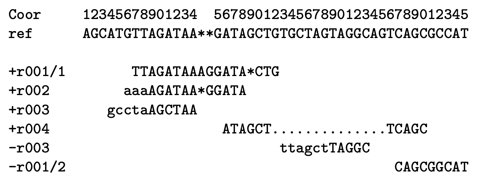
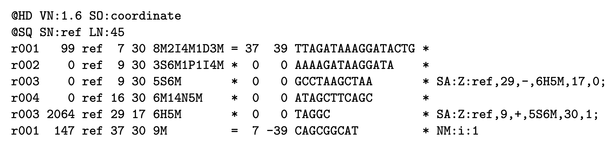
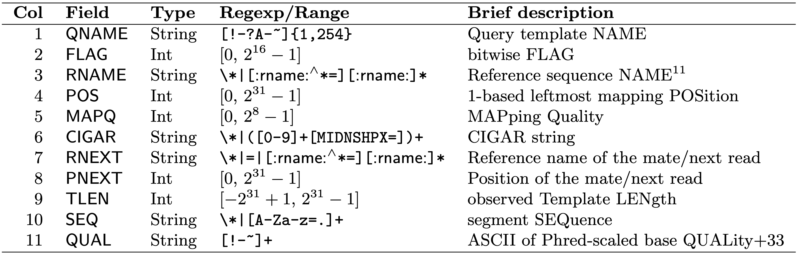
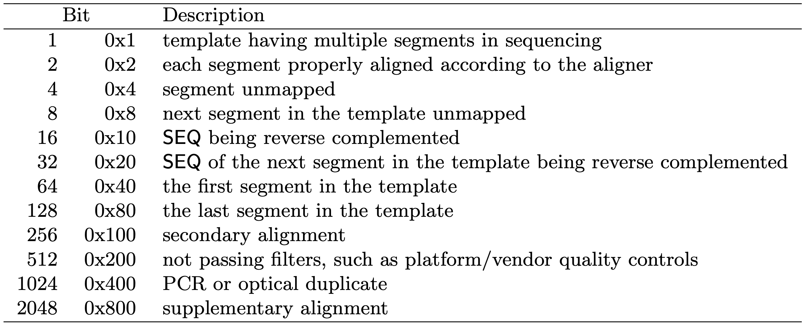
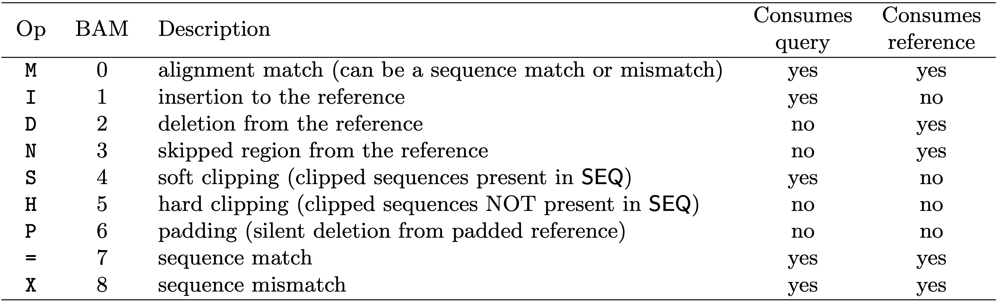

# Genomics File Formats

## Raw NGS data, FASTQ file format

FASTQ files are arguably the workhorse format of bioinformatics. FASTQs are used to store sequence reads generated in next-generatoon sequencing (NGS) experiments. Similarly to FASTA files, FASTQ files contain a herder line, followed by the sequence read, however unlike FASTA files individual quality of base calls from the sequencer are included for each record in a FASTQ file.

Here is what a the first record of an example FASTQ file looks like
```
@SRR1039508.1 HWI-ST177:290:C0TECACXX:1:1101:1225:2130 length=63
CATTGCTGATACCAANNNNNNNNGCATTCCTCAAGGTCTTCCTCCTTCCCTTACGGAATTACA
+
HJJJJJJJJJJJJJJ########00?GHIJJJJJJJIJJJJJJJJJJJJJJJJJHHHFFFFFD
```

**Four rows exist for each record in a FASTQ file:**
- **Row 1:** Header line that stores information about the read (always starts with an `@`), such as the *instrument ID*, *flowcell ID*, *lane on flowcell*, *file number*, *cluster coordinates*, *sample barcode*, etc.
- **Row 2:** The sequence of bases called
- **Row 3:** Usually just a `+` and sometimes followed by the read information in line 1
- **Row 4:** Individual base qualities (must be same length as line 2)

Quality scores, also known as **Phred scores**, in row 4 represent the probability that the associated base call is incorrect, which are defined by the below formula for current Illumina machines:
```
Q = -10 x log10(P), where Q = base quality, P = probability of incorrect base call
```
or
```
P = 10^-Q/10
```

Intuitively, this means that a base with a Phred score of `10` has a `1 in 10` chance of being an incorrectly called base, or *90%* chance of being the correct base. Likewise, a score of `20` has a `1 in 100` chance (99% accuracy), `30` a `1 in 1000` chance (99.9%) and `40` a `1 in 10,000` chance (99.99%).

However, we can clearly see that the quality scores are not probabilities. Instead, quality scores are encoded by a character that is associated with an *ASCII (American Standard Code for Information Interchange)* characters. *ASCII* codes provide a convenient way of representing a number with a character. In FASTQ files, Q-score is linked to a specific ASCII character by **adding 33 to the Phred-score**, and matching the resulting number with its *ASCII* character according to the standard code. You can see the full table used for ASCII character to Phred-score conversion [here](https://support.illumina.com/help/BaseSpace_OLH_009008/Content/Source/Informatics/BS/QualityScoreEncoding_swBS.htm). The reason for doing it this way is so that quality scores only take up **1 byte per value** in the FASTQ file.

For example, the first base call in our sequence example above, the `C` has a quality score encoded by an `H`, which corresponds to a Q-score of 39 (this information is in the linked table), meaning this is a good quality base call.

Generally, you can see this would be a good quality read if not for the strech of `#`s indicating a Q-score of 2. Looking at the FASTQ record, you can see these correspond to a string of `N` calls, which are bases that the sequencer was not able to make a base call for. Streches of Ns' are generally not useful for your analysis.

**Paired-end reads:**  

If you sequenced paired-end reads, you will have two FASTQ files:  
**..._R1.fastq** - contains the forward reads  
**..._R2.fastq**- contains the reverse reads  

Most downstream analysis tools will recognize that such files are paired-end, and the reads in the forward file correspond to the reads in the reverse file, although you often have to specify the names of both files to these tools.

It is critical that the R1 and R2 files have **the same number of records in both files**. If one has more records than the other, which can sometimes happen if there was an issue in the demultiplexing process, you will experience problems using these files as paired-end reads in downstream analyses.

### Working with FASTQ files

We will be using the RNA-seq dataset described in [Himes *et al*, 2014, *PloS One*](https://journals.plos.org/plosone/article?id=10.1371/journal.pone.0099625). This study investigates the mechanism by which glucocorticoids, a major treatment used in asthma care, prevent inflammation of airway smooth muscle cells (ASM). The authors sequenced 4 primary human ASM cell lines that were treated with a control vehicle (untreated), dexamethasone (Dex), albuterol (Alb), or both dexamethasone and albuterol (co-treated) for 18 hours before sample collection (although only Dex samples are considered in the paper). They then use differential expression analysis to identify >300 differentially expressed genes (DEGs).


### Raw data

Raw sequence data was obtained from the [*Sequence Read Archive*](https://www.ncbi.nlm.nih.gov/sra)
[SRA toolkit](https://github.com/ncbi/sra-tools) (SRA) under project accession [SRP033351](https://www.ncbi.nlm.nih.gov/sra?term=SRP033351). The raw FASTQ files are locted in `/dartfs-hpc/scratch/rnaseq1/`. Each sample is named according to their **SRR** identifier from the SRA. SRR (SRA run accession) identifiers are used to denote objects containing actual sequencing data from a sequencing run. Downloading data from the SRA is easist using the SRA toolkit, which can be installed using a conda environment.

```bash

# Create conda environment with the sratoolkit and efetch tools installed
conda create --name sratoolkit
conda activate sratoolkit
conda install sratoolkit
conda install efetch

# Use prefetch to download required references sequences
prefetch SRR*

# Use fastq-dump to download assocaited fastq files
fastq-dump --outdir ./ --split-3 --gzip ~/ncbi/public/sra/SRR*.sra
```

For this dataset it would take too long to have everyone download all of the fastq files from the SRA so that we can work with them, so the code above is just an example of how you would access FASTQ files from the SRA, given a list of SRA identifiers you were interested in. In practice today you are going to be using FASTQ files that we have already downloaded for you, and to save on space in your directories rather than copy the FASTQ files to your directory we are going to have you create symlinks to the data which we have already downloaded to `dartfs-hpc/scratch/fund_of_bioinfo/data/raw-fastq/`.

```bash

# lets have a look at the project directory containing the raw FASTQs
ls -lah /dartfs-hpc/scratch/fund_of_bioinfo/data/raw-fastq/

```

Since these are paired-end reads each sample has a file for read 1 (SRRXXX_1) and a file for read 2 (SRRXXX_2). All of the files are `gzipped` in order to reduce the disk space they require, which is important as you can see that they are all generally at least **1GB** (you need a lot of space to process RNA-seq, or other-NGS data). Since these files are so large each person copying them to their home directory would take up a lot of space, instead we are going to have you set up a symbolic link or symlink to the data in the scratch drive.

```bash
# Create a symlink to the data directory in the scratch drive
ln -s /dartfs-hpc/scratch/fund_of_bioinfo/data/raw-fastq/*fastq.gz ./

# Check that your command worked
ls

```
Symlinked files are similar to an alias they are a file that points to a location. Any modifications made to the original files in `/dartfs-hpc/scratch/fund_of_bioinfo/data/raw-fastq/` will also be seen in the symlink files. Moving the original files or deleting the original files will cause the symlinks to malfunction. Remember because your symlinks are pointing to something in the scratch directory these files are slated to be deleted in 45 days (in this case in this case these files will be deleted 01/28/21) at which point your symlinks will still exist but no longer function properly.

### Basic operations

While you don't normally need to go looking within an individual FASTQ file, it is handy to be able to do so if an error is thrown while you are processing them (as in the number of reads in the forward and reverse files don't match). There are a lot of operations we can do with a FASTQ file to gain more information about our experiment, and being able to interact with FASTQ files can be useful for troubleshooting problems that might come up in your analyses.

Due to their large size, we often perform gzip copmpression of FASTQ files so that they take up less space, however this means we have to unzip them if we want to look inside them and perform operations on them. We can do this with the `zcat` command and a pipe (|). `zcat` works similar to `cat` but operates on zipped files, FASTQ files are very large and so we will use `head` to limit the output to the first ten lines.

Lets use `zcat` and `head` to have a look at the first few records in our FASTQ file.
```bash
# unzip and view first few lines of FASTQ file
zcat SRR1039508_1.chr20.fastq.gz | head
zcat SRR1039508_2.chr20.fastq.gz | head
```

How many records do we have in total? (don't forget to divide by 4..)
```bash
zcat SRR1039508_1.chr20.fastq.gz | wc -l
zcat SRR1039508_2.chr20.fastq.gz | wc -l
```
Paired-end reads should have the same number of records!

What if we want to count how many unique barcodes exist in the FASTQ file. To do this, we would need to print all the sequence lines of each FASTQ entry, then search those for the barcode by specifying a regular expression. To print all the sequence lines (2nd line) of each FASTQ entry, we can use a command called `sed`, short for ***stream editor*** which allows you to streamline edits to text that are redirected to the command. You can find a tutorial on using **sed** [here](https://www.digitalocean.com/community/tutorials/the-basics-of-using-the-sed-stream-editor-to-manipulate-text-in-linux).

First we can use sed with with the `'p'` argument to tell it that we want the output to be printed, and the `-n` option to tell sed we want to suppress automatic printing (so we don't get the results printed 2x). Piping this to `head` we can get the first line of the first 10 options in the FASTQ file (the header line). We specify `'1-4p'` as we want sed to *print 1 line, then skip forward 4*.
```bash
zcat SRR1039508_1.chr20.fastq.gz | sed -n '1~4p' | head -10
```

Using this same approach, we can print the second line for the first 10000 entires of the FASTQ file, and use the `grep` command to search for regular expressions in the output. Using the `-o` option for grep, we tell the command that we want it to print lines that match the character string.
```bash
# Print the first 10 lines to confirm we are getting bthe sequence lines
zcat SRR1039508_1.chr20.fastq.gz | sed -n '2~4p' | head -10

# Pipe the sequence line from the first 10000 FASTQ records to grep to search for our (pretend) adapter sequence
zcat SRR1039508_1.chr20.fastq.gz | sed -n '2~4p' | head -10000 | grep -o "ATGGGA"
```

This is a bit much to count by each, so lets count the how many lines were printed by grep using the `wc` (word count) command with the `-l` option specified for lines.
```bash
# Count how many times in the first 10000 FASTQ our (pretend) adapter sequence occurs
zcat SRR1039508_1.chr20.fastq.gz | sed -n '2~4p' | head -10000 | grep -o "ATGGGA" | wc -l
```

Using a similar approach, we could count up all of the instances of individual DNA bases (C,G) called by the sequencer in this sample. Here we use the `sort` command to sort the bases printed by `grep`, and `grep` again to just get the bases we are interested in, then using the `uniq` command with the `-c` option to count up the unique elements.
```bash
# Determine the G/C content of the first 10000 reads
zcat SRR1039508_1.chr20.fastq.gz | sed -n '2~4p' | head -10000 | grep -o . | sort | grep 'C\|G' | uniq -c
```

Now we have the number of each nuleotide across the reads from the first 10000 records. A quick and easy program to get GC content. GC content is used in basic quality control of sequence from FASTQs to check for potential contamination of the sequencing library. We just used this code to check 1 sample, but what if we want to know for our 4 samples?


### For & while loops

Loops allow us repeat operations over a defined variable or set of files. Essentially, you need to tell Bash what you want to loop over, and what operation you want it to do to each item.

Notice that the variable ***i*** set in the conditions for our loop is used to reference all the elements to be looped over in the operation using the term ***$i*** in this **for*** loop example:

```bash
# loop over numbers 1:10, printing them as we go
for i in {1..10}; do \
   echo "$i"; \
done
```

Alternatively, if you do not know how many times you might need to run a loop, using a ***while*** loop may be useful, as it will continue the loop until the boolean (logical) specified in the first line evaluates to `false`. An example would be looping over all of the files in your directory to perform a specific task. e.g.

```bash
ls *.fastq.gz | while read x; do \
   # tell me what the shell is doing
   echo $x is being processed...;
   # provide an empty line for ease of viewing
   yes '' | sed 1q;  \
   # unzip w/ zcat and print head of file
   zcat $x | head -n 4;  \
   # print 3 lines to for ease of viewing
   yes '' | sed 3q ;
done
```

Perhaps we wanted to check how many reads contain the start codon `ATG`. We can do this by searching for matches and counting how many times it was found, and repeating this process for each sample using a while loop.

```bash
ls *.fastq.gz | while read x; do \
   echo $x
   zcat $x | sed -n '2~4p' | head -n 4 | grep -o "ATG" | wc -l
done
```

We could use one of these loops to perform the nucleotide counting task that we performed on a single sample above, but apply it to all of our samples in a single command.

```bash
ls *.fastq.gz | while read x; do \
   yes '' | sed 1q
   echo processing sample $x
   zcat $x | sed -n '2~4p' | sed -n '1,10000p' | grep -o . | sort | grep 'C\|G' | uniq -c ;
done
```
### Scripting in bash

So loops are pretty useful, but what if we wanted to make it even simpler to run. Maybe we even want to share the program we just wrote with other lab members so that they can execute it on their own FASTQ files, or use the program again later on a different dataset. One way to do this would be to write this series of commands into a Bash script, that can be executed at the command line, passing the files you would like to be operated on to the script.

To generate the script (suffix `.sh`) we could use the `nano` editor:

```bash
nano count_GC_content.sh
```

Add our program to the script, using a shebang `#!/bin/bash` at the top of our script to let the shell know this is a bash script. As in the loops we use the `$` to specify the input variable to the script. `$1` represents the variable that we want to be used in the first argument of the script. Here, we only need to provide the file name, so we only have 1 `$`, but if we wanted to create more variables to expand the functionality of our script, we would do this using `$2`, `$3`, etc. Copy the following code into the nano editor file you just opened and use the ctrl+x command to close the file and save the changes you made.

```bash
#!/bin/bash
echo processing sample "$1"; zcat $1 | sed -n '2~4p' | sed -n '1,10000p' | grep -o . | sort | grep 'C\|G' | uniq -c
```

Now run the script, specifying the a FASTQ file as variable 1 (`$1`)

```bash
# have a quick look at our script
cat count_GC_content.sh

# now run it with bash
bash count_GC_content.sh SRR1039508_1.chr20.fastq.gz
```

Now we can use our while loop again to do this for all the FASTQs in our directory
```bash
ls *.fastq.gz | while read x; do \
   bash count_GC_content.sh $x
done
```

What if we wanted to write the output into a file instead of printing to the screen? We could save the output to a *Standard output* (stout) file that we can look at, save to review later, and document our findings. The `1>>` redirects the output that would print to the screen to a file.
```bash
# create the text file you want to write to
touch stout.txt

# run the loop
ls *.fastq.gz | while read x; do \
   bash count_GC_content.sh $x 1>> stout.txt
done

# view the file
cat stout.txt
```

These example programs run fairly quickly, but stringing together mutiple commands in a bash script is common and these programs can take much longer to run. In these cases we might want to close our computer and go and do some other stuff while our program is running. We can do this using `nohup` which allows us to run a series of commands in the background, but disconnects the process from the shell you initally submit it through, so you are free to close this shell and the process will continue to run until completion. e.g.
```bash
nohup bash count_GC_content.sh SRR1039508_1.chr20.fastq.gz &

# show the result
cat nohup.out
```

### Quality control of FASTQ files

While the value of these sorts of tasks may not be immediately clear, you can imagine that if we wrote some nice programs like we did above, and grouped them together with other programs doing complimentary tasks, we would make a nice bioinformatics software package. Fortunately, people have already started doing this, and there are various collections of tools that perform specific tasks on FASTQ files.

One excellent tool that is specifically designed assess quality of FASTQ file is [FastQC](https://www.bioinformatics.babraham.ac.uk/projects/fastqc/). FastQC is composed of a number of analysis modules that calculate various QC metrics from FASTQ files (such as GC content, distribution of base quality, etc.) and summarizes this all into a nice QC report in HTML format, that can be opened in a web browser. Assesing the quality of the raw data you are going to begin working with should be the first step in any bioinformatic analysis, as certain features of your data might dictate decisions you make in processing your data downstream.

Lets have a look at some example QC reports from the FastQC documentation:

[Good Illumina Data FastQC Report](https://www.bioinformatics.babraham.ac.uk/projects/fastqc/good_sequence_short_fastqc.html)
[Bad Illumina Data FastQC Report](https://www.bioinformatics.babraham.ac.uk/projects/fastqc/bad_sequence_fastqc.html)

Lets run FASTQC on our data and move the results to a new directory.
```bash
# specify the -t option for 4 threads to make it run faster
fastqc -t 4 *.fastq.gz

# move results to a new folder
mkdir fastqc_results
mv *fastqc* fastqc_results

# move into it and ls
cd fastqc_results
ls -lah
```

**Note**: FastQC does not use the entire dataset, just the first few thousand reads in the FASTQ file, therefore there could be some bias introduced by this, although we assume there isn't since entires are placed into FASTQ files randomly.

Opening and evaluating an individual .html file for each FASTQ file is obviously going to be tedious and slow. Luckily, someone built a tool to speed this up. [MultiQC](https://multiqc.info/) *MultiQC* searches a specified directory (and subdirectories) for log files that it recognizes and synthesizes these into its own browsable, sharable, interactive .html report that can be opened in a web-browser. *MultiQC* recognizes files from a very wide range of bioinformatics tools (including FastQC), and allows us to compare QC metrics generated by various tools across all samples so that we can analyze our experiment as a whole.

Lets run MultiQC on our FastQC files:
```bash
multiqc .
```

Copy to report to your LOCAL MACHINE in a new folder and open in a web-broswer:
```
# make a directory and go into it (ON YOUR LOCAL MACHINE)
mkdir fund_of_bioinfo/
cd fund_of_bioinfo/

# use secure copy (scp) to download the files to your local machine
scp netID@discovery7.dartmouth.edu:/dartfs-hpc/rc/home/h/netID/fundamentals_of_bioinformatics/fastqc_results/multiqc_report.html .
```

You can find the MultiQC report run on the complete dataset across all samples in the dataset in the github repository, under `QC-reports`. Lets open it and explore our QC data.

**What do we think about the quality of our dataset?**

### Read pre-processing & trimming

An additional QC step one should perform on raw FASTQ data is to *pre-process* or *trim* the sequences to remove sequences that we are not interested in, or were not called confidently by the sequenecer. This step is **optional** in most analysis, although should be based on an empirical decision that leverages the QC assessment of raw FASTQs using a quality report like the one we just generated with FASTQC/MULTIQC. For example, if we see we have a large number of adapter seqeunces in our data, or a high proportion of low-quality bases near our read ends, we may wish to trim our raw reads. In the absence of such issues, we could skip this step.

Another reason this step is optional is that many aligners can account for mismatches or low quality bases at the end of reads during the alignment process. The aligner will *soft-clip* these bases from the alignment when it maps that read (more on this later) so we do not necessarily need to have these bases trimmed off all of the reads.

### Principles of read trimming: Downstream steps are more efficient

Several algorithms exist for trimming reads in FASTQ format. Generally, these algorithms work by looking for matches to the sequence you specify at the 5' and 3' end of a read. You can specify the minimum number of bases you would like to be considered a match, as the algorithm will trim partial matches to the sequence you specify. Examples of sequences you might want to remove include: adapter sequences, polyA tails, or low quality bases.


### Read trimming with cutadapt

[Cutadapt](https://cutadapt.readthedocs.io/en/stable/) is a useful tool for cleaning up sequencing reads, and allows for multiple adapters to be specified simulatenously, and has numerous options that can be tweaked to control its behaviour.

Basic usage of cutadapt:
```bash
cutadapt -a ADAPTER -g ADAPT2 [options] -o output.fastq input.fastq.gz
```
- `-a` specifies an adapter to trim from the 3' end of read 1
- `g` specifies an adapter to trim from the 5' end of read 1
- `o` specifies name of out file

For paired-end reads:
```bash
cutadapt -a ADAPT1 -g ADAPT2 [options] -o out1.fastq.gz -p out2.fastq input1.fastq.gz input2.fastq.gz
```
Capital letters are used to specify adapters for read 2.

If we wanted to trim polyA sequences and save the output to a report called cutadapt.logout, we could use:  
```bash
cutadapt -a 'A{76}' -o out.trimmed.fastq.gz input.fastq.gz > cutadapt.logout;
```
`-a A{76}` tells cutadapt to search for streches of A bases at the end of reads, with a maximum length of the read length (76bp).

Since the polyA and adapter sequence contamination is relatively low for this dataset, we won't trim any specific sequences, although we will perform basic quality and length processing of the raw reads. Lets make a new directory and do this for do this for one sample.
```bash
mkdir ../results/trim
cd ../results/trim

cutadapt \
   -o SRR1039508_1.trim.chr20.fastq.gz \
   -p SRR1039508_2.trim.chr20.fastq.gz \
   ../../raw_data/SRR1039508_1.chr20.fastq.gz ../../raw_data/SRR1039508_2.chr20.fastq.gz \
   -m 1 -q 20 -j 4 > SRR1039508.cutadapt.report
```

- `-m` removes reads that are samller than the minimum threshold
- `-q` qulaity threshold for trimming bases
- `-j` number of cores/threads to use

Now lets run this on all of our samples:
```bash
ls ../../raw_data/*.chr20.fastq.gz | while read x; do \

   # save the file name
   sample=`echo "$x"`
   # get everything in file name after "/" and before "_" e.g. "SRR1039508"
   sample=`echo "$sample" | cut -d"/" -f4 | cut -d"_" -f1`
   echo processing "$sample"

   # run cutadapt for each sample
   cutadapt \
      -o ${sample}_1.trim.chr20.fastq.gz \
      -p ${sample}_2.trim.chr20.fastq.gz \
      ../../raw_data/${sample}_1.chr20.fastq.gz ../../raw_data/${sample}_2.chr20.fastq.gz \
      -m 1 -q 20 -j 4 > $sample.cutadapt.report
done
```

You should now have trimmed FASTQ files in this directory that can be used for an alignment. You should also be able to see and print each of your reports from cutadapt.
```bash
ls *cutadapt.report | while read x; do
   yes '' | sed 4q
   echo Printing $x
   yes '' | sed 1q
   cat $x
done
```

**Additional note:** For data generated at Dartmouth, since much of the data in the Genomics core is generated using an **Illumina NextSeq 500**, we also often use the `--nextseq-trim` option in cutadapt.

This option works in a similar way to the qulaity threshold option `-q` BUT ignores Q-scores for streches of G bases, as some Illumina instruments, such as the NextSeq, generate strings of Gs when when the sequencer 'falls off' the end of a fragment and dark cycles occur, and therefore provides more appropriate quality trimming for data generated on these instrucments.


# Aligned read files, BAM/SAM/CRAM formats

### Principles of read alignment for RNA-seq

# short read mapping using read/reference indexing (bowtie, bwa-mem,)
#
The goal of aliginging reads to a reference genome is to find the ***most likely location in that reference genome where the read originated from***.

Although we won't go into the theory here, aligning reads to reference genomes involves ***mapping*** to identify the most likely position of the read in the reference genome, followed by the ***alignment***, which describes the base-by-base relationship between the read and the reference. Alignments are often imperfect, and are associated with quality scores (***MAPQ scores***) that describe the quality of the alignment.

**Challenges of aligining millions of short reads to a refence genome involve:**
- Mismatches introduced by **genetic variation** and **sequencing errors**
- **Repeitive sequences** in genomes (e.g. start and end of chromosomes)
- For Eukaryotic genomes the presence of **introns** in reference genomes, meaning aligners must be able to consider **splice-junctions**
-For Prokaryotic genomes the presence of **mobile genetic elements** or **recombination hotspots** in reference genomes

It is important when selecting an aligner to use for your dataset that it is appropriate for your experiment, as numerous aligners exist and make different assumptions and have different strengths/weaknesses. Importantly, some aligners are ***splice-aware*** while others are not. ***Splice-aware*** aligners can generate alignments to a reference genome that span the intronic regions and therefore account for splicing, e.g. `STAR` and `HISAT2`. If your dataset is prokaryotic (non-splicosomal) you would **not** want to use a splice-aware aligner, and instead using an aligner that is not designed to map across intronic regions such as `bwa-mem` or `bowtie2`.


### Concepts for read alignment

**Read clipping**  
Aligners are capable of 'clipping' reads from sequence ends if they do not improve the quality of an alignment that exists for the rest of the sequence.  

There are two type of clipping:  
- *Soft-clipping*: bases at 5' and 3' ends of the read will be kept in the read sequence in the BAM file, but are NOT part of the alignment
- *Hard-clipping*: bases at 5' and 3' ends of the read will be removed from the BAM file altogether and are NOT part of the alignment

Such clipping is commonly used by aligners to get rid of sequence contamination, e.g. ***adapter sequences*** or ***polyA tails*** from mRNAs, so that it does not affect the alignment. This is why you do not necessairily need to be very aggressive in read trimming and pre-processing steps.

Clipping can be very advantageous, but also can potentially cause some issues, read more [here](https://sequencing.qcfail.com/articles/soft-clipping-of-reads-may-add-potentially-unwanted-alignments-to-repetitive-regions/).

**Splicing**  
As discussed above, numerous aligners exist, consisting of both ***splie-aware*** and ***splice-unaware*** aligners. Splice-aware aligners, such as `STAR` and `HISAT2` will produce alignments spanning splice junctions, which is obviously an important characteristic of RNA-seq data that the aligner needs to be able to account for. Furthermore, if you provide coordinates of splice-junctions to aligners like `STAR`, it can improve the mapping over spliced regions and improve detection of novel splice-functions.

**What input do I need for an alignment?**  
At miniumum:  
- `FASTQ` file(s)
- A reference genome (`.fasta`)

Optional:   
- `.gtf` file for the reference genome that species the genomic feature annotation. As mentioned above, if you know where the splice-junctions in your genome are, you can give this to aligners such as STAR and they will use this information to improve the quality of mapping in these regions.


## SAM/BAM/CRAM file format

**Alignment file formats**  

Read alignments are stored in the ***SAM (.sam)***, ***BAM (.bam))***, and ***CRAM (.cram)*** file formats. ***SAM*** stands for ***Sequence Alignment/Map*** format and is in tab-delimited text format, making it a human readable file (should you dare to look inside, these file are huge). ***BAM*** files are the **compressed, indexed, binary version** of SAM files and are **NOT** human readable, but are much faster to parse and do complex downstream operations on. ***CRAM*** files are compressed versions of the ***BAM*** format, and are not human readable, they are generally only used for storage purposes. You can read all about the SAM/BAM/CRAM file format specification in the documentation [here](https://samtools.github.io/hts-specs/SAMv1.pdf). While you may never need to actually look inside of a SAM/BAM file, it is important to have an understanding of what information is stored in one.

Both formats contain a number of slots for each read alignment that describe key information about the alignment. 11 slots are mandatory, while others are optional and depend on the aligner used, and the settings used in that alignment.


The image for the example BAM file is take from the [SAM/BAM file format documentation](https://samtools.github.io/hts-specs/SAMv1.pdf)

#### Notes on select fields:

**FLAG**:  
Encodes important information about the read, for example, is it a ***primary***, ***secondary***, or ***supplementary*** alignment. Since a single read will likely have a number of properties that we want to ***'flag'***, SAM files use a special way of encoding the FLAG field to pack as much information as possible into a single number. While we won't go into detail on this here, SAM/BAM file use a *bit-wise* system to combine information across flags into a **single integer**. I encourage you to go read more about FLAGs and how they are specified in the SAM/BAM documentation.

The Broad institute provides an [excellent tool](https://broadinstitute.github.io/picard/explain-flags.html) for decomposing SAM flags into the proprties of the read that make up a specific `FLAG` value.

This command will provide basic information on FLAGs from samtools.
```bash
samtools flags
```
The values shown here relate the the [hexadecimal system](https://www.electronics-tutorials.ws/binary/bin_3.html)

**MAPQ**:   
Corresponds to the quality of the mapping. These are calculated in the same way as the Phred scores `Q = -10 x log10(P)`, although are generally considered to be a best guess form the aligner. A MAPQ of 255 is used where mapping quality is not available. Some aligners also use specific values to represent certain types of alignments, which may affect use of downstream tools, so it is worth understanding those that are specific to your aligner.

**CIGAR**  
An alphanumerical string that tells you information about the alignment. For relatively short reads, these are nice, but for long reads, they are a headache. Numbers correspond to number of bases, and letters correspond to features of those bases.  

Letter key for CIGAR strings:
M = match or mismatch  
S = soft clip  
H = hard clip  
I = insertion  
D = deletion  
N = skipping  

So for example, alignment in row 3 of our SAM file example above (`5S6M`) would describe an alignment where 5 bases are soft-clipped, followed by 6 matching bases.


SAM format is a common way of representing sequenced reads, especially after reads have been aligned or mapped to a reference genome. BAM is a binary (non-human readable) format of SAM that takes up less space. CRAM files are compressed versions of BAM files - these take up the least space and are recommended for longer term storage of alignment files. SAM/BAM/CRAM files can be converted back and forth with the tool **samtools view**.

```bash

#convert sam to bam
samtools view -b sample.sam > sample.bam

#convert bam to cram
samtools view -C sample.bam > sample.cram
```

A SAM file is made up of two basic parts, the header and the alignment.

### SAM file header field

All header lines will start with the **@** symbol. The mandatory flag **@HD** will come first in the file and should only occur once, this flag has the meta-data that pertains to the SAM file and will either have a **GO** field indicating that reads are grouped but not sorted or a **SO** field indicating that reads are sorted. If the reads have been mapped there will be a series of **@SQ** flags. Additional optional flags are **@RG** which denotes the read groups, **@PG** which denotes the programs used, and **@CO** which is used for additional comments.

To view a SAM/BAM/CRAM file you can use the **samtools view** tool with the **-H** flag:

```bash

samtool view -H sample.bam
```



### SAM file alignment field

<p align="center">
  
 </p>
 </p>

 The alignment field has eleven mandatory fields for each read, outlined in the table above. Some of the major ones are detailed below.

- **QNAME** denotes the query name, if there are muleiple alignment lines in this flag it indicates multimapping or chimeric reads

- **FLAG** a combination of bitwise flags that describe the alignment properties of each segment of the sequence

<p align="center">
  
 </p>
 </p>

- **RNAME** the name of the reference sequence aligned to the read in this field

- **POS** the left most position of the first CIGAR operation that "consumes" a reference base

- **MAPQ** mapping quality, 255 means no mapping quality is available

- **CIGAR** represents the type of match between the query and reference

<p align="center">
  
 </p>
 </p>

- **QUAL** Phred scaled base error probability

You can learn more about the SAM file format [here](https://samtools.github.io/hts-specs/SAMv1.pdf).

# Add coding exercises for building an alignment with a couple of different programs


## Quantification (RNAseq and chipSeq)

<p align="center">

</p>
</p>

***Fig. 1.** Genomic context of aligned reads can fall into several categories dictated by the annotation used. *


----


## TO DO:
- cover zwero and 1 -based coord systems
- Add basic concepts of assembly, quantification, peak calling as file types are introduced  
- VCF files
- normalization, FPKM, TPM etc,
- bed files
- bigwig files
- quantification and peak calling basics
