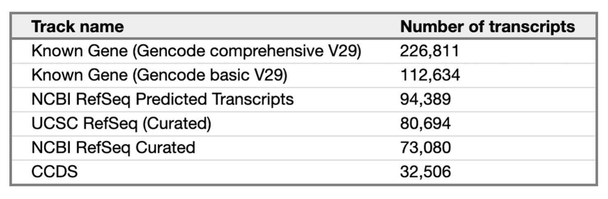
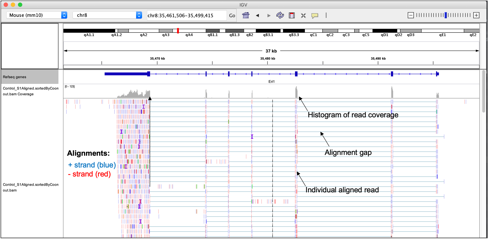

# Working with NGS data Part II

## Alignment files (BAM/SAM/CRAM formats)

### Learning objectives: 
- Understand the major principles behind short-read alignment
- Learn how alignment data is stored in SAM/BAM format
- Learn how to perform basic operations on BAM files using `Samtools`
- Perform an alignment with `STAR`

Make a new directory to work in: 
```bash 
#log onto the n07 node
mksub -I -l walltime=5:00:00 -l nodes=n07

# go to our home dir for the wrkshop
cd /dartfs-hpc/scratch/YOUR_INITIALS_HERE/fundamentals_of_bioinformatics/

# make the directroy and cd into it 
mkdir aligned
cd aligned
```

If you get lost, or do not have enough time to finish the commands before we move to the next session you can copy the files needed for the next step with the following command from the scratch directory you have created for yourself. Again, you will need to update the target directory to your own directory on scratch. 

```bash
# go to your scratch directory (e.g. /dartfs-hpc/scratch/omw/fundamentals_of_bioinformatics/)

# copy files 
# REMEMBER TO CHANGE THE DESTINATION DIRECTORY TO YOUR OWN INITIALS
cp /dartfs-hpc/scratch/fund_of_bioinfo/aligned/* /dartfs-hpc/scratch/omw/
```

### Principles of read mapping for RNA-seq

For NGS experiments, the goal of read mapping is to find an alignment that describes the **most likely location in the reference genome where that read originated from**. This is generally determined by reducing the information in the reference and query (read to be mapped) into smaller strings and looking for the position in the reference with the highest number of matching smaller strings. This process is also used in *de novo* genome assembly, local alignments (BLAST or BLAT), and global alignments.

Although we won't go into the theory here, aligning reads to reference genomes involves **mapping** to identify the most likely position of the read in the reference genome, followed by the **alignment**, which describes the base-by-base relationship between the read and the reference.

<p align="center">

</p>

Challenges of aligning millions of short reads to a reference genome involve:
- Mismatches introduced by genetic variation and sequencing errors
- Repetitive sequences in genomes (e.g. start and end of chromosomes)
- For Eukaryotic genomes the presence of introns in reference genomes, meaning aligners must be able to consider splice-junctions
- For Prokaryotic genomes the presence of mobile genetic elements or recombination hotspots in reference genomes

It is important when selecting an aligner to select one appropriate for your experiment. Different aligners exist and generally have different properties and applications. For example, some aligners are **splice-aware** while others are not. Splice-aware aligners can generate alignments that span intronic regions and therefore account for splicing, e.g. `STAR` and `HISAT2`. If your dataset is prokaryotic (non-splicosomal) you would not want to use a splice-aware aligner, and instead using an aligner that is not designed to map across intronic regions such as `bwa-mem` or `bowtie2`.


### What is a reference genome?

Reference genomes are more of a concept, not a reality. A reference genome (or reference assembly) is an idealized representation of the genome of particular organism, generated through [*de novo* *genome assembly*](https://link.springer.com/referenceworkentry/10.1007%2F978-0-387-09766-4_402) of sequencing reads from one or several individuals. In NGS analysis, we commonly use reference genomes as a scaffold upon which to construct alignments of sequencing reads via read mapping.

Reference genomes have proven a powerful tool that allows us to appropriately address many scientific questions, as well as providing the scientific community a standardized coordinate system for that is used for specific genome builds. For example, the permanent start coordinate for the human gene in reference genome GRCh38/p.13 is chr9:127,786,034.

New genome builds are produced when significant improvements have been made to the sequence, warranting release of an updated sequence with a new coordinate system. For example, genome coordinates are different between GRCh38 and GRCh37. Individual genome builds are sometime updated through *patches*, for example, when a previously ambiguous sequence becomes available.

However, there are a number imitations to using reference genomes in the ways described above:  
- do not appropriately account for genetic variation, as they are composed of one linear sequence
- short-read sequencing technology has been used to generate some references, which can lead to inaccuracies or gaps in the assembly of regions that are challenging to sequence with these technologies (e.g. repetitive regions)
- some assemblies, such as the human reference, do not contain so-called non-reference unique insertions (NUIs), which are unique sequences found in multiple individuals but not in the reference

These limitations have resulted in productive discussion and research around the concepts and utilities of reference genomes, prompting some alternative reference styles to be suggested. See [Wong *et al*, Nat. Comm. 2020](https://www.nature.com/articles/s41467-020-19311-w) and Ballouz *et al*, Genom. Biol. 2019](https://genomebiology.biomedcentral.com/articles/10.1186/s13059-019-1774-4) for examples.

In recent years, long read sequencing technologies have allowed us to improve the quality and completeness of reference genomes.

#### Sources of reference genomes & genome annotations

Reference genomes are hosted on a number of different websites, usually distributed in FASTA format, and often accompanied by genome annotations, which describe the gene/transcript models for that genome. These annotations are the product specific pipelines utilized by large-scale genome annotation projects.

For example, [*RefSeq (NCBI)*](https://ftp.ncbi.nlm.nih.gov/genomes/refseq/), [*UCSC*](https://hgdownload.soe.ucsc.edu/downloads.html), and [*Ensembl*](http://ftp.ensembl.org/pub/) all generate genome annotations based on specific annotation pipelines, and currently host annotations for a wide range of organisms.

The table below from the [UCSC website](https://genome.ucsc.edu/FAQ/FAQgenes.html#gene) highlights how different genome annotation from different annotation pipelines can be with respect to availability of transcript models for human genome build GRCh38/hg38 (as of March 2019).  

<p align="left">

</p>

Several genome annotation project websites will also host current and archived versions of the reference genome sequence. For common genomes, the hosted reference genomes (and their sequences) are identical and come from the same source/submitter. For example, the human genome reference sequences hosted on NCBI, UCSC, and Ensembl all use the sequence provided by the Genome Reference Consortium (GRC)](https://www.ncbi.nlm.nih.gov/grc) which provides genome assemblies for human, mouse, zebrafish and chicken.

Most reference genomes and genome annotations can be downloaded through ftp sites that allow you to download the FASTA files for that genomes using the UNIX command line. While there are several ways you can download files from the command line, one example is through using the `rsync` command.

*Do not run this command - this is only an example*
```bash
# example rsync command with the UCSC ftp site
# the -a option denotes archive mode, the -P option indicates you want to show the progress as files are downloaded
rsync -a -P rsync://hgdownload.soe.ucsc.edu/goldenPath/hg38/hg38Patch11/ ./
```


### General concepts for read alignment

**Read clipping:**  
Aligners are capable of 'clipping' reads from sequence ends if they do not improve the quality of an alignment that exists for the rest of the sequence.  

There are two type of clipping:  
- *Soft-clipping*: bases at 5' and 3' ends of the read will be kept in the read sequence in the BAM file, but are NOT part of the alignment
- *Hard-clipping*: bases at 5' and 3' ends of the read will be removed from the BAM file altogether and are NOT part of the alignment

Such clipping is commonly used by aligners to get rid of sequence contamination, e.g. adapter sequences or polyA tails from mRNAs, so that it does not affect the alignment. This is why you do not necessarily need to be very aggressive in read trimming and pre-processing steps. Clipping can be very advantageous, but also can potentially cause some issues, read more [here](https://sequencing.qcfail.com/articles/soft-clipping-of-reads-may-add-potentially-unwanted-alignments-to-repetitive-regions/).

**Splicing:**  
As discussed above, numerous aligners exist, consisting of both ***splice-aware*** and ***splice-unaware*** aligners. Splice-aware aligners, such as `STAR` and `HISAT2` will produce alignments spanning splice junctions, which is obviously an important characteristic of RNA-seq data that the aligner needs to be able to account for. Furthermore, if you provide coordinates of splice-junctions to aligners like `STAR`, it can improve the mapping over spliced regions and improve detection of novel splice-functions.


**What input do I need for an alignment?**  
At miniumum:  
- `FASTQ` file(s)
- A reference genome (`.fasta`)

Optional:   
- `.gtf` file for the reference genome that species the genomic feature annotation. As mentioned above, if you know where the splice-junctions in your genome are, you can give this to aligners such as STAR and they will use this information to improve the quality of mapping in these regions.


**Alignment file formats**  

Read alignments for NGS data are stored in three major file formats: *SAM (.sam)*, *BAM (.bam)*, and *CRAM (.cram)*.

- **SAM (Sequence Alignment/Map)** format - tab-delimited text format, so is human readable file (should you dare to look inside)
- **BAM** files are compressed, binary version of SAM files and are NOT human readable, but are much faster to parse and do complex operations with.
- **CRAM** files are compressed versions of the BAM format, and are not human readable, they are generally only used for storage purposes.

You can read all about the SAM/BAM/CRAM file format specification in the documentation [here](https://samtools.github.io/hts-specs/SAMv1.pdf). While you may never need to actually look inside of a SAM/BAM file, it is important to have an understanding of what information they contain.

Alignment files are composed of two basic sections:
- the header
- the alignments

All header lines start with the `@` symbol. The mandatory flag `@HD` will come first in the header and can be followed by a number of additional flags that represent features of the alignments in the file (e.g. `SO`, indicating reads are sorted by coordinate).

The alignment section contains a number of 'slots' for each read alignment that describe key information about the alignment. 11 slots are mandatory, while others are optional and depend on the aligner used, and the settings used for mapping.

<p align="center">

</p>

SAM/BAM/CRAM files can be viewed, queried, and maniuplated using the [Samtools software suite](http://www.htslib.org/), which we will explore the usage of in more detail later in this lesson.


#### Notes on select SAM fields:

**FLAG:**  
Encodes important information about the read, for example, is it a *primary*, *secondary*, or *supplementary* alignment. Since a single read will likely have a number of properties that we want to *'flag'*, SAM files use a special way of encoding the FLAG field to pack as much information as possible into a single number. While we won't go into detail on this here, SAM/BAM file use a bit-wise system to combine information across flags into a single integer.

I encourage you to go read more about FLAGs and how they are specified in the SAM/BAM documentation.The Broad institute also provides an [excellent tool](https://broadinstitute.github.io/picard/explain-flags.html) for decomposing SAM flags into the properties of the read that make up a specific `FLAG` value.

This command will provide basic information on FLAGs from samtools.
```bash
samtools flags
```
The values shown here relate the the [hexadecimal system](https://www.electronics-tutorials.ws/binary/bin_3.html)

**MAPQ:**  
Corresponds to the quality of the mapping. These are calculated in the same way as the Phred scores `Q = -10 x log10(P)`, although are generally considered to be a best guess form the aligner. A MAPQ of 255 is used where mapping quality is not available. Some aligners also use specific values to represent certain types of alignments, which may affect use of downstream tools, so it is worth understanding those that are specific to your aligner.

**CIGAR:**  
An alphanumerical string that tells you information about the alignment. For relatively short reads, these are nice, but for long reads, they are a headache. Numbers correspond to number of bases, and letters correspond to features of those bases.  

Letter key for CIGAR strings:
`M` = match or mismatch  
`S` = soft clip  
`H` = hard clip  
`I` = insertion  
`D` = deletion  
`N` = skipping  

So for example, alignment in row 3 of our SAM file example above (`5S6M`) would describe an alignment where 5 bases are soft-clipped, followed by 6 matching bases.


### Generating alignments

Since the reads we have been working with were generated as part of a eukaryotic RNA-seq experiment, we ned to use a splice aware aligner that can generate gapped alignments. [STAR](https://github.com/alexdobin/STAR/blob/master/doc/STARmanual.pdf) (Spliced Transcripts Alignment to a Reference) is a  flexible and efficient short read aligner. We will use STAR as a general example of aligning short reads to a reference genome. Other short read aligners (e.g. `bwa` and `bowtie/bowtie2`) will use different syntax on the command line and you should carefully read the documnetation for the aligner you plan to use.

#### Constructing a genome index

Short read aligners require you to create an index of your reference genome before you can conduct an alignment. The index The index is in principle similar to how one might index a book, so that specific items or information can be found more quickly. For the genome index, we are indexing the genome so that the aligner can narrow down where a read may map to and speed up mapping.

Index generation can be time consuming, so we are providing you with a pre-built genome index consisting of only chromosome 20 (hg38). Alignments will therefore only be generated for this chromosome. The code chunk below shows example usage of STAR to create a STAR index of hg38.

```bash
###### DO NOT RUN - EXAMPLE CODE CHUNK ONLY #######
STAR --runThreadN 16 \
  --runMode genomeGenerate \
  --genomeDir hg38_chr20_index \
  --genomeFastaFiles Homo_sapiens.GRCh38.dna.primary_assembly.chr20.fa \
  --sjdbGTFfile Homo_sapiens.GRCh38.97.chr20.gtf \
  --genomeSAindexNbases 11
```

Option details:
- `--runThreadN`: no. of core/threads you want to use
- `--runMode`: the mode you want to run STAR in (for index generation, this should be genomeGenerate)
- `--genomeDir`: directory you want your genome to go to
- `--genomeFastaFiles`: path to genome .fasta
- `--sjdbGTFfile`: path to genome annotation in .gtf format
- `--sjdbOverhang`: default is 100, usually set to the readlength -1

You can find the pre-built index at `/scratch/fund_of_bioinfo/ref/hg38_chr20_index/`. Once you have generated an index, it is best not to do anything with it, except tell STAR where it is when you want to align reads.

#### Aligning the reads

We are ready to align our reads, present in the paired-end FASTQ files `SRR1039508_1.trim.chr20.fastq.gz` and `SRR1039508_2.trim.chr20.fastq.gz`.

```bash
# run splice aware alignment
STAR --genomeDir /dartfs-hpc/scratch/fund_of_bioinfo/ref/hg38_chr20_index \
  --readFilesIn ../trim/SRR1039508_1.trim.chr20.fastq.gz ../trim/SRR1039508_2.trim.chr20.fastq.gz \
  --readFilesCommand zcat \
  --sjdbGTFfile /dartfs-hpc/scratch/fund_of_bioinfo/ref/Homo_sapiens.GRCh38.97.chr20.gtf \
  --runThreadN 1 \
  --outSAMtype SAM \
  --outFilterType BySJout \
  --outFileNamePrefix SRR1039508.
```

Option details:
- `--genomeDir`: the path to the directory with genome indices
- `--readFilesIn`: read files to map to reference alignment
- `--readFilesCommand`: uncompression command to apply to read files
- `--sjdbGTFfile`: the path to the annotation file that includes cooordinates of splice-junctions
- `--runThreadN`: number of threads to use in the run
- `--outSAMtype`: (SAM/BAM unsorted/ BAM SortedByCoordinate)
- `--outFilterType`: how mapped reads will be filtered (normal/BySJout)
- `--outFileNamePrefix`: prefix for outfiles generated in the run

> *NOTE:* It usually makes sense to set `outSAMtype` to `BAM SortedByCoordinate`, so that I do not need to convert the default SAM file output by STAR to BAM, then sort it. However, since we want to look inside the file at the alignments, we are creating a SAM first, and will convert to a BAM afterwards.

As with most aligning, there are many options that can be set to control how read mapping is performed and define properties of alignments that can be generated. The setting you need to use depend you your data type and analysis workflow. Always read the documentation for the aligner you are using in detail.

**Alignment output**

Once the alignment has finished, you should have a number of new files in your directory. These are composed of:  
- `.sam` - your alignment file
- `Log.out` - the log of the STAR run
- `Log.final.out` - the summary file of the mapping statistics
- `Log.progress.out` - a summary file that is updated with key mapping statistics as the run progresses
- `SJ.out.tab` - high-confidence splice-functions

There are a number of ways that alignment quality can be assessed, many of them depending on your data type (e.g. RNA-seq, ChIP-seq), and you should always do a detailed post-alignment QC analysis.  Regardless of data-type, the most important alignment QC metric is generally the percentage of uniquely mapping reads. For STAR alignments, this metric is included in the `Log.final.out` file.

```bash
cat SRR1039508.Log.final.out
```

### Working with SAM/BAM files

[Samtools](http://www.htslib.org/doc/samtools.html) is an extensive software suite that provides tools for working with alignment files. We will use Samtools to explore our alignments, and demonstrate some common tasks that can be performed using this software. While our alignments were generated from RNA-seq reads, the samtools usage examples below will be aplpiciable to analysis of any NGS data type.

Using samtools with the `view` command and `-H` flag allows you to view the header line of a SAM file.
```bash
samtools view -H SRR1039508.Aligned.out.sam  | head
```

`view` can also be used to print the first few alignments.
```bash
samtools view SRR1039508.Aligned.out.sam | head
```

It is common to sort SAM/BAM files as this is required by many downstream tools that take alignment files as input.
```bash
samtools sort SRR1039508.Aligned.out.sam -o SRR1039508.Aligned.out.sorted.sam
```

In practice, we can ask programs like STAR to give us indexed and sorted BAM files as output from the alignment, however this is not the case with all aligners and in these cases you will have to sort and index files after the alignment is complete. Now that we've looked at the alignments, we should convert our SAM to BAM for indexing and downstream analysis.
```bash
samtools view -S -b SRR1039508.Aligned.out.sorted.sam > SRR1039508.Aligned.out.sorted.bam
```

We should also index this BAM, which will create a file with the same name, but the suffix `.bai`.
```bash
samtools index SRR1039508.Aligned.out.sorted.bam
```

Another useful thing we might want to do with our BAM file is to count how many alignments have specific FLAG types (unique alignments, secondary, unmapped, properly paired).
```bash
samtools flagstat SRR1039508.Aligned.out.sorted.bam
```

We can even use the specific FLAGs in the BAM file to extract specific alignments. For example, you might want to produce BAM files where all of the *secondary alignments* have been filtered out:
```bash
# use -F option in view to filter out reads that were unmapped
samtools view -F 256 SRR1039508.Aligned.out.sorted.bam -o SRR1039508.Aligned.out.sorted.unmapped.bam

# count number of alignments
samtools view -c SRR1039508.Aligned.out.sorted.unmapped.bam

# directly count reads with specific flag without making an intermediate file
### Note: using lower case -f retains alignments with flag specified, upper case -F filters out alignments with that flag  
samtools view -c -f 256 SRR1039508.Aligned.out.sorted.unmapped.bam
```


### Visualizing alignments

Alignments can be visualized using genome browser software such as the Integrative Genomics Viewer (IGV), allowing you to interactively explore alignments to a reference genome and how they overlap with genome annotation (e.g. gene models). This is an extremely useful way to visualize NGS data, and also allows you to review the evidence supporting downstream analysis results generated from aligned reads (e.g. variant calls).

The figure below shows some example alignments for paired-end mouse RNA-seq data visualized using the IGV.

<p align="center">

</p>

Note how the alignments pile up over the exons, which makes sense since these are RNA-seq data where only the transcriptome was sequenced. Alignment gaps are also present, which indicate alignments that span the intronic regions. If we had not used a gapped aligner such as STAR, we would have failed to generate many of these alignments.

We will use IGV to visualize and explore some alignments interactively on day-2.


### Generate alignments for multiple samples

It would be tedious (and more error prone) to repeat the code we used above to perform read mapping for multiple samples. We can use our new skills for coding through the UNIX shell to perform the mapping for multiple samples iteratively. In particular, we will use a `for` or `while` loop.

```bash
ls ../trim/*_1.trim.chr20.fastq.gz | while read x; do

  # save the file name
  sample=`echo "$x"`
  # get everything in file name before "/" (to remove '../trim/')
  sample=`echo "$sample" | cut -d"/" -f3`
  # get everything in file name before "_" e.g. "SRR1039508"
  sample=`echo "$sample" | cut -d"_" -f1`
  echo processing "$sample"

  # run STAR for each sample
  STAR --genomeDir /dartfs-hpc/scratch/fund_of_bioinfo/ref/hg38_chr20_index \
    --readFilesIn ../trim/${sample}_1.trim.chr20.fastq.gz ../trim/${sample}_2.trim.chr20.fastq.gz \
    --readFilesCommand zcat \
    --sjdbGTFfile /dartfs-hpc/scratch/fund_of_bioinfo/ref/Homo_sapiens.GRCh38.97.chr20.gtf \
    --runThreadN 4 \
    --outSAMtype BAM SortedByCoordinate \
    --outFilterType BySJout \
    --outFileNamePrefix ${sample}.
    
   #index the BAMs for each sample
   samtools index ${sample}.Aligned.sortedByCoord.out.bam
done
```
Note that I change `--outSAMtype` to `BAM sortedByCoord` so that we don't have to convert SAM to BAM and run `sort`.

View the STAR alignment reports quickly:
```bash
ls *Log.final.out | while read x; do
   echo Printing $x
   cat $x
done
```

## Break out room exercises

- Look at the SAM file that you created

- Convert the SAM file to a BAM file

- Convert the SAM file to a CRAM file

- How much space does each file take up?

- What is the best way to store the aligned file to minimize the space constraints?
