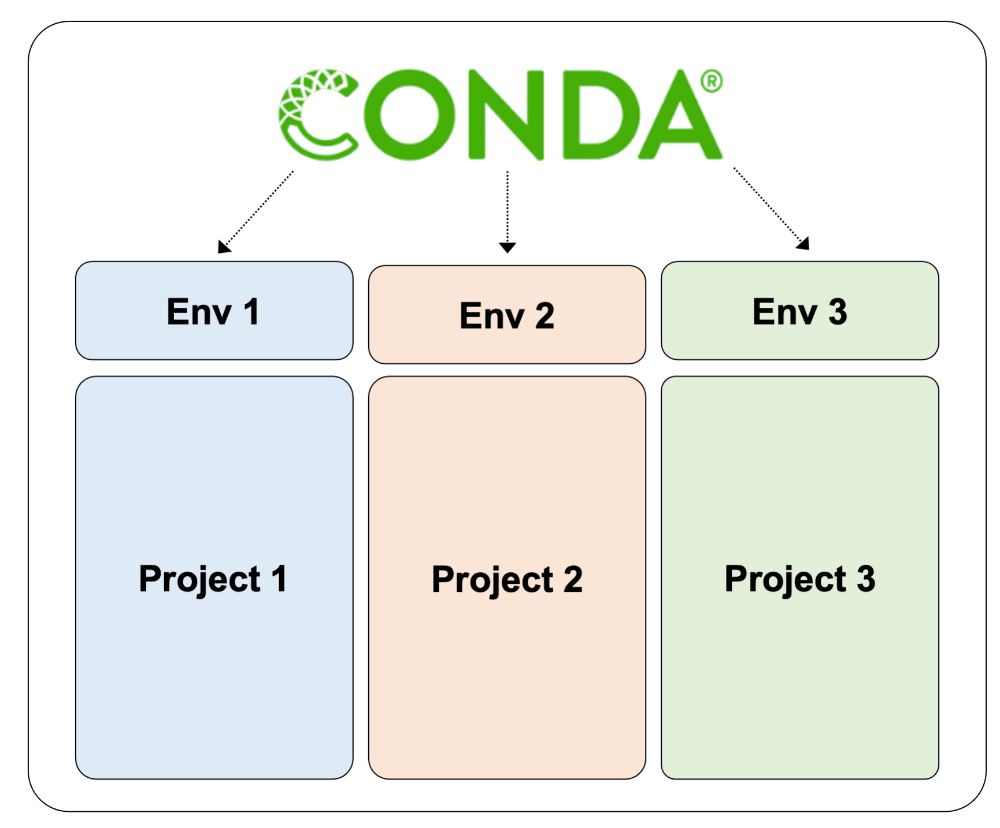
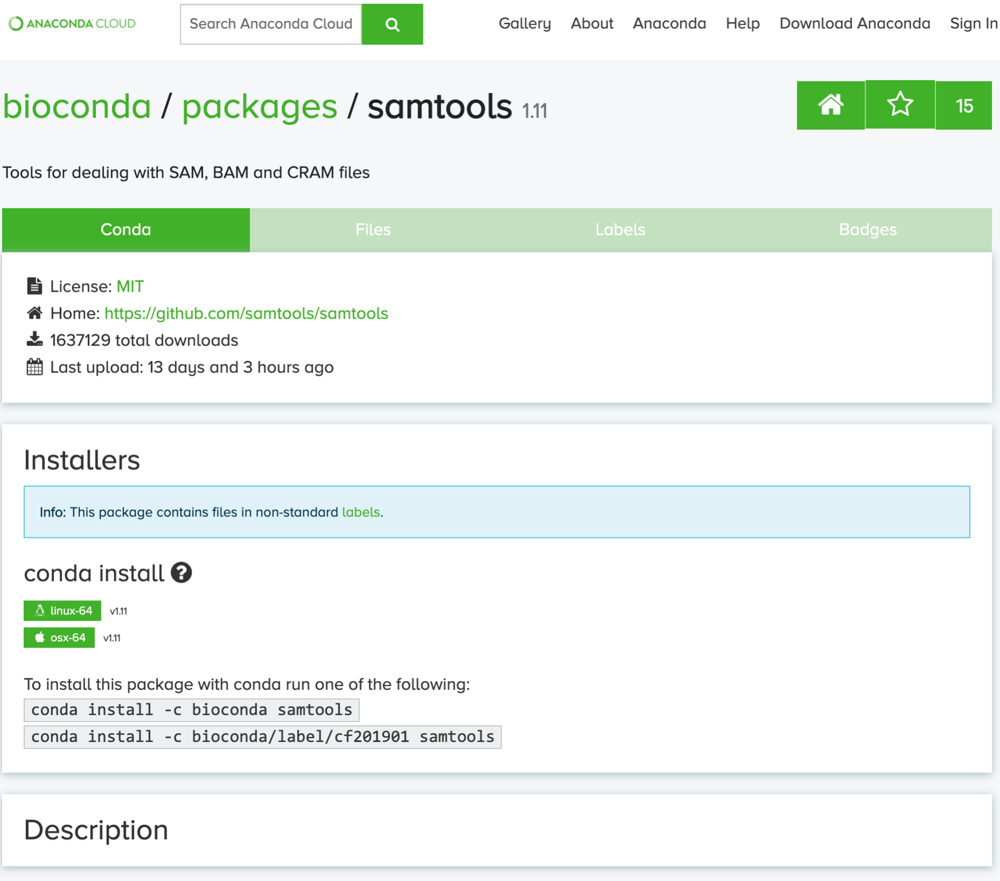

# Installing and managing bioinformatics software using a CLI

## Introduction

Bioinformatics software can be installed and managed in a number of ways. It is important to be keep track of software versions so that you can report what was used for specific analyses/projects.

Depending on the software to be installed, it may be available in one of the following formats:  
 - Pre-installed on your system (eg. modules on Discovery)
 - Language-specific package managers (eg. R/Bioconductor, Python/pip)
 - Full package and environment management tools (eg. Conda)
 - Pre-compiled binary executable
 - Source code to be compiled
 - Virtual machine images (eg. Docker, Singularity)

<p align="center">
  
</p>

In this lesson, we will introduce the major ways bioinformatics packages can be installed and managed through a command line interface.

---

## Software pre-installed on the system
Linux systems will have many core utilities for navigating the file system, creating, editing and removing files, downloading and uploading files, compiling code, submitting jobs to a cluster, and many more.  These utilities are commonly found in `/usr/bin`.  

On Discovery, software is also made available to users via system-wide modules. See section in lesson on high performance computing (HPC) and the discovery cluster.

---

## Language-specific package managers
Package managers for specific programming languages aim to make the installation of packages or libraries more simple, and from a central location. This allows software to be installed using a single command, rather than having to search the internet for each piece of software and download/install it separately.

For R, packages are available from two major sources:  
- [*CRAN*](https://cran.r-project.org/web/packages/available_packages_by_name.html) - A large diverse collection of R packages currently approaching 17,000 in total
- [*Bioconductor*](https://www.bioconductor.org/) - a specific collection of packages specifically geared toward facilitating bioinformatic data analysis in R

To install R packages from CRAN (within R):
```R
# Install ggplot2 from CRAN
install.packages('ggplot2')
```

To install R packages from Bioconductor (within R):
```R
# Get Bioconductor, if not installed already
install.packages("BiocManager")
# Install DESeq2 from Bioconductor
BiocManager::install("DESeq2")
```

In Python, packages are available in PyPI. To install Python packages from PyPI (from within thebash shell):
```shell
# Install matplotlib from PyPI
pip install matplotlib
```

---

## Conda - Full package and environment management

[Conda](https://docs.conda.io/projects/conda/en/latest/) is an open source package and environment manager that runs on Windows, MacOS and Linux. Conda allows you to install and update software packages as well as organize them efficiently into *environments* that you can switch between to manage software collections and versions.


Conda allows you to create a virtually unlimited number of software environments that can be used for specific analyses, and therefore presents efficient and reproducible way to manage your software across multiple projects.



Environments can be created with or without specific versions of software. For example, to create a new environment called `env1` that uses python 3.7.1:
```bash
conda create -n env1 python=3.7.1
```

After creating a conda environment, you will need to activate it.
```bash
conda activate env1
```

After activating it, you will see the name of the environment appear in parentheses to the left of your command prompt. You can see all of the installed software in your environment using the `list` command.
```bash
conda list
```

Once your conda environment is activated, you can install new software by running a single line of code. For example, if we wanted to install `samtools` to this environment, we would run:
```bash
# DO NOT RUN NOW, AS IT MAY TAKE A SHORT WHILE
conda install -c bioconda samtools
```

`bioconda` refers to the specific *'channel'* that samtools will be installed from. Conda, and its parent dstribution *Anaconda*, are organized into channels that contain specific collections of software. `bioconda` contains a lot of bioinformatics software.

The easiest way to identify the install details for a specific package is to search for it on the conda website. The image below shows an example of the page for the bioconda distribution of samtools (available [here](https://anaconda.org/bioconda/samtools)).



When you are finished with your environment, or if you wish to switch to a different environment, you can simply run `conda deactivate` and you will be returned to your original software environment.
```bash
conda deactivate
```

Conda is an excellent way to install and manage software for bioinformatics, since typical programs used in bioinformatics require a large number of dependency packages, and we often want/need to use different versions for different projects.

> Research computing provides an introduction to using Conda on the Dartmouth computing infrastructure (link [here](https://services.dartmouth.edu/TDClient/1806/Portal/KB/ArticleDet?ID=72888)), which describes how to best make use of Conda on Discovery/Polais/Andes.

---

## Pre-compiled binary executable
Some developers will pre-compile releases of their software for several operating systems and make them available for download. If a pre-compiled executable is available for the Linux system we are using (for Discovery, this is CentOS 7), this can be a painless way to install software. It only requires downloading the executable to a directory and running it.

Programs written in Java are frequently distributed as JAR files, which are similar to pre-compiled binaries, in that only a single file is required to download and install the software. The JAR file is then run using the `java -jar` command.
```shell
java -jar some_software.jar
```

---

## Source code to be compiled
If software is not available via a package manager, or via a pre-compiled executable, it must be compiled from source code.  For Bioinformatics software, this will usually be C or C++ code, and will be distributed with a "makefile", which can be compiled with the following commands.  

The `--prefix="/path/to/install"` defines the directory where the software will be installed.
```shell
./configure --prefix="/path/to/install"
make
make install
```

With package managers becoming more widespread, you should only rarely need to install software by compiling source code.

---

## Virtual machine images (eg. Docker, Singularity)
Virtual machine images allow software to be distributed along with an entire linux environment. This ensures that anyone running the software will be able to, regardless of software installed or environment variables, and make software management seamless.

However, containers can raise security issues when working with high performance computing clusters such as discovery. Docker cannot currently be used on discovery, and singularity images that can be currently used is somewhat limited.


