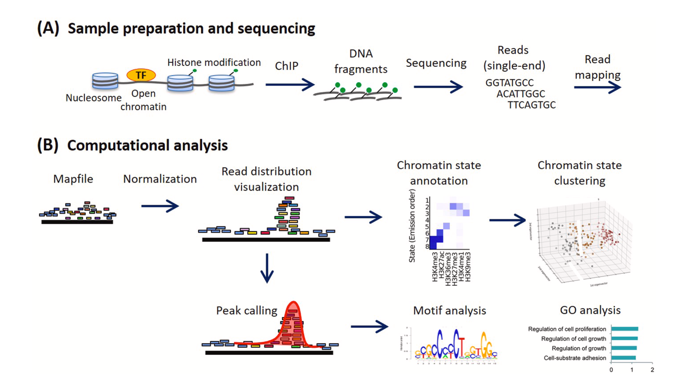
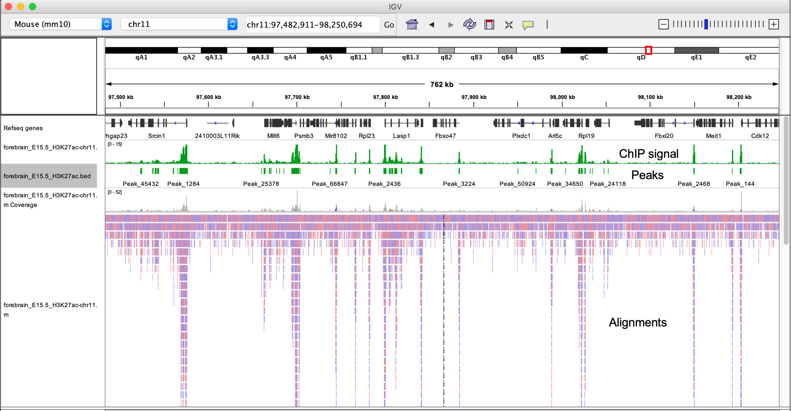
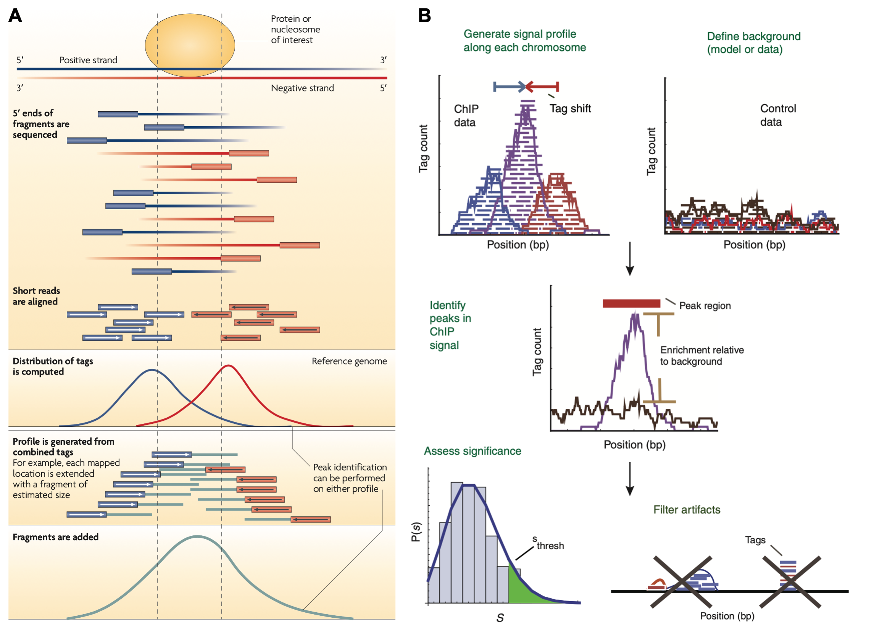
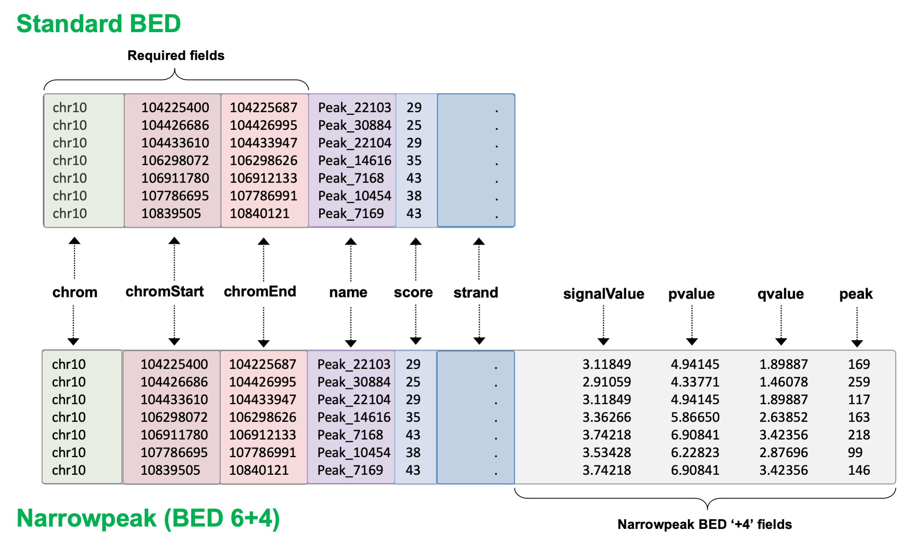
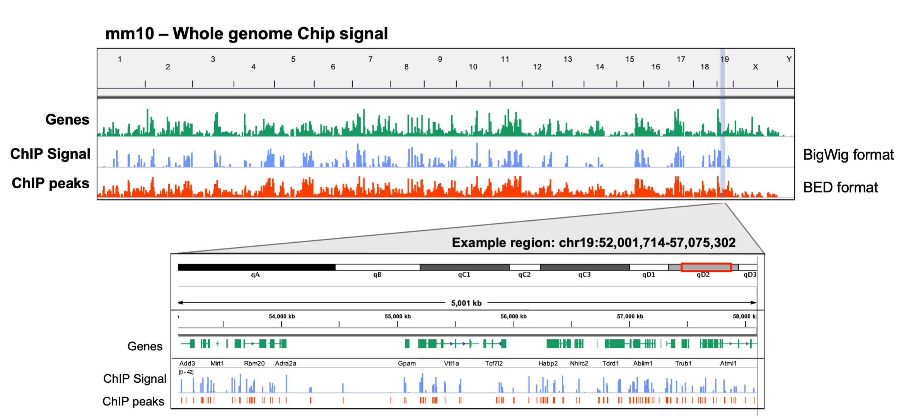
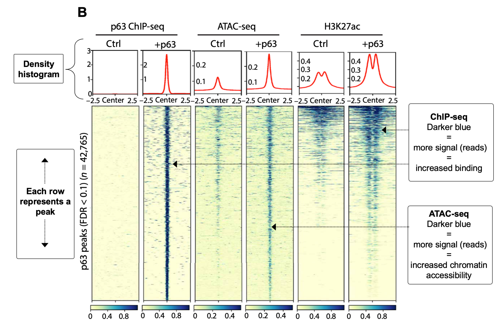

# Working with NGS data Part III

After aligning reads to a reference genome, there are a couple of different ways we can continue with the analysis, which are dependent on the data type.

**Read quantification:**
- When working with RNA-seq data for example, we are often interested in counting how many reads overlap each gene. This process, often referred to as *quantification*, allows us to infer the expression levels of individual genes.

**Peak calling:**
- Alternatively, in experiments where we have performed some sort of enrichment for genomic regions of interest (e.g. DNAase-seq, ChIP-seq, ATAC-seq), we are usually interested in identifying regions containing signal above some background level. This is referred to as *peak calling* and allows us to confidently identify the regions containing enriched signals, e.g. transcription-factor binding sites in a ChIP-seq experiment.

**Variant Calling:**
- Another downstream analysis is *variant calling*, or the process of determining which loci in the sequenced genome differ from the reference genome, or from another sample from the same experiment.  Calling variants, such as SNPs and insertions/deletions, can be used for purposes such as population-level genotyping or somatic mutation analysis.


In this lesson, we will briefly explore the fundamental concepts of *read quantification*, *peak calling*, and *variant calling*, while introducing useful software and relevant file formats for each.

---

## Read count quantification

For most downstream analyses in RNA-seq, especially differential expression, we care about how many reads aligned to a specific gene, as this tells us about the genes expression level, which we can then compare to other samples. Inherently, this means that we want to make these data count-based, so that we can use statistical models to compare these counts between experimental conditions of interest.

<p align="center">

</p>

> Although RNA-seq is the most common scenario where read counting is performed, read counting is relevant in the analysis of other genomic data types. For example, in ChIP-seq we often want to perform a differential binding analysis between two or more conditions, which requires us to count how many reads overlap each of our called peaks.

Read quantification methods generally require two inputs:  
- an alignment file (.bam)
- a set of features over which to count (e.g. GTF/GFF).

Recall that a GTF/GFF file is used to store genome annotation data, therefore contains the coordinates over all of the exons that we want to count reads.


The most simplistic methods (e.g. [htseq-count](https://htseq.readthedocs.io/en/release_0.11.1/count.html), [featureCounts](http://subread.sourceforge.net/)) use a specific set of rules to count the number of reads overlapping specific features. These are a good choice if your data is less complex, e.g. 3'-end data. More complex methods such as [RSEM](https://deweylab.github.io/RSEM/)), determines the probability that a read should be counted for a particular feature.

As an example, lets use [htseq-count](https://htseq.readthedocs.io/en/release_0.11.1/count.html) to quantify reads for an alignment we created in the previous lesson. Some important options in *htseq-count* include:

**Feature type (`-t`):**  
Specifies the feature in your GTF file you want to count over (3rd column). The default is **exon**. However, this can be changed to any feature in your GTF file, so theoretically can be used to count any feature you have annotated.

**Strandedness (`-s`):**  
Specifies if reads in your experiment come from a stranded (`yes`) or unstranded (`no`) library type. It is critical to set this correctly, as incorrect selection will result in needlessesly throwing away 50% of your reads.  

```r
# go to your scratch dir 
biow

# make a new directory to store your data in
mkdir quantification
cd quantification

# quantify reads that map to exons (default)
htseq-count \
	-f bam \
	-s no \
	-r pos \
	../aligned/SRR1039508.Aligned.sortedByCoord.out.bam \
	/dartfs-hpc/scratch/fund_of_bioinfo/ref/Homo_sapiens.GRCh38.97.chr20.gtf > SRR1039508.htseq-counts
```

Have a look at the resulting file.
```bash
# how many lines
wc -l SRR1039508.htseq-counts

# first few rows
head SRR1039508.htseq-counts

# importantly, lets check the last few rows as these contain some important info
tail -n 12 SRR1039508.htseq-counts
```

This process can be repeated for each sample in your dataset, and the resulting files compiled to generate a matrix of raw read counts that serve as input to downstream analysis (e.g. differential expression or binding analysis).


---

## Peak calling

In contrast to RNA-seq experiments, we are sometimes more concerned with identification of genomic regions that are enriched with aligned reads, rather than quantifying read numbers overlapping genomic features like exons. This is the case in ChIP-seq experiments, where we have used an antibody to enrich our sample for DNA bound to a specific protein, then perform sequencing to determine the location of these bound sites at a genome-wide level.

<p align="center">

</p>

Adapted from [Nakato & Sakata, *Methods*, 2020](https://www.sciencedirect.com/science/article/pii/S1046202320300591)

After sequencing the enriched regions of DNA and mapping them to a reference genome, we use statistical approaches to model the distribution of reads compared to those of a background sample (e.g. input DNA or IgG IP) in order to identify regions that are truly enriched regions representing real binding sites. This process is referred to as **peak calling**. Some example ChIP-seq alignments are shown below. You can see that the pileups in read density correlate with the called peaks shown in the green annotation tracks.

<p align="center">

</p>

Alignments generated after mapping short reads from a ChIP-seq experiment to a reference genome generally show asymmetric distribution of reads on the +/- strand immediately around a binding site. By shifting these reads toward the middle, or extending them to the expected fragment length, we can generate a signal profile that is compared to the background signal from the control DNA sample using statistical models, ultimately assigning a probability value (*P*-value) to each peak.

<p align="center">

</p>


Part A has been adapted from [Park, *Nature Rev. Gen.*, 2009](https://www.nature.com/articles/nrg2641). Part B has been adapted from [Pepke et al, *Nature Methods*, 2009](https://www.nature.com/articles/nmeth.1371).


> While peak calling is typically associated with ChIP-seq, it is utilized in a growing number of genomic analysis workflows, especially in more recent years as the number of technologies being designed to profile various genomic features grows rapidly.

Below is an example a shell command line usage that you could use to call peaks with MACS2.  

*Do not run this is only an example*
```bash
macs2 callpeak \
	-t sample-1-chip.bam \
	-c sample-1-input.bam \
	-f BAM \
	-g 1.3e+8 \
	--outdir peaks
```

- `t` denotes the file containing enriched sequence tags/alignments
- `c` denotes the file containing control aignments, where no enrichment was performed
- `f` describes the file type of the inputs
- `g` is the total size of the genome
- `--outdir` the file path you want results to be written to

The peaks generated by MACS2 and other peak callers are stored using the **BED (Browser Extensible Data)** file format. BED files are text files used to store coordinates of genomic regions, and can be visualized directly in genome browsers such as UCSC and IGV. Three fields (columns) are required in BED files:
- chrom
- chromStart
- chromEnd

Nine additional optional fields can be provided to include additional information in a bed file. Other 'flavors' of BED files exist, that utilize several of the standard BED file format fields, as well as additional custom fields. `.narrowpeak` files are an example, and are referred to as a BED6+4 file format, as they use the first six columns of standard BED files with an additional 4 custom columns.

<p align="center">

</p>

The [UCSC website](https://genome.ucsc.edu/FAQ/FAQformat.html#format1) is an excellent resource for learning more about BED, narrowpeak, and other genomics file formats.

Lets briefly explore a BED file on the command line. We will use `heart_E15.5_H3K9ac.bed` located in the scratch directory:
```bash
# examine the head and tail of the file
head -n 10 /dartfs-hpc/scratch/fund_of_bioinfo/bed_files/heart_E15.5_H3K9ac.bed
tail -n 10 /dartfs-hpc/scratch/fund_of_bioinfo/bed_files/heart_E15.5_H3K9ac.bed

# count number of regions in the file
wc -l head -n 10 /dartfs-hpc/scratch/fund_of_bioinfo/bed_files/heart_E15.5_H3K9ac.bed
```

**Note:** The settings and options used to perform peak calling appropriately are dependent on the data you have (e.g. ChIP-seq, ATAC-seq, etc.) and the type of peak you are hoping to detect. TFs usually form narrow punctuate peaks but other marks, such as histone marks, typically form broader peaks, and can require different settings to accurately detect.

After a set of peak regions have been defined, read quantification can be performed over these regions, since these count data can be used as input to a differential binding analysis (ChIP-seq) or a differential accessibility analysis (ATAC-seq), to identify peaks unique to an experimental condition.


### Visualizing signal of enriched sequence tags (alignments)

In analyses where you have identified a set of called peaks representing regions with  signal significantly above the background level, it can be useful to visualize extent of the signal in those peak regions, in order to gain an idea of **how enriched** above background the signal in those regions was.

Visualization of signal track data is usually achieved by converting alignment files (.BAM format) into a **bigWig** file, an indexed binary file format used to store dense continuous data (i.e. signal) over a large set of coordinates that can be viewed as a graph. These features make bigWig files a very efficient way to visualize read density/signal for any type of high-throughput genomics data.

bigWig files can be constructed from the *wiggle (Wig)* or *bedGraph* file formats, both of which are also used to store dense continuous data. bigWig, Wig, and bedGraph files formats are all described in more detail on the [UCSC website](http://genome.ucsc.edu/goldenPath/help/bigWig.html).

<p align="center">

</p>

> For the purposes of this workshop, we only need understand the idea behind of bigwig files and what they are used for. We hope to address their generation and use in more detail in future workshops.

Bigwig file data essentially describes all positions in the reference genome, thus we can use them to evaluate signal across many genomic loci simultaneously. One common example is to plot the signal directly upstream and downstream of the called peaks. As you can see in the example below, such analysis is not limited to ChIP-seq, and could instead represent Tn5 insertions in an ATAC-seq experiment, for example.

<p align="center">

</p>

Adapted from Figure 1 of [Lin-Shiao *et al*, 2019, *Science Advances*](https://advances.sciencemag.org/content/5/5/eaaw0946)


---

## Variant calling

Following an experiment such as Whole Genome Sequencing or Exome Sequencing and subsequent read alignment, a common next step is calling the variants in each sample.  *Variants* are locations in the sequenced samples where the sequenced reads differ from the reference genome to which they have been aligned.  

Common software for variant calling includes Genome Analysis Toolkit, Mutect, Freebayes, Varscan, and Strelka.  The purpose of these softwares is to determine which variants are real, or which might be artifacts of sequencing error or alignment error, and output a score associated with that determination.  Any of these variant callers will require as input an aligned BAM file and a reference genome file.  Some expected optional parameters might be a list of sites to mask (such as known repetitive sites in the genome or known germline variants in a population), the expected ploidy of the sequenced sample, or a GTF file for annotating the genome context of each variant.

The standard file format output by variant callers is Variant Call Format, or VCF, which is a tabular format containing the genomic location of each variant and the level of evidence for it in each sample, as well as a header describing the construction of the file.

<p align="center">

</p>

After variant calling is performed and a confident set of variants is determined for each sample, some downstream analyses could include comparing variants found in tumor vs. normal pairs, variants found in resistant vs. non-resistant cell lines, or stastical analysis of the presence of variants in any case-control disease populations.
