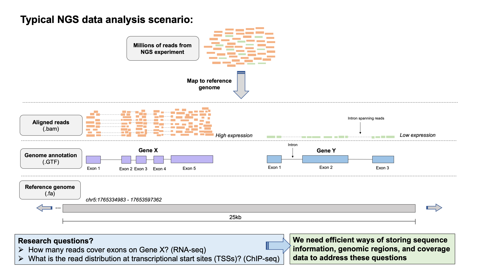
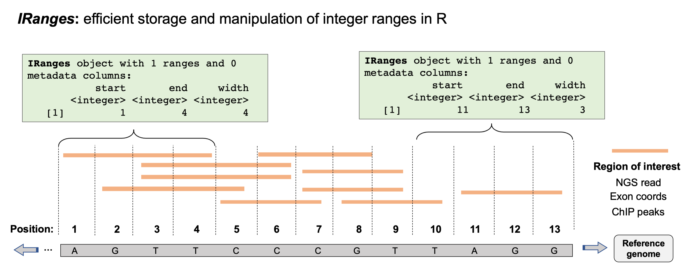
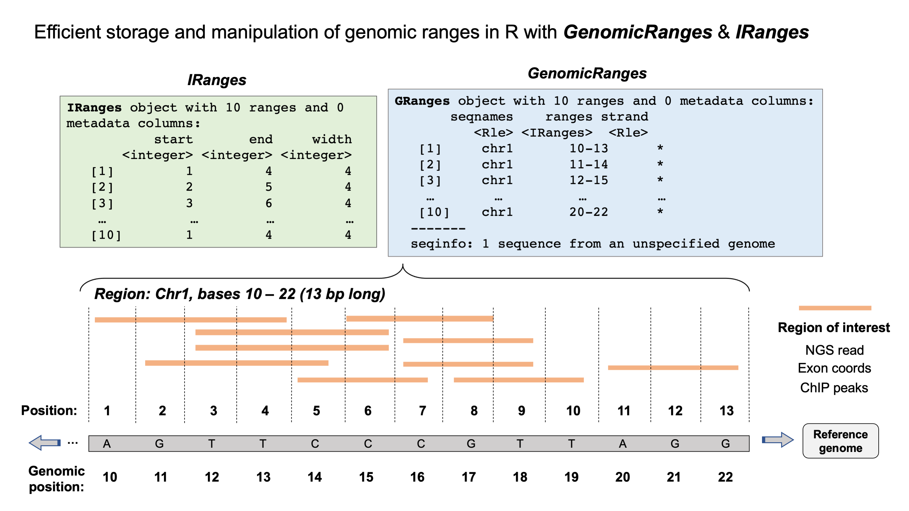
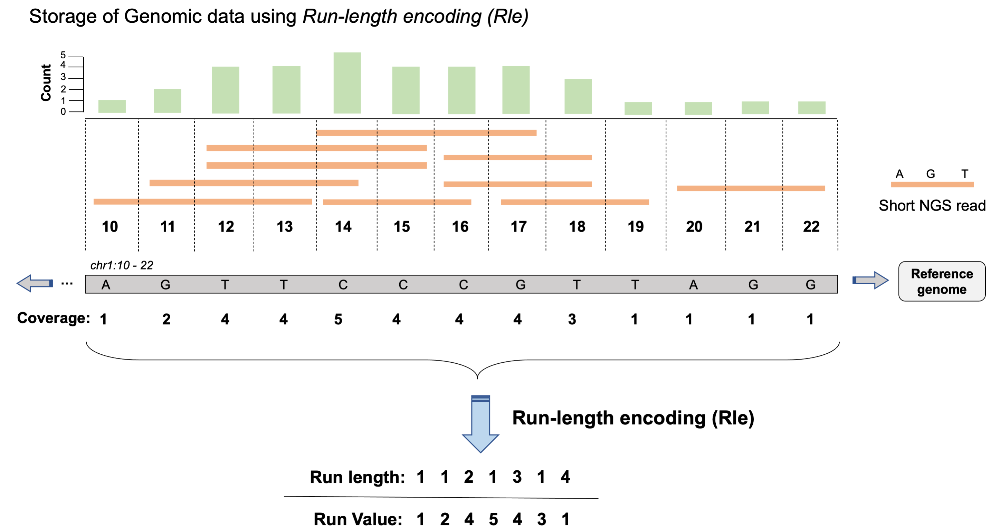
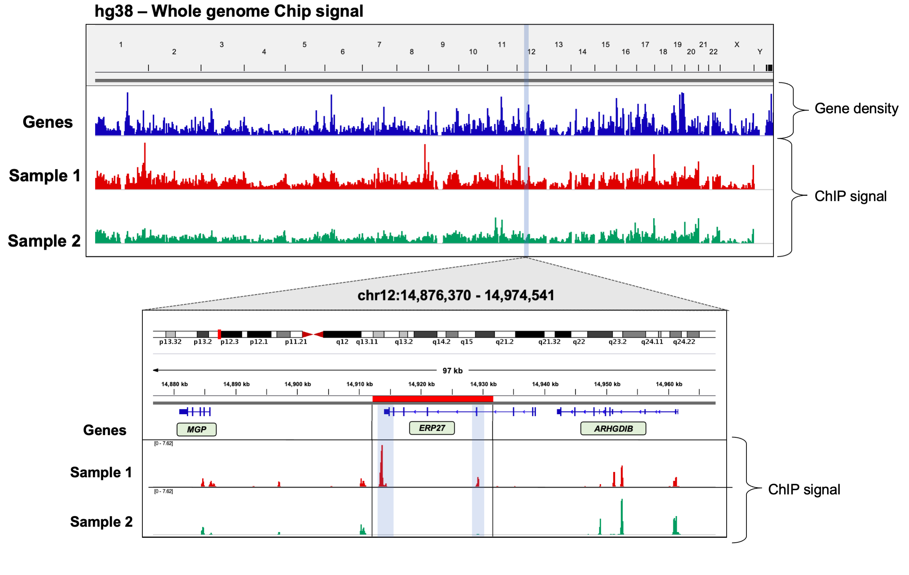
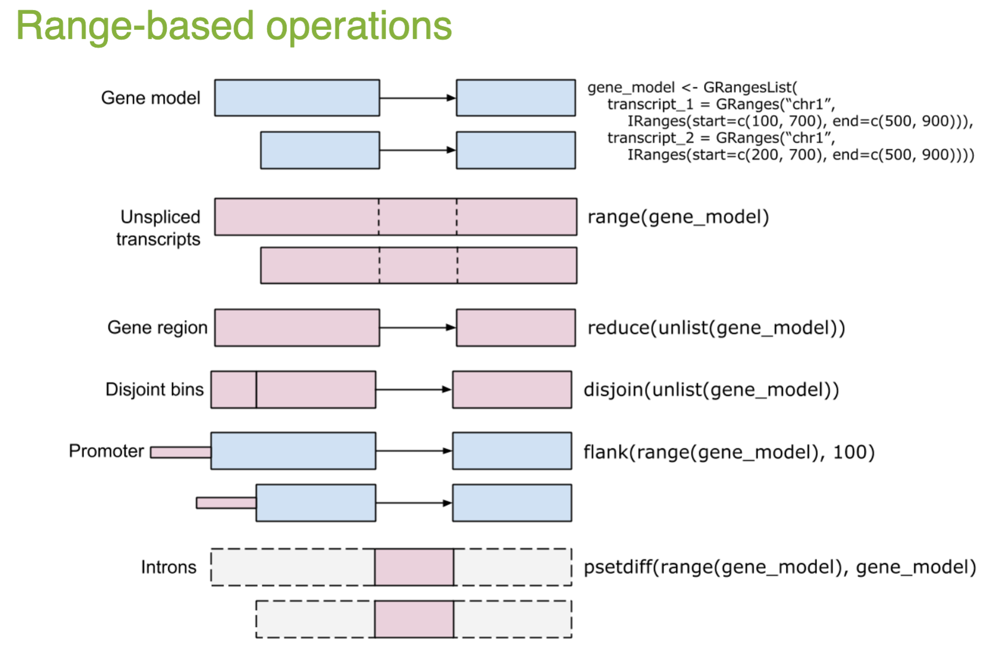

# Part 1 -  Genomic data analysis in R




By far the largest advantage to using R to perform specific stages of genomic data analysis are the large number of packages available that facilitate efficient analysis of high-throughput data. In particular, [**Bioconductor**](https://www.bioconductor.org/) is an open source project that provides a wide-range of data analysis software packages implemented in the R environment. Bioconductor packages introduce several particuarly useful object classes and methods that provide effecient storage of, access to, and maniuplation of various forms of genomics and high throughput sequencing data. 

BioConductor packages are especially noteworthy for their high level of integration and use of common object classes, making cross-compatibility of many Bioconductor packages very easy, as well as allowing previous packages to be utilized by subsequently developed packages. Applications of BioConductor packages range from simple data representation utilities to full implementations of complex statistical methodologies developed for the analysis of specfic types of genomics data. 


Explore available package on the [Bioconductor website](https://www.bioconductor.org/) and browse their Vigenettes to get an idea for the range of software available. The table below provides examples of some important BioConductor packages organized by their application/utility, as well as some more specific examples designed for analysis of specific data-types. 

**Key *Bioconductor* packages by utility.**

**Applications/utility** | **Packages**
-------|-------
Data representation | IRanges, GenomicRanges, GenomicFeatures, BioStrings, BSGenome, SummarizedExperiment
File handling & manipulation | *rtracklayer*, *BioStrings*, *ShortRead*, *Rsamtools*
RNA-seq | *DESeq2*, *edgeR*, *DEXSeq*. *EDAseq*
ChIP-seq | *ChIPseeker*, *ChIPpeakAnno*, *DiffBind*, *ChIPQC*, *TFBStools*
DNA methylation | *minfi*, *methylKit*, *ENmix*, *BiSeq*, *ELMER*
Varaint analysis | *VariantAnnotation*, *maftools*, *VariantFiltering*, *ensemblVEP*
Metagenomics | *decontam*, *philr*, *metavizr*, *BDMMAcorrect*
Single-cell analysis | *SingleCellExperiment*, *scater* *scran*, *SingleR*, *DropletUtils*
Genomic visualiuzation | *rtracklayer*, *ggbio*, *Gviz*, *clusterProfiler*, *genomation*
Genomic annotation | *GenomeInfoDB*, *TxDb*, *AnnotationHub*, *org.X.db*, *BioMart*
Gene ontology analysis | *GO.db*, *DO.db*, *rGREAT*, *fGSEA*, *clusterProfiler*, *GSVA*

#### Installing & loading Bioconductor packages 

The `Biocmanager` package, and specifically its function `BiocManager::install()` is used to install Bioconductor packages, essentially replacing `install.packages` which is used for installing *CRAN* packages. 
```{r}
install.packages('BiocManager')
BiocManager::install()
```

Bioconductor packages can then be loaded like regular R-packages: 
```
library(IRanges); library(GenomicRanges)
```

#### Handling genomic regions with Bioconductor




[GenomicRanges](https://bioconductor.org/packages/release/bioc/html/GenomicRanges.html) is an extremely useful package from the BioConductor project for working with genomic regions and coordinates in R, and lies at the core of numerous other BioConductor packages such as [BSgenome](https://bioconductor.org/packages/release/bioc/html/BSgenome.html), [rtracklayer](https://bioconductor.org/packages/release/bioc/html/rtracklayer.html) and [VariantAnnotation](https://bioconductor.org/packages/release/bioc/html/VariantAnnotation.html). 




#### Using coverage & signal track data with Bioconductor  

##### The IRanges package 

As discussed above, various types NGS assays may result in a specific set of regions of interest for further downstream analysis. For example, coding regions in RNA-seq, transcription-factor signal peaks in ChIP-seq, or accessible chromatin in ATAC-seq. Being able to store, query, and manipulate genomic regions in critical in facilitating downstream analysis of these regions. 

The *IRanges* package provides an efficient way to achieve these tasks on basic sets of integer ranges. The *GenomicsRanges* package then builds upon the IRanges functionaility to enable storage and manipulation of genomic regions on annotated sequences (chromosomes). in the below example, you can see an example set of regions on chromosome 1 of the human genome. These regions could be anything of interest, e.g. and NGS read, exon coordinates, TF peaks. 

For the purposes of IRanges however, simply consider them as a set of integer regions. In the figure, we can see how these would be specified in R if we used the `IRanges()` constructor function to generate an `IRanges` class object of the integer regions shown in orange. Each object shows that each region has a `start`, `end` and `width`. 

We could construct these two regions with the following code: 
```
# 1st region
IRanges(start = c(1), width = 4)

# 2nd region 
IRanges(start = c(11), width = 3)
```

*IRanges* objects can contain mutiple regions, which we could have contructed for these regions like this: 
```
ir <- IRanges(start = c(1,11), width = c(4, 3))
ir
```

IRanges provides numerous functions for operating on and maniuplating these regions. For example, the functions `shift()`, `narrow()`, and `resize()` for adjusting start, end and width sizes of regions stored in an `Iranges` object. Lets work through a couple of examples: 
```
# shift all of the regions by a specified offset 
shift(ir, 2)

# resize all regions to only the integer at the center of each region 
resize(ir, fix="center", width=1)
```

Lets contruct an *Iranges* class object that contains all of the integer regions shown in the figure above (normally, these regions would be defined by your data, so you wouldn't need to do this step, but it is helpful to understand). 
```
ir <- IRanges(start = c(1,2,3,3,5,6,7,7,8,11), 
              width = c(4,4,4,4,3,3,3,3,3,3))
ir
``` 

##### The GenomicRanges package 

The *GenomicRanges* package extends the functionality introduced by IRanges to allow for analysis of genomic regions within the Bioconductor framework, and severs as a foundation for accessing and manipulating genomic regions for other BioConductor packages, some of which we will discuss (e.g. *rtracklayer*, *BSGenome*, *GenomicAlignments*). 

At the core of the package is the *GRanges* class, which is analogous to the IRanges class but specifies genomic ranges denoted by a start, and end on a specific sequence (e.g. a chromosome). Lets construct a `GRanges` object for the ranges shown in the figure. 

```
gr <- GRanges(
    seqnames = rep("chr1", 10),
    ranges = IRanges(start = c(1,2,3,3,5,6,7,7,8,11), width = c(4,4,4,4,3,3,3,3,3,3)),
    names = paste0("r", "-", seq(1,10)),
    strand = c(rep("+", 2), rep("-", 3), rep("*", 3), rep("+", 2)),
    score = rnorm(10,5,2))
gr

# return the region ranges only 
granges(gr)

# return the strand info for all regions 
strand(gr)

# return teh region names  
names()

# extract the metadata columns 
mcols()
```

Now lets imagine that these regions all represent sequencing reads in an NGS experiment. A common analytical task to perform on these regions would be to ask *what is the read coverage at each genomic position*. The `coverage` function provides a convient way to address this question, by returning a vector that indicates the frequency of reads overlapping each of the genomic positions. 
```
# calculate coverage of each base over this genomic region 
coverage(gr)

# perhaps we are only interested in the regions on the + strand 
coverage(gr[strand(gr)=="+"])

# 
sum(coverage(gr))
```

Expecting a regular numerical vector? That might be OK in our small toy example here, but imagine we need to do this for regions covering an entire genome. The object size would quickly become extremely large and require significant amounts of computational memory to handle. Instead, *GenomicRanges* leverages functionaility inrtoduced by *IRanges* to compress this sort of data through a process called **Run-length encoding (RLE)**. RLE is an efficient form of data compression for instances where we have long vectors with *runs* of numbers that might be the same. Consider the example below: 



*RLE* is an especially efficient way of storing genomics data since there are often streches of repeated values in the final data representation, and often long streches of sequences are not considered in an experiment (e.g. non-coding regions in RNA-seq) so we shouldn't waste space storing information on those positions. RLE is emplyed in the BIGWIG file format to allow efficient storage and access to signal track data against a reference genome. Consider the below example in the context of a ChIP-seq experiment. 





GRanges objects can be indexed similar to regular objects in R, their intervals can be manipulating using the same functions introduced above for IRanges objects, and queried/manipulated using additional method functions available in the GenomicRanges package. Lets explore some of these. 
```
# index GRange object for specific elements 
gr[1]
gr[[1]]
gr[1][["r-1"]]

# view the top X regions of interest 
head(gr, n=5)

# view the top X regions with scores greater than a value of interest 
head(gr[score(gr)>4], n=5)
```

There are also numerous range-based operations can be performed on GRanges objects using functionality implemented through IRanges, and can be used to manipulate the original regions in almost ay way you desire. 


**Image source:** [GRanges tutorial](https://www.bioconductor.org/help/course-materials/2015/SeattleApr2015/B_GenomicRanges.html))

Lets try a few out on our GRanges object: 
```
# shift all regions 5bp 
shift(gr, 5)

# resize all regions by requiring them to be 5bp wide 
resize(gr, 5)

# reduce the regions to one simplified set of non-overlapping regions 
reduce(gr)
```

### Working with multiple GRanges objects  

Now that we understand the basics of the IRanges and GenomicRanges packages, lets load in some real data as GRanges objects and perform some basic analysis tasks with them. We will be using ChIP-seq data from a recent study of the chromatin landscape in the developing mouse (Gorkin *et al*, *Nature*, 2020)[https://www.nature.com/articles/s41586-020-2093-3], published as part of the (ENCODE (Encyclopedia of DNA Elements) project)[https://www.encodeproject.org/]. 

In this study, the autors generate an atlas of the dynamic chromatin landscape at various time points during mouse embryonic development, conducting over 1100 ChIP-seq experiments and 132 ATAC-seq experiments spanning 72 stages of development in various tissues. We will use a small subset of this data to demonstrate how the GenomicRanges package can be used to explore this type of data, as well as compare and contrast between samples. 


In particular, we will use ChIP-seq data generated in immunoprecipation experiments for several histone modifications, whose presence and absence can be used to infer the functional state of chromatin at specific loci (e.g. active transcription, enhancers, heterochromatin). Namely, we will start by contrasting the locations of ChIP-seq peaks for two chromatin marks between forebrain and heart tissues in the developing mouse: 
- **H3K27ac** - acetylation at the 27th lysine residue of histone H3
- **H3K9ac** - acetylation at the 9th lysine residue of histone H3


Both H3K27ac and H3K9ac are known to be found at regions of active chromatin and particularly enhancers, therefore by comparing their distribution across forebrain and heart tissues at a soecific stage of development (E15.5), we can gain insight into which regions of the mouse genome are important for tissue-specific development. 

To make things easier, we have downloaded the called peaks (in broadpeak format) for you from the (ENCODE website) [https://www.encodeproject.org/], therefore the first thing we need to do is read these data into R. Since broadpeak files are a form of extended BED file, we can use functions from the `rtracklayer` package to read them into our current session. 
```
# we need to establish a vector describing what the extra extended BED columns are
extraCols_narrowPeak <- c(signalValue = "numeric", pValue = "numeric",
                          qValue = "numeric", peak = "integer")
# Note: if we had a reglar BED file (no extended fields) we could ignore the extraCols argument

# use the import() function to read in the peaks called in the forebrain H3K27ac ChIP-seq
fr_h3k27ac <- rtracklayer::import("forebrain_E15.5_H3K27ac.bed", 
                                  format = "BED", 
                                  extraCols = extraCols_narrowPeak,
                                  genome = "mm10")
                                  
# do the same for the heart H3K27ac ChIP-seq peaks 
ht_h3k27ac <- rtracklayer::import("heart_E15.5_H3K27ac.bed", 
                                  format = "BED", 
                                  extraCols = extraCols_narrowPeak, 
                                  genome = "mm10")

# print both GRanges objects to get an idea for their contents 
fr_h3k27ac
ht_h3k27ac

# check their lengths 
length(fr_h3k27ac)
length(ht_h3k27ac)
```

Now that we have loaded in the H3K27ac ChIP-seq peaks, we want to get a basic idea of how these peaks overlap, which tells us about how similar the chromatin states are between forebrain and heart tissue in the developing mouse at E15.5. GenomicRanges has specific functionality for doing this sort of analysis. 
```
# use findOverlaps() to return matches of genomic ranges between a 'query' and a 'subject'
overlaps <- findOverlaps(query = fr_h3k27ac, subject = ht_h3k27ac)
overlaps

# subset the forebrain GRanges object for H3K27ac peaks that overlap with peaks in heart
fr_h3k27ac_ov1 <- fr_h3k27ac[queryHits(overlaps)]
fr_h3k27ac_ov1

# and vice versa for heart with forebrain 
ht_h3k27ac_ov1 <- ht_h3k27ac[subjectHits(overlaps)]
ht_h3k27ac_ov1

# use these objects to calculate the % of overlapping peaks between 
length(fr_h3k27ac_ov1)/length(fr_h3k27ac)*100
length(ht_h3k27ac_ov1)/length(ht_h3k27ac)*100

# we could directly subset for the overlapping peaks using subsetByOverlaps()
subsetByOverlaps(fr_h3k27ac, heart_h3k27ac)

# alternatively, we could get the H3K27ac peaks that are unique to each tissue  
#### forebrain
fr_h3k27ac_uniq1 <- fr_h3k27ac[-queryHits(overlaps)]
fr_h3k27ac_uniq1

#### heart 
fr_h3k27ac_uniq1 <- fr_h3k27ac[-queryHits(overlaps)]
fr_h3k27ac_uniq1
```

Now lets read in the peaks for H3K9ac in both forebrain and heart. To help keep the objects in our R environment organized, we can use another class available in GenomicRanges, the `GRangesList` class, which allows us to store multiple Granges objects in a list. This makes sense to do for our analysis, as we have multiple sets of peaks for each tissue that we want to be in our R environment. 
```
# forebrain H3K9ac ChIP-seq peaks
fr_h3k9ac <- rtracklayer::import("forebrain_E15.5_H3K9ac.bed", 
                                  format = "BED", 
                                  extraCols = extraCols_narrowPeak,
                                  genome = "mm10")
                                  
# heart H3K9ac ChIP-seq peaks 
ht_h3k9ac <- rtracklayer::import("heart_E15.5_H3K9ac.bed", 
                                  format = "BED", 
                                  extraCols = extraCols_narrowPeak, 
                                  genome = "mm10")

# combine with H3K27ac peak sets to make GrangesList objects 
fr <- GRangesList("h3K27ac" = fr_h3k27ac, "h3K9ac" = fr_h3k9ac)
ht <- GRangesList("h3K27ac" = ht_h3k27ac, "h3K9ac" = ht_h3k9ac)

# have a look at them 
fr
ht

# check their length
length(fr)
length(ht)

# explore individual elements of the list
fr[[1]]
fr[[2]]
length(fr[[1]])
length(fr[[2]])
```

We can use the GRangesLists to explore the overlap between marks within a given tissue, using the same approach with the `findOverlaps()` function as we did above. 
```
# subset for overlapping regions within the forebrain peaks, across both histone marks 
fr_overlaps <- findOverlaps(query = fr$h3K27ac, subject = fr$h3K9ac)
fr_overlaps

# subset the forebrain H3K27ac GRanges for peaks overlapping with firebrain H3K9ac peaks
fr_h3k27ac_ov_h3K9ac <- fr$h3K27ac[queryHits(fr_overlaps)]

# calculate % overlapping peaks based on all forebrain H3K27ac peaks
length(fr_h3k27ac_ov_h3K9ac)/length(fr$h3K27ac)*100

# do the same for heart
ht_overlaps <- findOverlaps(query = ht$h3K27ac, subject = ht$h3K9ac)
ht_h3k27ac_ov_h3K9ac <- ht$h3K27ac[queryHits(ht_overlaps)]
length(ht_h3k27ac_ov_h3K9ac)/length(ht$h3K27ac)*100
```

You could also obtain the overlapping regions between histone marks within each tissue more directly using the `susetByOverlaps()` function:
```
fr_ov2 <- subsetByOverlaps(fr$h3K27ac, fr$h3K9ac)
fr_ov2

ht_ov2 <- subsetByOverlaps(ht$h3K27ac, ht$h3K9ac)
ht_ov2
```

Comparing the % of overlap for H3K27ac and H3K9ac in both tissues, we can see that there is quite a lot of overlap, but also still a lot of regions that don't overlap. This may suggest that these two histone marks also have independent roles in defining functional regions of chromatin. Indeed, the *ENCODE project* and *(Roadmap Epigenomics project)[http://www.roadmapepigenomics.org/]* use a complex statistical model to learn chromatin states and functionally annotate genomes based on ChIP-seq from several chromatin marks (called (ChromHMM)[https://www.nature.com/articles/nprot.2017.124]) for their sets of comprehensive consolidated epigenomes. 

### Visualization 

Bioconductor (and many packages outside Bioconductor) provide packages with extensive functionality for plotting genomics data, especially for data stored with GRanges class objects. One useful package is `GViz` which includes a diverse array of functionality for producing complex plot of genomics data. Especially useful, are the functionalities in Gviz that allow you to plot *'tracks'* that correspond to data from one sample or observation type (e.g. forebrain H3K27ac peaks), just as you might use view them in a genome browser. 

Lets use `Gviz` to create a simple visualization of a specific genomic region, so that we can compare the peaks present for H3K27ac in forebrain and heart within that region. 
```
# create an annotation track from the Granges object for H3K27ac
fr_h3k27ac_track <- AnnotationTrack(fr$h3K27ac, chromosome = "chr17", start = 9e6, end = 10e6,
                         name = "Forebrain - H3K27ac", stacking = "dense", col = "indianred")

# do the same for heart H3K27ac
hr_h3k27ac_track <- AnnotationTrack(he$h3K27ac, chromosome = "chr17", start = 9e6, end = 10e6,
                         name = "Heart - H3K27ac", stacking = "dense", col = "cornflowblue")
                   
# create a genomic axis object to add to plot 
gtrack <- GenomeAxisTrack()

# plot the tracks for this region 
plotTracks(list(gtrack, fr_h3k27ac_track, hr_h3k9ac_track), from = 9e6, to = 10e6)
```

!()[../figures/fr-ht-h3k27ac-chr17.png]

Clearly the peaks are distributed differently over this region of chromosome 17, supporting the notion that the regions of functional chromatin differ between forebrain and heart tissue in the developing mouse embryo at E15.5. However, this plot isn't really that useful to us if we don't have any genome annotation to go with it. For example, which genes are the peaks near? Are the peaks mostly located within gene bodies, or are they intergenic? 

In order to address these questions, we need to pull in some annotation data for the mouse genome. Fortunately, Bioconductor has very extensive functionality in the form of various packages specifcally devoted to genome annotation, and interface with public databases like *UCSC*, *Ensembl*, and *NCBI* to obtain the most up to date reference data available. **This will be the focus of our next lesson**. 

**Practical note:** Generally, I would not explore a new dataset using Bioconductor-based visualization packages. When I am interested in exploring the data visually and/or am interested in a specific region or gene, I will use a genome browser like *IGV* to do this. This is much faster and easier and requires no coding. However, the real utility of packages like `Gviz` is that they provide a comprehensive and flexible way to display data in numerous ways not possible in standard genome browsers, and also provide a way to produce plots for numerous regions of interest programmatically. 

### Additional considerations:  
- There are numerous ways to perform the sorts of tasks that we did in this lesson, both within and outside of R. For example, (**BEDTools**)[https://bedtools.readthedocs.io/en/latest/], described as "the swiss-army knife for genomic-arithmetic" allows you to intersect, subset, merge, count, and manipulate genomic regions directly from the UNIX command line for several file formats (BED, GFF/GTF, VCF). Alternatively, (**Biopython**)[https://biopython.org/] provides similar functionality from within python.  


- Whether you use *BEDTools*, *BioPython* or Bioconductor packages within R is dependent on what you are doing and what you need to do next. For example, if you will be needing functionality from other Bioconductor packages after analysing the overlap between sets of genomic regions, you may choose to use R/Bioconductor. If you simply need to intersect two BED files to make a third that reflects the intersection for inout into another UNIX-based software, you could use BEDTools.   

- This lesson is not intended to be a comprehensive introduction to the complete functionality of any of the packages discussed here, and would be impossible to achieve in the time we have. This lesson is based off of similar exercises available from far more comprehsnive vigenettes and documentation at the Bioconductor webpages for each page. There is an enormous range of functionality available from these packages and I encourage you to use this lesson as a starting point to direct you toward these more comprehsnive resources. For example, the [BioConductor website](https://bioconductor.org/packages/release/bioc/html/GenomicRanges.html) for *GenomicRanges* provides an excellent vigentte of *GenomicRanges* HOWTOs, covering a wide range of common tasks when operating on genomic regions. 

