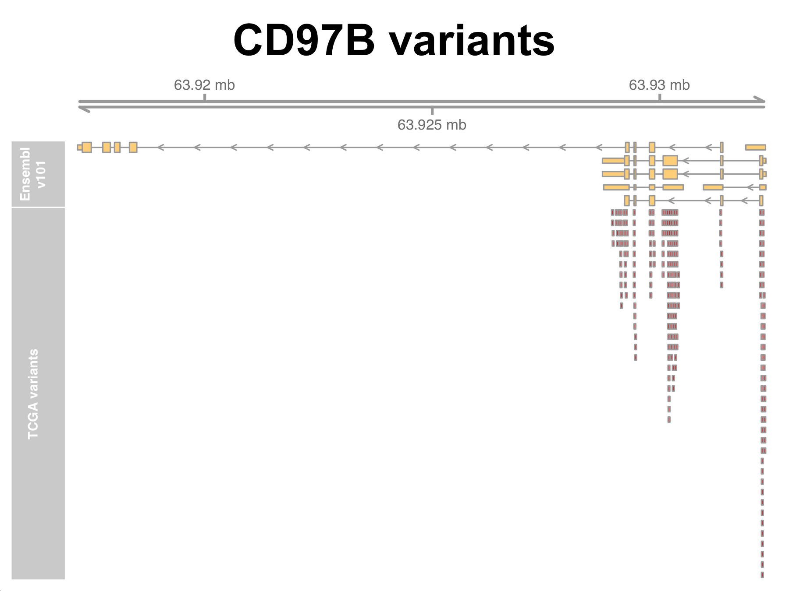
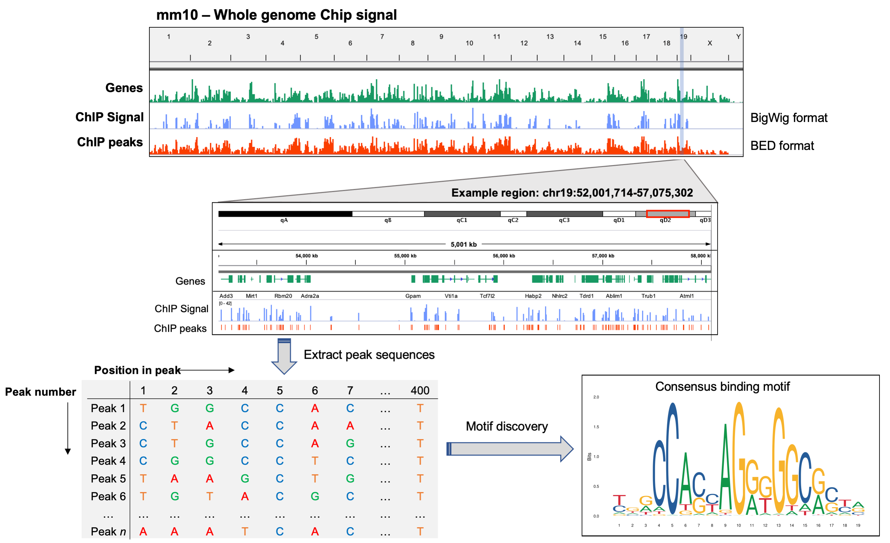

# Part 2 - Genome annotation in R/Bioconductor 

As discussed at the end of part 1, there are many instances in genomic data analysis where we will want to utilize publicly available genome annotation data. This is typically done toward the end of an analysis when you wish to learn more about the most significant results. Bioconductor provides an extensive set of annotation resources that provide access with a number of popular annotation databases (NCBI, Ensembl, GenBank, UniProt) as well as functionality that allows interaction with these data using common Bioconductor data structures (e.g. GRanges). 

Examples of common annotation tasks include:  
* Mapping unique gene identifiers (e.g. ENSEMBL or NCBI IDs) to gene symbols in an RNA-seq experiment 
* Annotate coding variants from a WGS/WES dataset based on transcriptional context (e.g. coding variants) for a specific genome annotation (e.g. Ensembl transcripts)
* Annotate the genomic context (e.g. promoter, intron, exon, intergenic), and obtain sequence information for, peaks from a ChIP- or ATAC-seq experiment (e.g. for motif analysis).

In this lesson, we will introduce the major Bioconductor packages for genome annotation and how you might use them to achieve common tasks in NGS data analysis. 

| **Package/package-family** | **Contents & uses**                                                |
|------------------------|-------------------------------------------------------------|
| *AnnotationDbi*      | Methods for accessing data from SQLite-based annotation packages |
| *GenomicFeatures*   | Methods for storing and manipulating transcriptome annotations using the *TxDb* object class  |
| *Org.X.db*               | Gene-based annotation for current genome versions, useful for mapping IDs, symbols and identifiers |
| *EnsDb.X.vX*   | Access to the most up-to-date transcriptome annotations directrly from Ensembl       |
| *biomaRT*   | Release-specific transcriptome annotations from Ensembl for any version or organism     |
| *BS.genome*              | Full sequences for common reference genomes                 |
| *genomation*             | annotation of genomic context and basic data visualization  |

In understanding the overall framework for how these packages work synergistercally to simplify the process of obtaining the annotation data you need, it is useful to distginuish the *annotation-centric* packages*, from the *method-centric* packages. 

*Annotation-centric* packages such as *Org.X.Db*, *EnsDb.X.vX*, *biomaRT*, and *BS.genome* are designed to provide access to specific annotations, e.g. Ensembl annotations for all organisms from a specific release, or access to legacy Ensembl genome annotations. 

*Method-centric* packages such as *AnnotationDbi* and *GenomicFeatures* provide functionality for convienient and efficient access to multiple databases, and do not focus on providing access to any one annotation resource alone. For example, *Org.X.DB*, *EnsDb.X.vX*, and *biomaRT* objects all inherit methods from *AnnotationDbi*, meaning that we can use these common methods to access data from different annotation packages (as we will see in this lesson). 

**Note:** Another *method-centric* package that we won't discuss here is [*AnnotationHub*](https://www.bioconductor.org/packages/release/bioc/html/AnnotationHub.html), which provides methods to query annotation data from a very large and diverse range of databases. 

### Mapping gene identifiers with *Org.X.DB*

OrgDb represents a family of Bioconductor packages that store gene identifiers from a numerous annotation databases (e.g. gene ontologies) for a wide range or organsisms. For example, `org.Hs.eg.db` loads the current annotations for human genes, `org.Mm.eg.db` for mouse, `org.Sc.sgd.db` for yeast, and so on. 

OrgDb packages also provide access to some basic additional annotation data such as membership in gene ontology groups. Just as we did in the last lesson, you can navigate through Bioconductor's package index to view all of the existing Org.X.db packages. 
[here](https://www.bioconductor.org/packages/release/BiocViews.html#___OrgDb)

It is worth noting that you are not loading annotation data for a specific genome build when using OrgDb packages (which should be obvious from the package names). OrgDb packages pertain to identifiers based on what are usually the most recent genome annotations since they are updated every few months. If you need annotations for an older build specifically, you may need to adopt a different approach than using OrgDb. 

Load the org.db package for the human genome:
```r
library(org.Hs.eg.db)
```

Once loaded, OrgDB allows access to the annotation data for the package you loaded through hidden objects that can be accessed using a set of common Org.Db functions. For example, we can access data from the `org.Hs.eg.db` package after loading it by using the hidden object *org.Hs.eg.db*. 
```r
org.Hs.eg.db

# what class is it
class(org.Hs.eg.db)

# what types of data can be extracted?
keytypes(org.Hs.eg.db)
```

OrgDb objects use the `keytypes()` method to access specific types of data from the annotation source. We can ask OrgDb to return a specific keytype that we are interested in. 
```r
# obtain all ENSEMBL IDs 
entrez.ids <- keys(org.Hs.eg.db, keytype="ENSEMBL")
head(entrez.ids)

# how many are there 
length(entrez.ids)
```

The situation we usually end up in however, is when we want to return a set of keytypes given one set of keytypes, for example, returning the gene symbol, entrez ID, and RefSeq ID from a list of Ensembl IDs. For thie we can use the `select()` method or `mapIds` method. 
```r
# use ensembl id of first 6 in entrez.ids to get desired keytypes
select(org.Hs.eg.db, keys = head(entrez.ids), columns = c("SYMBOL","ENTREZID", "REFSEQ"), keytype="ENSEMBL")

# using mapIds but only to get gene symbol 
mapIds(org.Hs.eg.db, keys = head(entrez.ids), column = c("SYMBOL"), keytype="ENSEMBL")
```

**Question:** When/why might we use `mapIds` over `select`?

### RNA-seq results annotation using OrgDb  

Lets apply this approach to annotate some real RNA-seq differential expression results. Start by reading in the data, currently stored in .csv format. 
```r
# read in data 
results <- read.csv("diff-exp-results.csv", stringsAsFactors = F, row.names = "ensembl")

# check the first few lines  
head(results) 
```

Now use mapIDs to obtain 1:1 mappings between the Ensembl ID and the gene symbol. 
```r
# using mapIds but only to get gene symbol 
gene.symbols <- mapIds(org.Hs.eg.db, keys = rownames(results), column = c("SYMBOL"), keytype="ENSEMBL")

# add to results 
results$symbol <- gene.symbols

# check the new results table 
head(results) 

# make sure there are no NAs..
table(is.na(results$symbol))
```

Uh Oh! There are lots of NAs, meaning many genes didn't have a symbol mapped to them... Turns out Org.Db is most built around **entrez IDs** and does not contain the annotations for many Ensembl genes, which includes a lot of non-coding RNAs like lincRNAs. Instead, we can use an Ensembl package, `EnsDb.Hsapiens.v86` to pull data directly from Ensembl. 

```r
library(EnsDb.Hsapiens.v86)
```

Now lets use `EnsDb.Hsapiens.v86` to retrieve annotation data for our genes and see how many missing genes occur. 

```r
# using mapIds but only to get gene symbol 
gene.symbols.2 <- mapIds(EnsDb.Hsapiens.v86, keys = head(entrez.ids), column = c("SYMBOL"), keytype="ENSEMBL")

# how long is it
length(gene.symbols.2)

# how many NAs
table(is.na(gene.symbols.2))
```

Many fewer NAs are identified, meaning we were able to annotate more of the genes in our dataset with gene symbols. There are still a few missing though, why might this be? 

To ensure we annotate all possible genes approrpiately, we need to make sure we are using annotation data from the genome annotation release that was used to determine read count quantification on our dataset (that is, the annotation used the define gene and exon boundaries for counting up reads and attributing them to each gene). 

For standard RNA-seq analyses, this is usually performed using a **GTF** file that contains all the gene model and annotation data for a specific release. These data were annotated using Ensembl verion **97** (which explains why the R-package based off of Ensembl v86 was not able to find matching symbols for all our Ensembl IDs) therefore we could read the GTF file directly into R and manually link ensembl IDs to gene symbols. 

However, the GTF file is pretty big, so it not really feasible for us to use that approach unless we take the time to download and store the file locally, or work on a HPC. Instead, we can download basic annotation data for Ensembl annotation releases using the BioMart resource through the Ensembl website. 

Lets go and download these data from the [Ensembl website](https://uswest.ensembl.org/index.html) together (remember that we need to download annotation data specifically for Ensembl v97, and the current version (as of Nov. 2020), which is the website default, is Ensembl v101). 

Now read this file into R:
```r
anno <- read.table("GRCh38.p12_ensembl-97.txt", sep="\t", header=TRUE, stringsAsFactors = F)

# check the first few rows and dimensions 
head(anno)
dim(anno)

# check how many Ensembl IDs overlap with our results 
table(anno$Gene.stable.ID %in% rownames(results))
table(rownames(results) %in% anno$Gene.stable.ID)

# lets rename the ensembl ID column in both datasets so that we can merge them together based on those IDs
colnames(anno)[1] <- "ensembl"
results$ensembl <- rownames(results)

results_merge <- merge(results, anno, by="ensembl")
head(results_merge)
table(is.na(z2$Gene.name))
```

Great! We now have gene symbols for all the genes in our dataset, and some additional annotation data integrated directly with our results. Save these data and send it to your PI! 
```r
write.csv(results_merge, file = "diff-exp-results-annotated.csv")
```

As we have seen, while the R-packages discussed above can present powerful and quick ways to access lots of annotation data (e.g. gene ontology etc.), there are some obvious limitations which are important to understand when you are annotating your own datasets. 

Using BioMart is also valuable if you need annotation data for a model organism that doesn't have an EnsDb or OrgDb R-package availble for it. 

If you want to access BioMart from within R, you can use the `BioMart` package to directly interface with the database. This can be a little slower than the approach described above, but can allow more flexibility depending on what you need annotation data for. 
```r
library(biomaRt)

# check available martslistMarts(), 10)
head(listMarts())
```

You can see the same marts are listed as were available from the BiomaRt website. We need to choose one of these marts in order to see the available annotation datasets that can be accessed from that mart. 
```r
# use 'ensembl to select the 'ENSEMBL_MART_ENSEMBL' mart 
ensembl <- useMart("ensembl")

# show available datasets to pull annotation data from 
head(listDatasets(ensembl), 10)
tail(listDatasets(ensembl), 10)
nrow(listDatasets(ensembl))

# check for human dataset 
table(listDatasets(ensembl)$dataset %in% "hsapiens_gene_ensembl")
```

Now select the `hsapiens_gene_ensembl` dataset from the mart and view the available *attributes* (values that can be returned, e.g. gene symbol) for that dataset. 
```r

# pick the ensembl mart for humans  
ensembl <- useMart("ensembl", dataset="hsapiens_gene_ensembl")

# list the attributes for this dataset 
head(listAttributes(ensembl), 10)
tail(listAttributes(ensembl), 10)
nrow(listAttributes(ensembl))
```

The flagship function of the BiomaRt package is `getBM()` (for get BiomaRt presumably) which means allows us to obtain specific data (attributes) given a set of values that we provide (e.g. Ensembl IDs). The process is very similar to how we used the `select()` and `mapIDs()` functions from OrgDb. Lets use `getBM()` to return annotation data from BiomaRt for our RNA-seq data. 
```r
# submit query for 1st 2000 genes (to save time in class) in our RNAseq results
anno_bm <- getBM(attributes=c("ensembl_gene_id", "hgnc_symbol", "chromosome_name", "start_position", "end_position", "strand"),
                 filters = "ensembl_gene_id",
                 values = head(results$ensembl, 2000), 
                 mart = ensembl)
head(anno_bm, 10)
```

You can see we now have a `data.frame` stored in anno_BM in our environment that looks similar to the text file that we downloiaded directly from biomaRt and read into R. You could follow a similar protocol to that which we performed to merge the BiomaRt data downloaded in the text file with our RNA-seq results. 

---

### Leverging transcript-specific data with Bioconductor 

Another useful core Bioconductor package is the `GenomicFeatures` package, which implements the `TxDb` object class, and provides a convienient and efficient way to store and access transcript specific data from a genome annotation. `TxDb` objects store a wide-range of transcript-specific information including coordinates and sequences for promoters, exons, introns, and untranslated regions (UTRs). 

`TxDB` objects for common genome annotations can be loaded directly by calling the corresponding annotation package. We can view the available `TxDb` packages by going to the Bioconductor website and using the search tool. Lets start by loading the `TxDb` package for the human genome and having a look at the contents. 
```r
library(TxDb.Hsapiens.UCSC.hg38.knownGene)

# assign to txdb variable 
txdb <- TxDb.Hsapiens.UCSC.hg38.knownGene
txdb
```

You can see this available `TxDb` object is for gene annotations generated under the UCSC annotation pipeline. What if your genome is not included in the available `TxDb` packages, for example, if we wanted to continue using an Ensembl annotation? Or perhaps there is no pre-constructed `TxDb` object avaialble for your organism. `GenomicFeatures` provides a number of function specifically to address these issues, for example:  
* makeTxDbFromEnsembl() - Contsrtuct a TxDb object from Ensembl
* makeTxDbPackageFromBiomaRt() - Contsrtuct a TxDb object from Biomart
* makeTxDbPackageFromGFF() - Contsrtuct a TxDb object from a GFF/GTF file (especially useful if you are working with a very niche or custom annotation/organism). 

Lets construct a TxDb object from the latest release for human genes from Ensembl. We won't actually build it from scratch right now as it takes a bit of time, but we have a pre-made TxDb ready for you to read into your environment and work with. 
```
#### DO NOT RUN ####
txdb <- makeTxDbFromEnsembl("homo_sapiens", release = 101)
                             
Fetch transcripts and genes from Ensembl ... OK
Fetch exons and CDS from Ensembl ... OK
Fetch chromosome names and lengths from Ensembl ...OK
Gather the metadata ... OK
Make the TxDb object ... OK

#### DO RUN ####
txdb <- loadDb("/Users/OwenW/Desktop/TxDb.Hsapiens.Ensembl.101.db")
txdb
```

Printing the object to the console tells us some basic information about the annotation. For example, you can see the data include hundreds of thousands of rows for unique transcripts, exons, and coding sequences. We can access this information with some basic accessor functions provided by the `GenomicFeatures` package.
```r 
# retrieve all transcript level info 
txs <- transcripts(txdb)
txs

# what class is it? 
class(txs)

# how long is it
length(txs)

# what is the distribution of transcripts across strands 
table(strand(txs))
```

The `transcripts()` function convieniently returns a **GRanges** class object. this means we can apply all the same methods and accessor functions we used in the previous lesson to the transcript data here (e.g. seqnames(), strand(), findOverlaps(), etc.). There are also several other useful accessor functions that bwe can use to return specific subsets of the data in our `TxDb` object. 
```r
# retireve all the exon ranges 
ex <- exons(txdb)

# retireve all the gene ranges 
ge <- genes(txdb)

# promoter ranges for a specified width around TSS
prom <- promoters(txdb, upstream=1000, downstream=0)

# non-overlapping introns or exons 
exonicParts(txdb)
intronicParts(txdb)
```

Some of these ranges might be a bit more useful to us if they were organized by their relation to a specific transcript or gene for example. There are several accessor functions that provide functionality to achieve this, and return **GRangesList** class object rather than ordinary Granges objects. 
```r
# return all transcript ranges organized by gene 
txs_by_gene <- transcriptsBy(txdb, by = "gene")
txs_by_gene

# index by gene.id of interest to get all transcripts annotated to that gene 
txs_by_gene["ENSG00000000419"]

# index by exons by transcript (to identify unique exons)
ex_by_gene <- exonsBy(txdb, by = "tx")
ex_by_gene
```

Equivalent functions exist to return oganized GRangesLists for specific features, including:  
* `exonsBy()` - exons by feature
* `cdsBy()` - coding sequences by feature 
* `intronsByTranscript()` - introns by transcript 
* `exonsByTranscript()` - exons by transcript 
* `threeUTRsByTranscript()` - 3'UTRs by transcript 
* `fiveUTRsByTranscript()` - 5'-UTRs by transcript 

As an alternative way to return data from the Txdb object, you can use the `select()` method with the `columns` and `keytypes` arguments just as we did for *OrgDBb* objects above. This convienient approach is made possible by the fact that *TxDb* object inheret from *AnnotationDbi* objects, just as *OrgDb* objects do. Using `select` in this way allows us to return data for a large list of features, or a specific subset that we request using the `keys` argument. For example, we might wish to return transcript to gene mapping for specific gene IDs, or we may want to obtain all the exon IDs and their genomic location info for a specific set of transcripts. 
```r
# look at the columns avaialble to be returned in the Txdb 
columns(txdb) 

# return the transcripts annotated to a specific gene of interest 
gene_to_tx <- select(txdb, keys = "ENSG00000273696", columns="TXNAME", keytype="GENEID")
gene_to_tx

# return tx to gene mapping for top 500 RNA-seq diff. exp. results 
gene_to_tx <- select(txdb, keys = head(rownames(results), 500) , columns="TXNAME", keytype="GENEID")
head(gene_to_tx)
dim(gene_to_tx)

# check for duplicate entries 
table(duplicated(gene_to_tx$GENEID))
table(duplicated(gene_to_tx$TXNAME))

# return exons IDs, their coordinates, and strand for top 10 transcripts from RNA-seq results 
tx_to_exon <- select(txdb, keys = head(gene_to_tx, 10)$TXNAME , 
                      columns=c("EXONCHROM", "EXONNAME", "EXONSTART", "EXONEND", "EXONSTRAND", "GENEID"), keytype="TXNAME")
tx_to_exon

# again, check for duplicate entries 
table(duplicated(tx_to_exon$TXNAME))
```

### Example application 1: Variant annotation 

Transcript annotation data can be used in many ways. One common usage example is for variant annotation, where we need to identify the transcriptional context of a variant set (e.g. promoter-associated, exon, intron, untranslated regions, etc.). 

To demonstrate how we could use our TxDb object created above to annotate variants, we will leverage functionality from another BioConductor package, `VariantAnnotation` that uses TxDb objects directly to annotate a set of variants (that can be in GRanges format). An example variant set is also provided, representing variants identified as present over multiple cancer types, as part of The Cancer Genome Atlas (TCGA) [Pan-Cancer Analysis of Whole Genomes (PCAWG) project](https://www.nature.com/articles/s41586-020-1969-6). Genomic coordinates (hg38) for all identified variants present on chromosome 17 are included in the file `../data/TCGA.pcawg.chr17.bed`. 

```r
library(VariantAnnotation)

# import the variant locations in bed file format 
bed <- import("/Users/OwenW/Desktop/TCGA.pcawg.chr17.bed", format="BED")
bed

# annotate the variants based on our Ensembl Txdb 
vars <- locateVariants(bed, txdb, AllVariants())
vars
`

As you can see by printing this object to the console, we now have variants annotated by their transcriptional context, as it relates to the human Ensembl annotation release 101. We can perform some simple operations on this object to explore it further and answer some basic questions, such as how many variants are annotated in each group variuant class. 

```r
# sum up variants in each group 
sum.tab <- table(vars$LOCATION)
sum.tab

# calculate a quick proprtions table 
round(prop.table(sum.tab), digits = 2)

# quick visualization 
barplot(round(prop.table(table(coding$LOCATION)), digits = 2))
```

It would also be nice to have the gene symbols included in the TxDb object. We can do this using the `select()` method as we did previously. This allows us to easily search for genes of interest, by their transcript ID, gene ID, or gene symbol. 
```r
# 
anno <- read.table("/Users/OwenW/GRCh38.p12_ensembl-101.txt", sep="\t", header=TRUE, stringsAsFactors = F)

# return indicies of ENSEMBL geneIDs from variants annotation in the Ensembl v101 annotation data 
indicies_of_matches <- match(vars$GENEID, anno$Gene.stable.ID)

# add gene symbols to vars object 
vars$GENE.SYMBOL <- anno$Gene.name[indicies_of_matches]

# exmaple gene of interest: 
vars_erbb2 <- vars[vars$GENE.SYMBOL %in% "ERBB2",]
vars_erbb2

# check how many of each variant type 
table(vars_erbb2$LOCATION)
```

We could also use the visualization approaches we learn't in the last lesson to plot the variants in this region using the `Gviz` package. 
```r
# required to set expectation for format of chromosome names ('chr17' vs '17')
options(ucscChromosomeNames=FALSE)

# set gene region track from our txdb 
txTr <- GeneRegionTrack(txdb, 
                        chromosome = "17", 
                        start = (min(start(vars_cd79b)) - 500),  
                        end =  (max(start(vars_cd79b) + 500)), 
                        name = "Ensembl v101")

# create the annotation track for the variants of interest 
track1 <- AnnotationTrack(granges(vars_cd79b), name = "TCGA variants", 
                          col.line = "red", fill = "red")
                          
# add the genome axis for scale 
gtrack <- GenomeAxisTrack()

# generate the plot 
plotTracks(list(gtrack, txTr, track1), main="CD97B variants")
```




### Example application 1: Peak annotation 

Another example usage of how you might use a TxDb object is in the annotation of peak regions from a ChIP-seq experiment. To demonstrate how we could approach this task, we will return to the ChIP-seq data from [Gorkin *et al*, *Nature*, 2020](https://www.nature.com/articles/s41586-020-2093-3) used in the previous lesson, which describes the dynamic chromatin landscape of the developing mouse. 

Start by reading the peak regions back in from the narrowpeak files: 
```r
# we will use a pre-loaded txdb for mm10 in this example 
library(TxDb.Mmusculus.UCSC.mm10.knownGene)

# set txdb to variable 
txdb <- TxDb.Mmusculus.UCSC.mm10.knownGene

# set extracols for reading in narrowpeak data 
extraCols_narrowPeak <- c(signalValue = "numeric", pValue = "numeric",
                          qValue = "numeric", peak = "integer")

# forbrain H3K27ac ChIP-seq peaks 
fr_h3k27ac <- rtracklayer::import("forebrain_E15.5_H3K27ac.bed", 
                                  format = "BED", 
                                  extraCols = extraCols_narrowPeak,
                                  genome = "mm10")

# heart H3K27ac ChIP-seq peaks 
ht_h3k27ac <- rtracklayer::import("heart_E15.5_H3K27ac.bed", 
                                  format = "BED", 
                                  extraCols = extraCols_narrowPeak, 
                                  genome = "mm10")

# forbrain H3K9ac ChIP-seq peaks 
fr_h3k9ac <- rtracklayer::import("forebrain_E15.5_H3K9ac.bed", 
                                 format = "BED", 
                                 extraCols = extraCols_narrowPeak,
                                 genome = "mm10")

# heart H3K9ac ChIP-seq peaks 
ht_h3k9ac <- rtracklayer::import("heart_E15.5_H3K9ac.bed", 
                                 format = "BED", 
                                 extraCols = extraCols_narrowPeak, 
                                 genome = "mm10")

# combine with H3K27ac peak sets to make GrangesList objects 
fr <- GRangesList("h3K27ac" = fr_h3k27ac, "h3K9ac" = fr_h3k9ac)
ht <- GRangesList("h3K27ac" = ht_h3k27ac, "h3K9ac" = ht_h3k9ac)
```

To annotate the genomic context of the ChIP peaks, we will use functionality from the Bioconductor package [*ChIPseeker*](https://bioconductor.org/packages/devel/bioc/manuals/ChIPseeker/man/ChIPseeker.pdf) which provides object classes and methods for ChIP-seq peak annotation and visualization. 

The specific function we will use to perform the annotation is the `annotatePeak` function, which accepts a *TxDb* class object directly to define the regions that the peaks should be annotated based on. Lets `annotatePeak` on the forebrain H3K27ac peak set. 
```r
# run annotatePeak 
fr_h3K27ac_anno <- annotatePeak(fr$h3K27ac, tssRegion=c(-2000, 1000), TxDb = txdb)
fr_h3K27ac_anno

# extract and print the annotation data 
fr_h3K27ac_anno <- fr_h3K27ac_anno@anno
fr_h3K27ac_anno

# what class is it
class(fr_h3K27ac_anno)
```

It would be useful if we could run `annotatePeak()` on all samples in one line. We can achieve this using `lapply`: 
```r
annolist <- lapply(list(fr$h3K27ac, ht$h3K27ac, fr$h3K9ac, ht$h3K9ac), 
                   annotatePeak, 
                   TxDb=txdb, 
                   tssRegion=c(-2000, 1000), verbose=FALSE)
                   
# set the names for each element of the list 
names(annolist) <- c('Forebrain_H3K27ac', 'Heart_H3K27ac', 
                     'Forebrain_H3K9ac', 'Heart_H3K9ac')
                     
annolist
annolist[[1]]
annolist$Forebrain_H3K27ac
```

One way to explore the annotations and compare them across peak sets is to use the `plotAnnoBar()` function from *ChIPseeker*, which plots the proportion of peaks falling into each of the annotation categories. 
```
plotAnnoBar(annolist)
```


While the proprotion of H3K27ac peaks distributed across the various annotation groups seem relatively stable between the forebrain and heart peak sets, there seems to be a substantially larger proportion of promoter-associated peaks in the H3K9ac peak set from heart tissue compared to that of the forebrain. Perhaos this suggests more transcriptional activity in the heart tissue. 

If we were interested in specifically exploring the promoter-associated peaks further on their own, we could subset the 
```
extract annotation data for heart h3k9ac 
ht_h3K9ac_anno <- annolist$Heart_H3K9ac@anno

# subset for promoter-associated peaks 
ht_h3K9ac_anno_promoter <- ht_h3K9ac_anno[ht_h3K9ac_anno$annotation=="Promoter (<=1kb)" | 
                                              ht_h3K9ac_anno$annotation=="Promoter (1-2kb)"]
ht_h3K9ac_anno_promoter
```

If we wanted to create a flat file storing the annotated peaks in a sharable file type, we could do this simply by converting the GRanges object to a data frame, and writing that dataframe to a `.csv` file. 
```r
# convert GRanges to dataframe 
df1 <- as.data.frame(fr_h3K27ac_anno)

# write to csv
write.csv(df1, file = "forebrain_h3K27ac_peaks_annotated_mm10.csv")
```

A far more comprehensive tutorial and description of the ChIPseeker package is available online at the [Bioconductor website](http://bioconductor.org/packages/devel/bioc/vignettes/ChIPseeker/inst/doc/ChIPseeker.html). 

---

### Genome reference sequences in Bioconductor 

Beyond providing access to extensive annotation data in R, Bioconductor also provides functionality to obtain and maniuplate the complete reference sequences for commonly used genomes. Specifically, the [BSgenome](https://bioconductor.org/packages/release/bioc/html/BSgenome.html) family of Bioconductor packages provides an efficient way to obtain, query, and maniuplate genomic sequence data from reference genomes. You can return a vector of the currently available genomes to your console by printing `available.genomes()` after loading the `BSgenome` package. 

```r
library(BSgenome)

available.genomes()
```

The available genomes are preominantly based around NCBI and UCSC genomes, however functionality does exist for [forging a *BSGenome*](https://bioconductor.org/packages/release/bioc/html/BSgenome.html) package, allowing you to leverage the *BioStrings* framework for genomes that are not part of the available set from `BSgenome`. 

If your genome is not included in the available genomes but you would still like to leverage the `BioStrings` and `BSGenome` framework, you can [forge a BSGenome package](https://bioconductor.org/packages/release/bioc/html/BSgenome.html) following instructions available at the BioConductor website. 

BSgenome packages are all heavily dependent on another Bioconductor package, [BioStrings](http://bioconductor.org/packages/release/bioc/html/Biostrings.html) , which defines a set of methods and object classes for storing and accessing the sequence data, and is loaded automatically when you loaded `BSgenome`. We will introduce the basic object classes and methods introduced by `BioStrings` to demonstrate how they form the basis for `BSgenome` packages, and what genomic sequence-based operations they allow you to perform on reference genome data (or any sequence you define). 

Analyzing genomic sequence data directly can be used for a number of common research tasks, all possible in the *BSGenome/BioStrings* framework, for example:  
* Extracting DNA/RNA/protein sequences of specific genes or gene regions of interest (e.g. DNA sequence flanking a ChIP-seq peak)
* Calculating nucleotide frequencies among specific genomic features
* Searching for matching sequences of interest (e.g. barcode matching)

#### Basic object-classes and methods in the *BioStrings* package

Before working with a complete reference genome sequence from *BSGenome*, lets discuss the basic object-classes implemented in the *BioStrings* package to store sequence data, as well as the methods use to parse these sequences. 

The most basic object class in *BioStrings* is the *XString* class, which is technically a '*virtual class*' (meaning it cannot actually store objects itself, but can be used to set rules for a a group of classes) encompassing object classes for DNA, RNA, and protein sequences: `DNAString`, `RNAString`, and `AAString`. Today we will focus on DNA sequences using *DNAString* class objects. 

Lets start by creating a **really** simple *DNAString* object and looking at some basic features of it:
```r
# use the DNAString contructor function to create a 10 letter DNA sequence 
seq <- DNAString(x="AGCT", start=1, nchar=NA)
seq

# how long is it 
length(seq)

# show the structure of the DNAString object 
str(dna.st)
``` 

This sequence is a bit short and unrealistic. Lets make a longer sequence using the pre-stored *BioStrings* object `DNA_ALPHABET` and some functions from base R. 
```r
# print DNA alphabet to see what it returns 
DNA_ALPHABET
```

You can see the 4 standard DNA bases are returned as the first 4 elements of this character string. The remaining elements represent ambiguous bases or specific combinations/relationships using something called the *extended The International Union of Pure and Applied Chemistry (IUPAC) genetic alphabet.* **BioStrings** and its object classes use the extended IUPAC genetic alphabet to describe nucelic acid sequences, therefore we will nbriefly cover the basics of the extended IUPAC alphabet now. 

The extended IUPAC code is a specific nomenclature designed to describe incompletely specified nucleic acids. The standard IUPAC code uses 16 characters to specify single bases (A, G, C, T, U) in nucleic acid sequences, or various possible states that a specific nucleic acid may exist as in a sequence. 

The standard IUPAC code is used by numerous bioinformatics tools and softwares in order to represent complex sequences of nucleic acids for which we may not be confident in some individual base identities (e.g. complex genomic regions that are challenging to sequence using short read approaches). 

**Table 1. Standard IUPAC genetic alphabet.**

|Symbol |	Mnemonic| Translation  |
|---|---|---|
| A	|	A | (adenine) |  
| C	|	C | (cytosine)  | 
| G	|	G	| (guanine)  | 
| T	|		T	| (thymine)  | 
| U	|		U	| (uracil)  | 
| R	|	pu**R**ine		| A or G  | 
| Y		| p**Y**rimidine		| C or T/U  | 
| S		| **S**trong interaction	|	C or G  | 
| W		| **W**eak interaction		| A or T/U  | 
| M		| a**M**ino group		| A or C  | 
| K		| **K**eto group		| G or T/U |   
| H		| not G		| A, C or T/U |   
| B		| not A		| C, G or T/U |  
| V		| not T/U		| A, C or G |  
| D		| not C		| A, G or T/U |  
| N		| a**N**y		| A, C, G or T/U |  
| - | none | Gap  

This table was adapted from [Johnson, 2010, *Bioinformatics*](https://www.ncbi.nlm.nih.gov/pmc/articles/PMC2865858/#B1). 

An extended IUPAC genetic alphabet was also described in 2010 [(Johnson, 2010, *Bioinformatics*)](https://www.ncbi.nlm.nih.gov/pmc/articles/PMC2865858/#B1). The extended code uses additional characters, underlining, and bolding as well as the original 16 character code (all meanings maintained) to denote all possible combinations or relationships between bases. Among other uses, this has been valuable for representing genetic varaition in DNA sequences. You can explore the details on the extended code in **Tables 2 & 3** of [(Johnson, 2010)](https://www.ncbi.nlm.nih.gov/pmc/articles/PMC2865858/#B1). 

 If you working with *BioStrings* objects, and need a reminder of the basic characters of the extended code, you can just type `IUPAC_CODE_MAP` when you have the *BioStrings* package loaded into your R session. 

For example, entering the below into your command-line..
```
IUPAC_CODE_MAP
```
...will return the below to your console: 
```r
     A      C      G      T      M      R      W      S      Y      K      V      H      D      B  N 
   "A"    "C"    "G"    "T"   "AC"   "AG"   "AT"   "CG"   "CT"   "GT"  "ACG"  "ACT"  "AGT"  "CGT" "ACGT" 
```

For now, lets use the standard, unambiguous DNA bases (A, G, C, T). 
```{r}
# randomly sample from specific characters in DNA_ALPHABET to create a longer sequence
seq = sample(DNA_ALPHABET[c(1:4, 16)], size=100, replace=TRUE)
seq

# use the paste command to collapse the characters into a single string 
seq = paste(seq, collapse="")
seq

# use the DNAString constructor function to turn this sequence into a DNAString class object 
seq.dnastring <- DNAString(seq)
seq.dnastring 
```

Now collect some basic information on your sequence. 
```r
# confirm how long it is 
length(seq.dnastring)

# what is the frequency of each base in your sequence 
alphabetFrequency(seq.dnastring, baseOnly=TRUE, as.prob=TRUE)

# what is the frequency of your favourite base (which is obviously Adenine) 
letterFrequency(seq.dnastring, "A", as.prob=TRUE)

# return the frequency of dinucleotide pairs 
dinucleotideFrequency(seq.dnastring, as.prob=TRUE)

# or even trinucleotides 
trinucleotideFrequency(seq.dnastring, as.prob=TRUE)
```

We can also perform some basic manipulations of our sequence using *BioStrings* functions. 
```r
# subset the sequence for 10 specific bases of interest  
seq.dnastring[10:19]

# this can also be done with the `subseq()` function  
subseq(seq.dnastring, 10, 19)

# get the reverse of our sequence 
reverse(seq.dnastring)

# get the reverse COMPLEMENT sequence 
reverseComplement(seq.dnastring)

# get the reverse complement of the first 10 bases in your sequence 
reverseComplement(subseq(seq.dnastring, 1, 10))

# translate our DNA sequence 
translate(seq.dnastring)
```

Again, our example is a little impractical since we are usually working with a set of sequences, for example the chromosomes in a reference genome. This is where the `DNAStringSet` object class becomes useful. `DNAStringSet` allows you to store, name, and manipulate multiple sequences in one *BioStrings* object. 
```r
# remove the old single sequence from our global R environment 
rm(seq)

# create a new variable, and fill it with individual sequences created as we did above 
seq.dnass <- NULL
seq.dnass[1] = paste(sample(DNA_ALPHABET[c(1:4)], size=50, replace=TRUE), collapse="")
seq.dnass[2] = paste(sample(DNA_ALPHABET[c(1:4)], size=50, replace=TRUE), collapse="")
seq.dnass[3] = paste(sample(DNA_ALPHABET[c(1:4)], size=50, replace=TRUE), collapse="")
seq.dnass[4] = paste(sample(DNA_ALPHABET[c(1:4)], size=50, replace=TRUE), collapse="")
seq.dnass[5] = paste(sample(DNA_ALPHABET[c(1:4)], size=50, replace=TRUE), collapse="")
seq.dnass

# how long is this object 
length(seq.dnass)

# use the constructor function DNAStringSet to make the DNAStringSet object with your sequences 
dna.st.set = DNAStringSet(seq.dnass)

# how long is the DNAStringSet object 
length(seq.dnass)

# name all your sequences 
names(seq.dnass) = paste("barcode-", 1:5, sep="")
seq.dnass
```

Like *XString*, a virtual class exists for `DNAStringSet` class objects called *XStringSet*, which also contains object classes for storing RNA and AA sequences (`RNAStringSet` and `AAStringSet`). 

#### Working with *BSGenome* reference genomes 

Now that we understand the major classes implemented by *BioStrings*, lets load a complete reference genome and start exploring it. 
```r
# assign the genome to a variable using getBSgenome() (you need to have the package for the BSgenome you are trying to load already installed)
genome <- getBSgenome("BSgenome.Mmusculus.UCSC.mm10")
genome

# check the structure 
str(genome) 

# print the metadata for the genome
metadata(genome) 
```

By default, the *BSGenomes* come with no sequence masking, for example of known repetitive regions that you may wish to ignore in your analyses. To obtain a masked genome, you should set `masked=TRUE` in the `getBSgenome()` function. This will load a genome in which specific sequences have been masked in a hierachical fashion using the following criteria:  
1. Gaps in the genome assembly
2. Sequences with intra-contig ambiguities
3. regions flagged by [*RepeatMasker*](http://www.repeatmasker.org/)
4. regions flagged by [*Tandem Repeat Finder*](https://tandem.bu.edu/trf/trf.html)

Lets load in the masked reference and compare to the unmasked version. 
```r
genome.m <- getBSgenome("BSgenome.Mmusculus.UCSC.mm10.masked")
class(genome.m)
genome.m

# unmaksed genome 
class(genome)
genome
```

The masked genomes utilized the `MaskedXString` class implemented by *BioStrings* to denote the masked sequences. If you print a specific sequence to the console from the masked genome, you will also get a high-level summary of masking for that sequence. 
```r
# return basic sequence information summary 
seqinfo(genome.m)

# print chromosome 1
genome.m$chr1

# unmasked genome 
seqinfo(genome)
genome$chr1
```

Lets move forward with teh masked genome for today. Remove the `genome` variable from your working environment and replace it with teh masked genome for convienience. 
```r
rm(genome)

genome.m <- getBSgenome("BSgenome.Mmusculus.UCSC.mm10.masked")
```

We can perform all the same *BioStrings* based-methods on the sequences stored in our *BSGenome* object. For example: 
```r
# assign chr 1
chr1 <- genome$chr1

# confirm how long it is 
length(chr1)

# subset it 
chr1[1:100]
chr1[100498:100598]

# what is the frequency of each base in your sequence 
alphabetFrequency(chr1, baseOnly=TRUE, as.prob=TRUE)

# what is the frequency of your favourite base 
letterFrequency(chr1, "A", as.prob=TRUE)
```

Beyond the basic *BioStrings* based methods, there is one very important method implemented by the *BSGenome* using the `getSeq()` function, that allows you to extract specific sequences at request from a *BSgenome* or *XStringSet* class object. We will use `getSeq()` functionality in our next example to illustrate how you might use BSGenome packages in a standard NGS analysis. 

#### Example usage of a BSGenome package: Extracting peak flanking sequences from ChIP-seq data 

Once peak regions have been identified to describe the potential binding locations of a particular transcription factor (TF), a common task in the analysis ChIP-seq data is to scan the sequences immediately surrounding these peaks in order to identify sequences enriched over these peak regions that may represent the binding motif for that TF. In order to achieve this, we need to obtain the sequences surrounding peaks. This is commonly done by 



```r
# read in peaks
bed <- import("/Users/OwenW/Desktop/CTCF-mouse-forebrain-mm10.bed", format="BED")
bed

# extract sequences for peak regions and print to console 
ctcf_seqs <- getSeq(genome, bed)
ctcf_seqs
```

Since the object returned by `getSeq()` is a DNAStringSet class object, we can use *BioStrings* based methods to perform operations on the sequences directly. For example, we might be interested in checking the nucleotide frequencies across all peaks. 
```r
# calculate nucleotide freqs. 
nt_freqs <- alphabetFrequency(ctcf_seqs, baseOnly=TRUE, as.prob=TRUE)

# calculate mean value for nucleotide freqs across all peaks 
round(apply(nt_freqs, 2, mean), digits=2)
```

We might also be interested in visualizaing the distribution of the peak width, to get an idea of how much they vary. We can use the `width` accessor function to extract the width of each peak, and base R functions for plotting. 
```r
hist(width(ctcf_seqs), 
     col = "darkgray", 
     xlab = "Peak width (bp)",
     main = "CTCF peak width distribution")
```

We could now export these sequences to a FASTA file (using `writeXStringSet()`) however several motif discovery softwares require that peaks be of the same size (width). To do this in a meaningful way for our ChIP-seq data, we will need to find the center of each peak, and then restrict to the a certain number of bases flanking either side of the center position. We will need to go back to the ranges from our original BED file to resize the peaks to the desired width around the center, then re-extract the sequences fopr those regions. 
```r
# resize the regions from the BED file 
bed_centered <- resize(bed, width = 400, fix = "center")
bed_centered

# check their with 
width(bed_centered)

# extract sequences again
ctcf_seqs_cent <- getSeq(genome, bed_centered)
ctcf_seqs_cent
```

Now we are ready to export these sequences in FASTA file format, which is used as the default format as input to many motif discovery algorithms. As mentioned above, we can do this for DNAStringSet objects with the function `writeXStringSet()`. 
```r
# export peaks to FASTA file 
writeXStringSet(ctcf_seqs, file=paste0(peak_dir, "CTCF-peaks-resized.fa"))
``` 

After you write the file, go to your the bash command line and have a look at your FASTA file to confirm it looks correct. 

**Note:** As we have discussed before, there are several other ways you could have performed this task outside of the functionality implemented by *BioStrings* and *BSGenome*. The major advantage of performing this analkysis in R/Bioconductor is that you do not need to host any large reference genome files locally ()except for installing the *BSGenome* packages, functionality from other Bioconductor packages can be utilized (such as how we used the *GRanges* `resize()` function abiove), and you can easily leverage the other functionality for sequence operations available in *BioStrings* (of which there are many). 

If you did have direct access to the reference genome locally and other functionality in Bioconductor wasn't a priority for you, you could perform this analysis at the command line in bash with [*bedtools*](https://bedtools.readthedocs.io/en/latest/) and its `getfasta` tool, which allows you to extract sequences from a BED/GTF/VCF file and export them to a FASTA file. 

---

#### Using *BioStrings* without *BSGenome*

It is also worth noting that *BioStrings* can be used independently from *BSGenome* with any set of sequences you are able to define in your R environment as an *XString* or *XStringSet* class object. For example, perhaps you are studying the *Amphimedon queenslandica*, a marine sponge organism native to the Great Barrier Reef, and want to explore some basic features of its coding sequences. 


Image source: [Wikipedia](https://en.wikipedia.org/wiki/Amphimedon_queenslandica)

We can retrieve a FASTA file for the coding sequences  (13 overall) from NCBI [(RefSeq ID: NC_008944.1)](https://www.ncbi.nlm.nih.gov/genome/2698) and read the FASTA file into R as a DNAStringSet object using the `readDNAStringSet()` function. 
```{r}
fasta.file <- "../data/a.queenslandica.fasta"
a.queen <- readDNAStringSet(fasta.file, "fasta") 
a.queen
```

Just as we have done earlier in this lesson, we can again use the *BioStrings* functions to perform basic operations on these sequences. For example: 
```r
# confirm how long it is 
length(a.queen)

# what is the frequency of each base in your sequence 
base.freqs <- alphabetFrequency(a.queen, baseOnly=TRUE, as.prob=TRUE)
base.freqs

# what is the frequency of your favourite base 
a.freqs <- letterFrequency(a.queen, "A", as.prob=TRUE)
a.freqs
```

*BioStrings* also implements extensive functionality for **pattern matching**, allowing you to search sequences for specific patterns of interest. For example, we may want to confirm that each of our coding sequences begins with an `ATG` start codon. We can do this using the *BioStrings* functions `matchPattern()` and `countPattern()`. 
```r
# return all matches in a DNAString subject sequence to a query pattern
matchPattern("ATG", a.queen[[1]])

# only return how many counts were found 
countPattern("ATG", a.queen[[1]])

# what happens if we remove the indexing of the DNAStringSet object 'a.queen'? Why?
matchPattern("ATG", a.queen)

# match a query sequence against multiple sequences that you want to search in  
vmatch <- vmatchPattern("ATG", a.queen)
vmatch

# look at the structure of this object 
str(vmatch)

# extract the IRanges for matches in the first subject sequence 
vmatch[[1]]
```

We may also have several patterns that we want to search for in each our coding sequences. For example, perhaps we want to search for standard stop codons (`TAG`, `TAA`, `TGA`) in the *A.queenslandica* coding sequences. *BioStrings* functions `matchPDict()` and `vmatchPDict()` provide functionality for such tasks. e.g. 
```r
# create a DNAStringSet of the stop codons 
stop.codons <- DNAStringSet(c("TAG", "TAA", "TGA"))

# create a dictionary of patterns (PDict class object) that you want to search your sequences for 
stop.codons.dict <- PDict(stop.codons)

# search in the first coding sequence 
match1 <- matchPDict(stop.codons.dict, a.queen[[1]])
match1
match1[[3]]

# use a loop to search for stop codons in all our coding sequences 
matches <- list()
for(i in 1:length(gc.content)){
  matches[[i]] <- matchPDict(stop.codons.dict, a.queen[[i]])
}
length(matches)
str(matches)
matches[[4]]
matches[[4]][[3]]
```

#### Other functionality in *BioStrings*

*BioStrings* also provides functionality for a number of other analytical tasks that you may want to perform on a set of sequences stored using the *XString* and *XStringSet* method, for example:  
* trimming sequence ends based on pattern matching using `trimLRPatterns()`
* local and global alignment problems using `pairwiseAlignment()`
* read in multiple sequence alignments using `readDNAMultipleAlignment()`
* motif searches with a Position Weight Matrix (PWM) using `matchPWM()` (commonly done in ChIP-seq & ATAC-seq)
* palindrome searching using findPalindromes `findPalindromes()`
* computing edit distances between sets of sequences using `stringDist()`  

An excellent *BioStrings* tutorial is available [here](https://bioconductor.org/help/course-materials/2011/BioC2011/LabStuff/BiostringsBSgenomeOverview.pdf) from one of the *BioStrings* creators, that covers much of the same material as we have above, but in more detail and with more complex examples. 

> Similar tasks (and many other things) can be performed in python using tools like [*biopython*](https://biopython.org/). The major advantage of the *BioStrings* package is its interoperability with other R/BioConductor packages, such as the *BSGenome* package. 


## Data containers, maybe Part 3..?
SummarizedExperiment style packages
counting up over genomic regions 
singlecellexperiment package 

### elude to other packages that can do this in R, but also out of R, maybe find a place to do this with deeptools 


