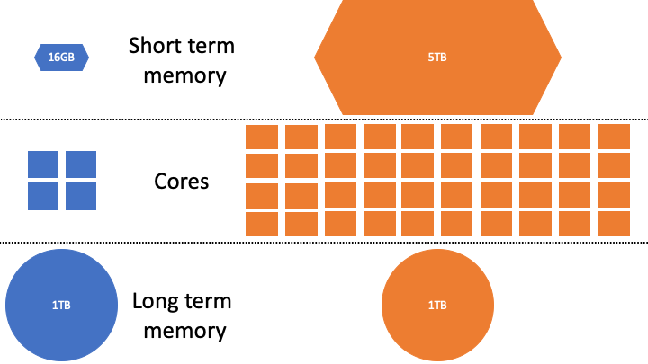
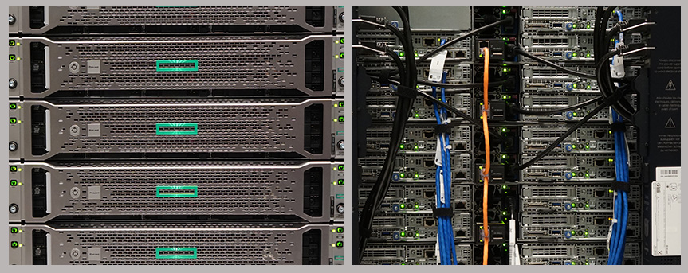
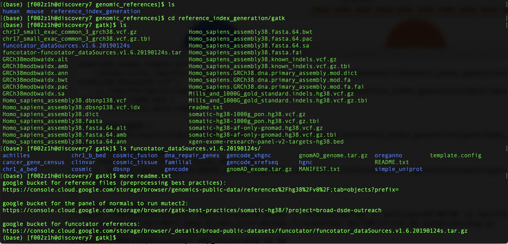
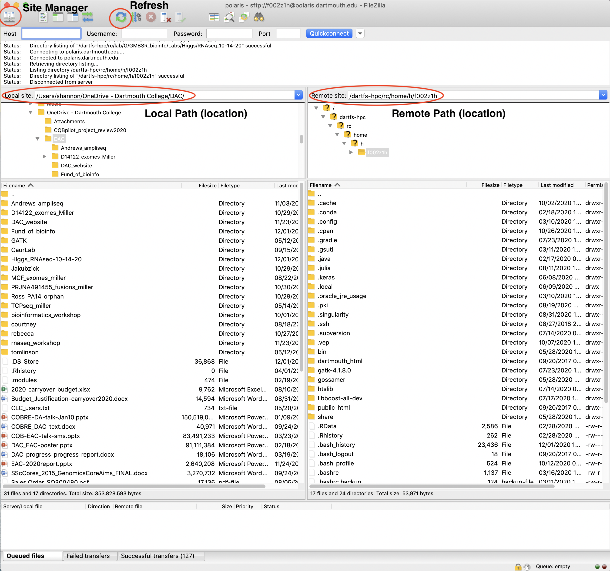
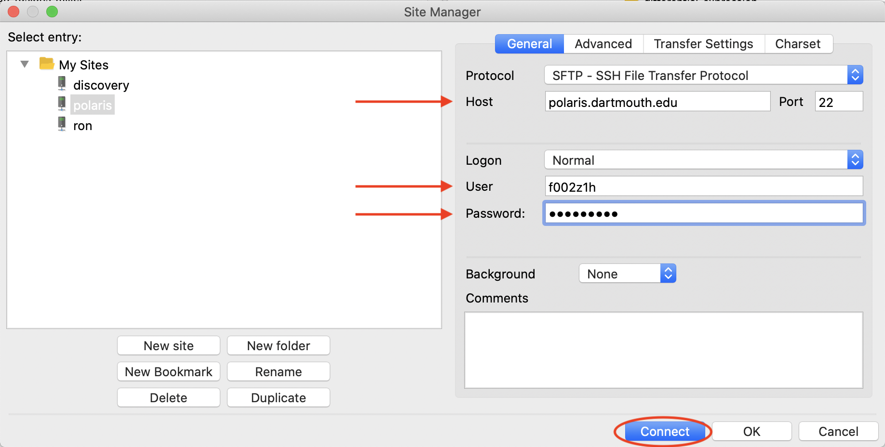
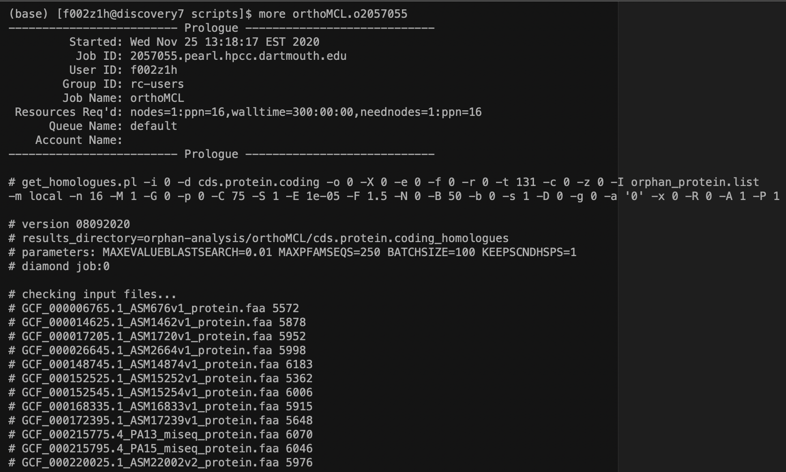
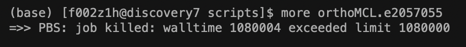

# High Performance Computing

High performance computing (HPC) is a group of interconnected computers, called **nodes**, that form what is commonly called a **cluster**. An HPC system is constructed from several different types of nodes, the **head node** is the node that you will be directed to upon logging onto the cluster. The head node is the middle man between the **compute nodes** that do most of the data processing and the outside network. Data processing should not be performed on the head node as it is not designed for this purpose.

Similar to your personal computer each node is made up of **cores**, **memory**, and **disk space**. Again just as in your personal computed the **core** processes the commands that are handed to it, the **memory** is for storing information needed by the core to execute the process, and the **disk space** is for longer term storage. Most personal computers are made up of multiple cores (quadcore, 6-core) and so data processing is often **parallelized**, that is parts of the task that do not depend on each other are preformed simultaneously by different cores **threading - explain what threading is and how you can tell if a task can be parallelized** . HPCs generally have hundreds or thousands of cores and thus are optimized for parallel computing of tasks that require more memory or disk space than is generally present on a personal computer. Even if a task could be performed locally, on your personal computer, it is generally performed faster and more efficiently on an HPC system.

<p align="center">
  
 </p>
 </p>
 
 <p align="center">
  
 </p>
 </p>

When you interact with an HPC system you do so using a terminal program (Mac/Linux - terminal, PC - MobaXterm, Cmder,etc.) rather than a graphics user interface (GUI). Learning to use the terminal to interact with files can be a steep learning curve, but once you get the hang of it you may find yourself interacting with your local files using the terminal!

<p align="center">
  
 </p>
 </p>

Dartmouth's HPC is maintained by [Research Computing](https://rc.dartmouth.edu)(RC) and is made up of 3000+ compute cores, 120,000 graphics processing cores, 12+ TB of memory, and 1PB of storage space. You can request an HPC account that comes with 50 GB of network file storage in [DartFS](https://rc.dartmouth.edu/index.php/dartfs/) for your personal account and 1TB of storage for a lab account. RC takes snapshots of your directories daily (kept for a week), weekly (kept for a month), and monthly(kept for a year), so that if you accidentaly delete or modify a file you have a repository of previous versions of that file. Furthmore they offer an option for web sharing, so that links to data can be shared with collaborators on or off campus (public_html). If you need additional space for temporary file storage there are scratch drives available which will store files for up to 45 days, you will receive a notification before these files are deleted.

## Discovery

Discovery is a linux cluster with 2016 cores, 14.5TB of memory, and 1.8PB of disk space. The compute nodes are managed by a [job scheduler](https://rc.dartmouth.edu/index.php/using-discovery/scheduling-jobs/scheduler-policy/) when you log onto discovery you are automatically directed to the head node where data processing should **not be executed**. Discovery is mainly used to submit large multi-threaded jobs that will run for many hours or days.

Interactive processing on discovery should only be performed on the *test node x01*. This is mostly for determining how long your discovery job will take once submitted. Once you are satisfied that the commands you're testing work as you expect they can be submitted to the scheduler using a PBS script. To use the test node simply log onto the test node interactively and execute the commands that you want to test.

*This is an example command and shouldn't be executed*
```bash

# Log onto to the test node x01 interactively (the -I flag) for up to 3 hours, the -l flags indicate the details of the submission that you are asking for
mksub -I -l nodes=x01 -l walltime=3:00:00

```
#### Andes/Polaris

If you would like to work interactively you should do so on Andes/Polaris clusters. Lets take a minute to log onto Polaris.

```bash

# Ssh onto Polaris, notice the command is the same except that the location that you are logging into has changed from discovery7 to polaris
ssh netID@polaris.dartmouth.edu

# Enter your password at the prompt (the password is the same as the one you used for discovery)
netID@polaris.dartmouth.edu's password:

# You're in!
(base) [netID@polaris ~]$

# Check your location on polaris
pwd

```
You will notice the the inital location you are logged into on polaris is the same home directory you found yourself in after your initial login to discovery. You can even see that all of the same files are there with the `ls` command. The content of your directories does not change whether you are logged onto discovery or polaris, what changes are the capabilities of the computing nodes that you are hosted on.

Andes and polaris are shared memory computers which run jobs that require a lot of memory or scratch space (temp files that are created during processing but discarded later). Andes has 60 cores, 512 GB of memory, and 5TB of scratch space. Polaris has 40 cores, 1TB of memory, and 5TB of scratch space. You will notice that there are far fewer cores on andes/polaris, these clusters do not use a job scheduler and jobs are executed interactively on these HPCs. If you feel more comfortable executing jobs interactively this is where you should work.

You will also notice there is a lot more memory on polaris than andes, jobs that require a lot of memory and scratch space should be executed interactively on polaris as discovery may not have the scratch space or memory available to execute these types of jobs.

## Moving files between computers

Sometimes you will want to move files from your account on the cluster to your local computer, or visa versa. You can do this is with the commands `scp` and `rsync`. The `scp` and `rsync` command have a similar syntax, for simplicity let's focus on the `rsync` command. The `rsync` command takes two arguments each will be a path to copy from/to, the source comes first and the destination comes second.

`rsync source_path destination_path`

Let's use these commands to move the file `all_counts.txt` which should be in the Day1 directory you copied from the github repository, into your `fundamentals_of_bioinformatics` directory on discovery. To start open a new terminal window, this window should default to your local home directory (you can check this with `pwd`), navigate to the location you copied the github repo to so that you can see the `all_counts.txt` file when you use the `ls` command. From this new terminal window enter the following command:

```bash

# Move the file from the cluster to your local machine
rsync all_conuts.txt netID@discovery7.dartmouth.edu:/dartfs-hpc/rc/home/h/netID/fundamentals_of_bioinformatics/

```

You will be prompted for your password to ensure you have permissions to access the file on discovery, and you should see the `all_counts.txt` file in your fundamentals_of_bioinformatics directory (you can check with the `ls` command).

Now lets copy the `fundamentals_of_bioinformatics` directory to your local directory, using the `scp` command.

```bash

# Move the file from the cluster to your local machine
rsync -r netID@discovery7.dartmouth.edu:/dartfs-hpc/rc/home/h/netID/fundamentals_of_bioinformatics/ ./

```

You will notice that we used the `-r` option with this command this stands for recursive, when copying a directory this will enable you to copy that directory and all of its contents organized exactly as they are in the location you are copying from. 

#### SFTP clients (FileZilla, CyberDuck, WinSCP)

Another way to do this that can be a little less daunting when you are new to the command line is to use an SFTP client. I use [FileZilla](https://filezilla-project.org) for this but there are many other programs available to visualize the files that you have locally and on a remote site of your choosing.

You will notice on the left is a list of the files in my local directory and on the right is a list of files in my remote directory. Once we have a connection established double-clicking a filename will transfer the file from one location to the other. If the filename already exists in the receiving directory a warning will pop up asking if you would really like to replace the current version of the file. In order to make sure the directories in both locations are showing the most current version of their contents it is often useful to use the **Refresh** button on the top menu.

<p align="center">
  
 </p>
 </p>

To establish a connection to a new site you would click on the **Site Manager** image on the top left of the screen. From there you would select the **SFTP** option under the protocol drop down menu, then enter the address of the remote host you would like to connect to, your user name (netID in this case), and password. Click connect and you should see a list displayed on the right pane of the window showing the contents of your home directory.

<p align="center">
  
 </p>
 </p>


## Environment Modules


Used on HPC systems to make software versions available
usually installed by the system admin, so you cannot add or modify them yourself


Each person who uses the HPCs at Dartmouth has a different set of tasks and data that they need to work on, and as such we do not need all the same software loaded to complete the tasks that you are interested. Instead discovery/polaris/andes have modules that contain pre-loaded software that you can load into your current environment so that they are available for you to use. Modules are used on HPC systems to make multiple versions of popular software availble to users. UNfortunately, modules are installed and maintained by the system administrators, so you cannot add modules or modify them yourself. 

In order to see the modules you currently have loaded in your environment use the command `modules list`. To see the breadth of software available for you to load use the command `module avail`.

<p align="center">
  
 </p>
 </p>

You can see that not only is there a lot of software available for you, there are multiple versions of the same software (java 1.6, 1.7, & 1.8) in case you need a specific version as a dependency for another piece of software. For exmaple, let's suppose we need to use an older version of R than the version loaded by default on discovery (3.6.0).

First, lets start running R interactively on discovery, and confirm the version currently loaded.
```bash
# start running R interactively
R

# (from within R) check the version
R.version

# quit running R interactively to return to the bash terminal
q()
```

Now go ahead and load the module for the older version of R that you need (3.3.1).
```bash
# Load a module to the current environment
module load R/3.3.1

# List your currently loaded modules to check that the module was loaded
module list
```

There may also be circumstances where you want to remove a loaded module as the software is interfering with another process that you would like to run or you want to load a different version of the same software. Let's remove the module we just loaded.
```bash

# remove the module
module rm R/3.3.1

# confirm that the module was removed
module list
```

There are some pieces of software that you will want to make sure are loaded each time that you log onto the HPC. It would be annoying if you had to use the command `module load` with each piece of software you always want loaded every time you log in. You can edit your `.bash_profile` to load those modules each time you log in. First let's look at the current contents of your `.bash_profile`

```bash

# Look at the contents of your .bash_profile
cat .bash_profile

```

You can see there is a location that says `# put your own module loads here` under this line is where we will add the commands for the modules that we would like to load. Use the `nano` command to add the latest R version to your environment by adding the line `module load R/3.3.1` under the line `# put your own module loads here`. Let's check that the changes we made have been saved.

```bash
#modify .bash_profile by adding the module load R/3.3.1 in the appropriace location
nano .bash_profile

# Look at the contents of your modified .bash_profile
cat .bash_profile
```


You can also remove all of your loaded modules with the `module purge` command.
```bash
module purge
```


## Submitting a job to the cluster

For many tasks that you will want to run, the task will require lots of memory and perhaps even threading to spread parts of the job onto multiple cores such that the job  is executed efficiently (think of a car being built in a factory it makes sense to build the headlights and doors in separate locations at the same time). We do this by submitting a job to the scheduler, in your submission you will provide parameters for running your job to the scheduler and the scheduler will assign your job to a (or multiple) node as soon as one becomes available. It is possible to do this all in one line of code, but the best practice is to use a script with all of this information endcoded and submit that script to the scheduler. In this way you have a written record of the parameters you used to submit the job and if anything goes wrong you can easily modify the script and resubmit it rather than typing the whole command out again.

Before submitting a job to the scheduler it is useful to check the traffic on discovery to get an idea of when a suitable node will become available. We can do this with the `pbsmon` command. 

```bash

# Check mode availability on discovery
pbsmon
```

You can see that each node is color coded to show how many of the cores on that node are avaialble, there is a code at the bottom of the display that tells you what each color means. When the majority of nodes are red (100% of cores in use) your job will be qued waiting for a while, when the majority of nodes are blue your job should be submitted rather quickly. 


Let's take a look at an example of a job submission script below:

```bash
#!/bin/bash -l  
#declare a name for this job to be my_serial_job  
#it is recommended that this name be kept to 16 characters or less  
#PBS -N my_job  

#request 1 node and 16  processors on that node  
#PBS -l nodes=1:ppn=16  

#request 0 hours and 15 minutes of wall time  
#(Default is 1 hour without this directive)  
#PBS -l walltime=0:15:00  

#mail is sent to you when the job starts and when it terminates (e) or aborts (a) - can also have an email sent when the job begins (b)   
#PBS -m ea  

#specify your email address   
#PBS -M my_email@dartmouth.edu  

#By default, PBS scripts execute in your home directory, not the  
#directory from which they were submitted. The following line  
#places the job in the directory from which the job was submitted.   
cd $PBS_O_WORKDIR  

some command that I would like to submit to the scheduler  
```

The lines that start with `#PBS` are the lines that are denoting the settings we would like for the scheduler to use for our command.

- `#PBS -N` declares the name that you would like to use for your job
- `#PBS -l nodes=1:ppn=16` tells the scheduler you need 1 node with at least 16 cores to run this job
- `#PBS -l walltime=0:15:00` tells the scheduler you need a maximum of 15 minutes to complete this job, the job will be killed after 15 minutes so it is always best to err on the side of more time
- `#PBS -m bea` tells the scheduler that you would like to be notified when the job starts, ends, and if any errors are encountered while running the job
- `#PBS -M` tells the scheduler how to contact you with the information you requested in the `-m` argument
- `cd $PBS_O_WORKDIR` tells the scheduler to put outfiles, log files and error files in the directory that you submitted your code from. Leaving this out will cause these files to be placed in your home directory.

### Building a command

Arguably the most important part to get right here is the *some command that I would like to submit* part of your script. We STRONGLY suggest that you read the manual for any tools that you are interested in using. Software executed through the command line has a plethora of options available, options that are often not available when using graphics user interfaces to execute the same software. It is important that you understand how these options change the way that the software will run on your data and which options are most appropriate for the data that you are using. Sometimes this comes down to knowing if your data are paired-end or single-end, but sometimes you need to know that the genome you are working with and the reference are not closely related and there could be options in the software that are more appropriate for that scenario. 

There is a saying in computer programming "Garbage in, Garbage out" ultimately this means that the computer can only (at this point) follow your directions and it is important to do your due diligence and ensure that the commands you are executing are 1. most appropriate for the data you are using and 2. will ultimately answer the questions you have about your data.

### Subnmitting a job to the scheduler

Once you have your script written and are ready to submit you can submit your code to the scheduler using the `mksub` command. This will enter your job into the que of jobs submitted by other users. Job submission is loosely based on the order of the que but also affected by the walltime that a job will require, and the type and number of nodes/cores that a job will require. Smaller jobs with less walltime get through the que faster than larger ones. 

```bash

# Submit a job to the scheduler
mksub my_script.pbs
```

### Checking your jobs progress

Once you submit your job you will want to peridically check on the progress of your job. One way to do that is using the commands `qstat` and `myjobs`. `qstat` will show you when your job was submitted to the que, and what the status of your job is (Q = still waiting to submit, R = currently running, C = completed).
`myjobs` will show the time the job was started, the status of your job (only running jobs are displayed), the time left based on the walltime you have requested,  and the HPC resources your job is using. 

```bash
#check the status of qued jobs
qstat
#check the status of running jobs
myjobs

```

A more detailed way of checking the progress of your job are the stdout and stderr reports that are automatically generated in the directory that the script was submitted from as soon as your job gets assigned a node. These files are named using the name that you declared for your job in the `#PBS -N` field, followed by the job number that was assigned when you submitted your job (this can be seen in the `qstat` and `myjobs` commands. So a job named *STAR_alignment* that was given the job number *2101976* would have a stdout file named *STAR_alignment.o2101976* and an error file named *STAR_alignment.e2101976*. The stdout file contains a header with an outline of the parameters that were used to call the job, followed by any output from the code that would normally be written to stdout if the job was run interactively. The stderr file writes any errors that are flagged as the job is running, including errors that result in termination of the job before the code has completed running. These errors are not always straightforward and sometimes require some research on the users part to trouble shoot what went wrong before resubmission. 

**Example stdout file**
<p align="center">
  
 </p>
 </p>
 
**Example stderr file**
<p align="center">
  
 </p>
 </p>


# R on the hpc
submitting an R script
loading R libraries
running R interactively

## Break out room exercises

- Build a pbs script that uses the counting GC script that you created yesterday

- Run this script on the raw fastq files

- Run this script on the trimmed fastq files

- Does the GC content change?
