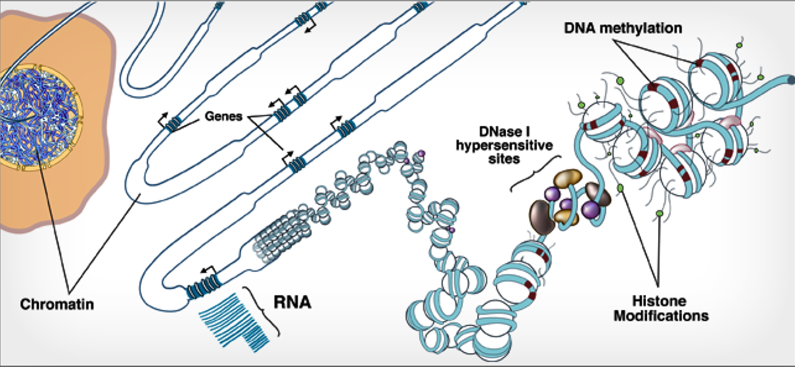
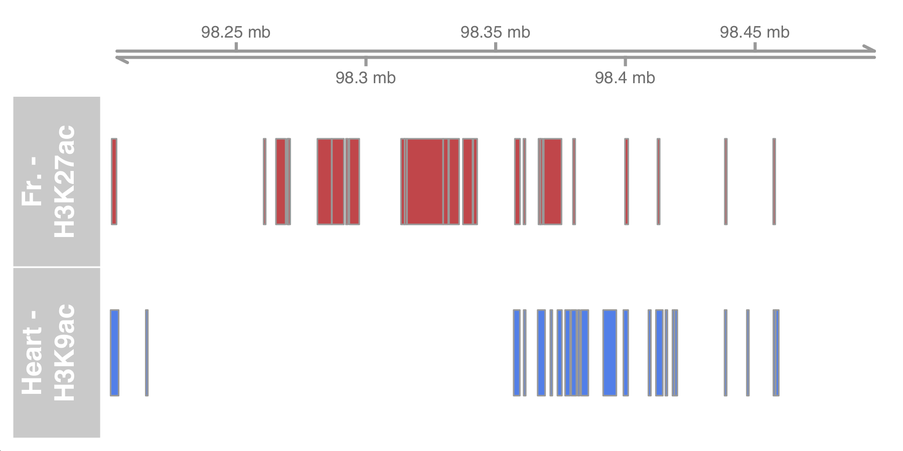

# Working with genomics data in R/Bioconductor - Part I

After performing initial analyses of NGS data using tools predominantly implemented through the UNIX shell, we often want to perform a set of downstream analytical tasks that add context to our experiment and help address our hypothesis. The R statistical programming environment, as well as the R-packages available through the  [Bioconductor project](https://www.bioconductor.org/), provide a wide-range of functionality to perform these downstream analyses.

Examples of downstream analyses that can be performed through the R/Bioconductor framework:
- compare, query, and visualize genomic region data (e.g. peak calls)
- retrieve and apply data from numerous genome annotation databases
- obtain and efficiently analyze sequences from common reference genomes
- explore NGS data using a collection of bioinformatics-specific visualization packages
- perform advanced statistical modeling, such differential expression analysis


### What is Bioconductor?

Bioconductor is a large collection of R-packages developed specifically for performing diverse analytical tasks on biological data. These packages are all free and open source, with new packages being added regularly. Bioconductor packages are especially noteworthy for their high level of integration with each other, providing a number of usage advantages as well as facilitating a streamlined development process.  

Importantly, many Bioconductor packages exist for NGS and genomics-specific applications. Visit the [Bioconductor website](https://www.bioconductor.org/) to get an idea for the range of software available.

<p align="center">

</p>

The table below provides examples of some important BioConductor packages organized by their application/utility, and some more specific examples designed for analysis of specific data-types.

**Important Bioconductor packages by application**

**Applications** | **Packages**
-------|-------
Data representation | IRanges, GenomicRanges, GenomicFeatures, BioStrings, BSGenome, SummarizedExperiment
File handling & manipulation | *rtracklayer*, *BioStrings*, *ShortRead*, *Rsamtools*
RNA-seq | *DESeq2*, *edgeR*, *DEXSeq*. *EDAseq*
ChIP-seq | *ChIPseeker*, *ChIPpeakAnno*, *DiffBind*, *ChIPQC*, *TFBStools*
DNA methylation | *minfi*, *methylKit*, *ENmix*, *BiSeq*, *ELMER*
Varaint analysis | *VariantAnnotation*, *maftools*, *VariantFiltering*, *ensemblVEP*
Metagenomics | *decontam*, *philr*, *metavizr*, *BDMMAcorrect*
Single-cell analysis | *SingleCellExperiment*, *scater* *scran*, *SingleR*, *DropletUtils*
Genomic visualiuzation | *rtracklayer*, *ggbio*, *Gviz*, *clusterProfiler*, *genomation*
Genomic annotation | *GenomeInfoDB*, *TxDb*, *AnnotationHub*, *org.X.db*, *BioMart*
Gene ontology analysis | *GO.db*, *DO.db*, *rGREAT*, *fGSEA*, *clusterProfiler*, *GSVA*

### Learning objectives:

In these lessons, we will focus on introducing you to the core set of Bioconductor packages, and how they can be used to perform common tasks in bioinformatics.

The primary topics we will cover include:
- analyzing genomic region data with bioconductor
- retrieve and apply data from genome annotation databases
- biological sequence analysis and reference genomes in R

> We will *not* be discussing R/Bioconductor packages developed to perform complex statistical analysis of specific genomics data types, for example using *DESeq2* for differential expression analysis of RNA-seq, or *DiffBind* for differential binding analysis in ChIP-seq. Performing downstream statistical analysis of genomics data with packages such as *DESeq2* and *DiffBind* requires a working understanding of R/Bioconductor as well as some fundamental statistical knowledge, which are unfortunately beyond the scope of this workshop.

### Installing & loading Bioconductor packages

The `Biocmanager` package, and specifically its function `BiocManager::install()` is used to install Bioconductor packages, essentially replacing `install.packages` which is used for installing *CRAN* packages.
```{r}
install.packages('BiocManager')
BiocManager::install()
```

Bioconductor packages can then be loaded like regular R-packages:
```r
library(IRanges)
```

### Working with genomic region data

Numerous NGS analyses result in a set of genomic regions of interest that you wish to assess in further downstream analysis. For example, coding regions in RNA-seq, transcription-factor binding sites in ChIP-seq, or accessible chromatin in ATAC-seq. Being able to store, query, and manipulate genomic regions is an extremely common and fundamental downstream analysis task of genomics data.

The *IRanges* and *GenomicRanges* form the core functionality for working with genomic region data in Bioconductor, with IRanges providing much of the basic functionality that is then extended specifically for genomics data by GenomicRanges. We will first discuss the basic methods implemented in IRanges before discussing the GenomicRanges package.

#### The *IRanges* package

In the below example, we have an example set of genomics regions from chromosome 1 of the human genome. These regions could be anything of interest, e.g. an NGS read, exon coordinates, TF peaks. IRanges uses a specific set of methods and object classes to efficiently store the integer data representing these regions.

<p align="center">

</p>

IRanges objects are generated using the `IRanges()` constructor function, which can then be printed to the console to show their start/end positions and width. We could generate `IRanges` class objects for two of the regions shown in the above example using the following code.

```r
# 1st region
IRanges(start = c(1), width = 4)

# 2nd region
IRanges(start = c(11), width = 3)
```

IRanges objects can contain multiple regions, which we could have constructed for these regions like this:
```r
ir <- IRanges(start = c(1,11), width = c(4, 3))
ir
```

IRanges provides a number of functions for operating on and manipulating regions stored in IRanges objects. For example, the functions `shift()`, `narrow()`, and `resize()` for adjusting start, end and width sizes of regions stored in these objects.

```r
# shift all of the regions by a specified offset
shift(ir, 2)

# resize all regions to only the integer at the center of each region
resize(ir, fix="center", width=1)
```

Lets construct an IRanges class object that contains all of the integer regions shown in the figure above (normally, these regions would be defined by your data, so you wouldn't need to do this step).
```r
ir <- IRanges(start = c(1,2,3,3,5,6,7,7,8,11),
              width = c(4,4,4,4,3,3,3,3,3,3))
ir
```

#### The *GenomicRanges* package

The *GenomicRanges* package extends IRanges functionality to more explicitly facilitate analysis of genomic regions within the Bioconductor framework. GenomicRanges severs as a foundation for storing, querying, and manipulating genomic regions for other key Bioconductor packages. e.g. [*rtracklayer*](https://bioconductor.org/packages/release/bioc/html/rtracklayer.html), [*BSGenome*](https://bioconductor.org/packages/release/bioc/html/BSgenome.html), [*GenomicAlignments*](https://bioconductor.org/packages/release/bioc/html/GenomicAlignments.html)).

<p align="center">

</p>

At the core of the package is the *GRanges* class, which is analogous to the IRanges class but specifies genomic ranges denoted by a start, and end on a specific sequence (e.g. a chromosome). Lets construct a `GRanges` object for the ranges shown in the figure.
```r
gr <- GRanges(
    seqnames = rep("chr1", 10),
    ranges = IRanges(start = c(1,2,3,3,5,6,7,7,8,11), width = c(4,4,4,4,3,3,3,3,3,3)),
    names = paste0("r", "-", seq(1,10)),
    strand = c(rep("+", 2), rep("-", 3), rep("*", 3), rep("+", 2)),
    score = rnorm(10,5,2))
gr

# return the region ranges only
granges(gr)

# return the strand info for all regions
strand(gr)

# return the region names  
names(gr)

# extract the metadata columns
mcols(gr)
```

Now imagine that these regions all represent sequencing reads in an NGS experiment. A common analytical task to perform on these regions would be to ask **what is the read coverage at each genomic position?**

The `coverage` function provides a convenient way to address this question, by returning a vector that indicates the frequency of reads overlapping each of the genomic positions.
```r
# calculate coverage of each base over this genomic region
coverage(gr)

# sum across all regions to get the total coverage for this genomic region
sum(coverage(gr))

# perhaps we are only interested in the regions on the + strand
sum(coverage(gr[strand(gr)=="+"]))
```

Expecting a regular numerical vector...? That might be manageable in our small example here, but imagine we need to store data across an entire genome. The object size would quickly become extremely large and require significant amounts of computational memory to handle.

Instead, *GenomicRanges* leverages a data compression approach called **run-length encoding (RLE)**. RLE is an efficient form of data compression for vectors consisting of long runs of continuous data. Consider the example below:

<p align="center">

</p?>

**RLE** is an especially efficient way of storing genomics data since there are often streches of repeated values in the final data representation, and often long streches of sequences are not considered in an experiment (e.g. non-coding regions in RNA-seq) so we shouldn't waste space storing information on those positions.

RLE-style encoding is employed by the `bigWig` file format to allow efficient storage and access to signal track data. These points are illustrated in the example below in the context of a ChIP-seq experiment.

<p align="center">

</p>

#### Manipulating *GRanges* objects

*GRanges* objects can be indexed similar to regular objects in R, their intervals can be manipulating using the same functions introduced above for *IRanges* objects, and queried/manipulated using additional method functions available in the GenomicRanges package.

```r
# index GRange object for specific elements
gr[1]
gr[[1]]
gr[1][["r-1"]]

# view the top X regions of interest
head(gr, n=5)

# view the top X regions with scores greater than a value of interest
head(gr[score(gr)>4], n=5)
```

There are also numerous range-based operations can be performed on *GRanges* objects using functionality implemented through *IRanges*.

<p align="center">

</p>

**Image source:** [GRanges tutorial](https://www.bioconductor.org/help/course-materials/2015/SeattleApr2015/B_GenomicRanges.html)

Lets try a few out on our GRanges object:
```r
# shift all regions 5bp
shift(gr, 5)

# resize all regions by requiring them to be 5bp wide
resize(gr, 5)

# reduce the regions to one simplified set of non-overlapping regions
reduce(gr)
```

### Working with multiple GRanges objects  

Now that we understand the basics of the IRanges and GenomicRanges packages, lets try them out on some real data. We will be using ChIP-seq data from a recent study of the dynamic chromatin landscape in the developing mouse [Gorkin *et al*, *Nature*, 2020](https://www.nature.com/articles/s41586-020-2093-3), published as part of the [ENCODE (Encyclopedia of DNA Elements) project](https://www.encodeproject.org/).

In this study, the authors generate an atlas of the dynamic chromatin landscape at multiple time points during mouse embryonic development, conducting over 1100 ChIP-seq experiments and 132 ATAC-seq experiments spanning 72 stages of development across numerous tissues and organs. *Figure 1A* from the [Gorkin *et al*](https://www.nature.com/articles/s41586-020-2093-3) manuscript is included below, and describes the data collected during this project.

**Figure 1A-B from Gorkin *et al*, 2020, *Nature***.

<p align="center">

</p>

In particular, we will use ChIP-seq data generated in immunoprecipation experiments for several histone modifications, whose presence and absence can be used to infer the functional state of chromatin at specific loci (e.g. active transcription, enhancers, heterochromatin). These data have been downloaded and made available in this github repo, in: `Bioinformatics_workshop/Day-3/data/`.

The first analysis we will perform is a comparison of ChIP-seq peaks for two important chromatin marks in forebrain and heart tissues:
- H3K27ac - acetylation at the 27th lysine residue of histone H3
- H3K9ac - acetylation at the 9th lysine residue of histone H3

<p align="center">

</p>

Image source: ENCODE project.

Both H3K27ac and H3K9ac are found at regions of active chromatin, particularly enhancers, therefore by comparing their distribution across forebrain and heart tissues at a specific stage of development (we will use E15.5), we could gain insight into which regions of the mouse genome are important for tissue-specific development.

To make things easier, we have downloaded the called peaks (in BED 6+4 format) for you from the [ENCODE website](https://www.encodeproject.org/), therefore the first thing we need to do is read these data into R. BED files can be read into R using the Bioconductor package `rtracklayer`.
```r
# we 1st need to establish a vector describing what the extra extended BED columns are
extraCols_narrowPeak <- c(signalValue = "numeric", pValue = "numeric",
                          qValue = "numeric", peak = "integer")
# Note: if we had a regular BED file (no extended fields) we could ignore the extraCols argument

# use the import() function to read in the peaks called in the forebrain H3K27ac ChIP-seq
fr_h3k27ac <- rtracklayer::import("forebrain_E15.5_H3K27ac.bed",
                                  format = "BED",
                                  extraCols = extraCols_narrowPeak,
                                  genome = "mm10")

# do the same for the heart H3K27ac ChIP-seq peaks
ht_h3k27ac <- rtracklayer::import("heart_E15.5_H3K27ac.bed",
                                  format = "BED",
                                  extraCols = extraCols_narrowPeak,
                                  genome = "mm10")

# print both GRanges objects to get an idea for their contents
fr_h3k27ac
ht_h3k27ac

# check their lengths
length(fr_h3k27ac)
length(ht_h3k27ac)
```

Now we want to get a basic idea of how the peak sets in forebrain and heart overlap. Below we explore how you could achieve this using functions from the GenomicRanges package.

```r
# use findOverlaps() to return matches of genomic ranges between a 'query' and a 'subject'
overlaps <- findOverlaps(query = fr_h3k27ac, subject = ht_h3k27ac)
overlaps

# subset the forebrain GRanges object for H3K27ac peaks that overlap with peaks in heart
fr_h3k27ac_ov1 <- fr_h3k27ac[queryHits(overlaps)]
fr_h3k27ac_ov1

# and vice versa for heart with forebrain
ht_h3k27ac_ov1 <- ht_h3k27ac[subjectHits(overlaps)]
ht_h3k27ac_ov1

# use these objects to calculate the % of overlapping peaks between
length(fr_h3k27ac_ov1)/length(fr_h3k27ac)*100
length(ht_h3k27ac_ov1)/length(ht_h3k27ac)*100

# we could directly subset for the overlapping peaks using subsetByOverlaps()
subsetByOverlaps(fr_h3k27ac, ht_h3k27ac)

# alternatively, we could get the H3K27ac peaks that are unique to each tissue  
#### forebrain
fr_h3k27ac_uniq1 <- fr_h3k27ac[-queryHits(overlaps)]
fr_h3k27ac_uniq1

#### heart
fr_h3k27ac_uniq1 <- fr_h3k27ac[-queryHits(overlaps)]
fr_h3k27ac_uniq1
```

Now lets read in the peaks for H3K9ac in both forebrain and heart. To help keep the objects in our R environment organized, we can use another class available in GenomicRanges, the `GRangesList` class, which allows storage or multiple Granges objects in a list style object. This makes sense to do for our analysis, as we have multiple sets of peaks for each tissue that we want to be in our global environment.
```r
# forebrain H3K9ac ChIP-seq peaks
fr_h3k9ac <- rtracklayer::import("forebrain_E15.5_H3K9ac.bed",
                                  format = "BED",
                                  extraCols = extraCols_narrowPeak,
                                  genome = "mm10")

# heart H3K9ac ChIP-seq peaks
ht_h3k9ac <- rtracklayer::import("heart_E15.5_H3K9ac.bed",
                                  format = "BED",
                                  extraCols = extraCols_narrowPeak,
                                  genome = "mm10")

# combine with H3K27ac peak sets to make GrangesList objects
fr <- GRangesList("h3K27ac" = fr_h3k27ac, "h3K9ac" = fr_h3k9ac)
ht <- GRangesList("h3K27ac" = ht_h3k27ac, "h3K9ac" = ht_h3k9ac)

# have a look at them
fr
ht

# check their length
length(fr)
length(ht)

# explore individual elements of the list
fr[[1]]
fr[[2]]
length(fr[[1]])
length(fr[[2]])
```

We can use the GRangesLists to explore the overlap between marks within a given tissue, using the same approach with the `findOverlaps()` function as we did above.
```r
# subset for overlapping regions within the forebrain peaks, across both histone marks
fr_overlaps <- findOverlaps(query = fr$h3K27ac, subject = fr$h3K9ac)
fr_overlaps

# subset the forebrain H3K27ac GRanges for peaks overlapping with firebrain H3K9ac peaks
fr_h3k27ac_ov_h3K9ac <- fr$h3K27ac[queryHits(fr_overlaps)]

# calculate % overlapping peaks based on all forebrain H3K27ac peaks
length(fr_h3k27ac_ov_h3K9ac)/length(fr$h3K27ac)*100

# do the same for heart
ht_overlaps <- findOverlaps(query = ht$h3K27ac, subject = ht$h3K9ac)
ht_h3k27ac_ov_h3K9ac <- ht$h3K27ac[queryHits(ht_overlaps)]
length(ht_h3k27ac_ov_h3K9ac)/length(ht$h3K27ac)*100
```

You could also obtain the overlapping regions between histone marks within each tissue more directly using the `susetByOverlaps()` function:
```r
fr_ov2 <- subsetByOverlaps(fr$h3K27ac, fr$h3K9ac)
fr_ov2

ht_ov2 <- subsetByOverlaps(ht$h3K27ac, ht$h3K9ac)
ht_ov2
```

Comparing the percentage of overlap for H3K27ac and H3K9ac, we see that while there is a lot of overlap, there are also a lot of of tissue specific regions, suggesting H3K27ac and H3K9ac profiles are tissue specific.

### Visualization

Bioconductor includes a number of visualization-specific packages. One useful package with extensive functionality for genomics data is the [GViz](http://bioconductor.org/packages/release/bioc/html/Gviz.html) package. The vignette available on the bioconductor page for Gviz provides an extensive overview of possible plots that can be generated using the package.

Lets use `Gviz` to create a simple visualization of a specific genomic region, so that we can compare the peak density for H3K27ac in forebrain and heart of the developing mouse.

```r
# create an annotation track from the Granges object for H3K27ac
fr_h3k27ac_track <- AnnotationTrack(fr$h3K27ac,
                                    chromosome = "chr17", start = 9e6, end = 10e6,
                                    name = "Forebrain - H3K27ac",
																		stacking = "dense",
																		col = "indianred")

# do the same for heart H3K27ac
hr_h3k27ac_track <- AnnotationTrack(ht$h3K27ac,
                                    chromosome = "chr17", start = 9e6, end = 10e6,
                                    name = "Heart - H3K27ac",
																		stacking = "dense",
																		col = "cornflowblue")

# create a genomic axis object to add to plot
gtrack <- GenomeAxisTrack()

# plot the tracks for this region
plotTracks(list(gtrack, fr_h3k27ac_track, hr_h3k27ac_track), from = 9e6, to = 10e6)
```

<p align="center">

</p>

The plot clearly supports the hypothesis that H3K27ac profiles vary in this region between forebrain and heart tissues. However, there is some information this figure does not provide that would add useful context, for example:  
- which genes/transcripts do these regions overlap?
- how do these profiles compare to other relevant published ChIP profiles?

In order to address these questions, we need to obtain relevant annotation data. Fortunately, Bioconductor provides a functions that allow you to interface directly with public databases like *UCSC*, *Ensembl*, and *NCBI* to obtain the most up to date annotation data available. **This will be the focus of our next lesson**.

### Practical considerations:

- I would not explore a new dataset using Bioconductor-based visualization packages. Generally, *IGV* will allow you to explore a new dataset faster, without having to do any coding. However, packages such as `Gviz` provide a comprehensive and flexible way to display data in numerous ways not possible in standard genome browsers, and therefore are an excellent way to explore candidate regions in more detail, or generate a number of plots programmatically.

- There are other ways to perform the sorts of tasks that we did in this lesson, both within and outside of R. For example, [*BEDTools*](https://bedtools.readthedocs.io/en/latest/), the so-called *"swiss-army knife for genomic-arithmetic"* allows you to intersect, subset, merge, count, and manipulate genomic regions directly via the UNIX shell. Alternatively, [*Biopython*](https://biopython.org/) provides similar functionality from within python.

<p align="center">

</p>

- The choice of which software you use for these types of operations is dependent on what you are doing and what you need to do next. For example, if plan to use other Bioconductor packages after determining overlap between sets of regions, you may choose to use R/Bioconductor. If you simply need to intersect two BED files quickly to be used as input into another UNIX-based software, it may be advantageous to use BEDTools.   

- This lesson is not intended to be a comprehensive introduction to the complete functionality of any of the packages discussed here, and would be impossible to achieve in the time we have. This lesson is based off of similar exercises available from far more comprehensive vignettes and documentation at the Bioconductor webpages for package. I encourage you to use this lesson as a starting point to direct you toward these more comprehensive resources.
