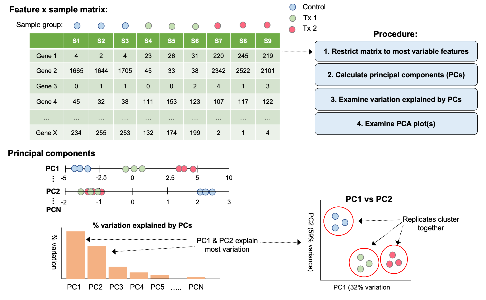
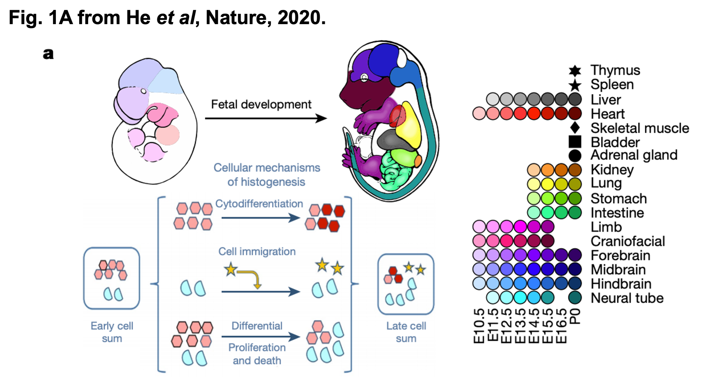
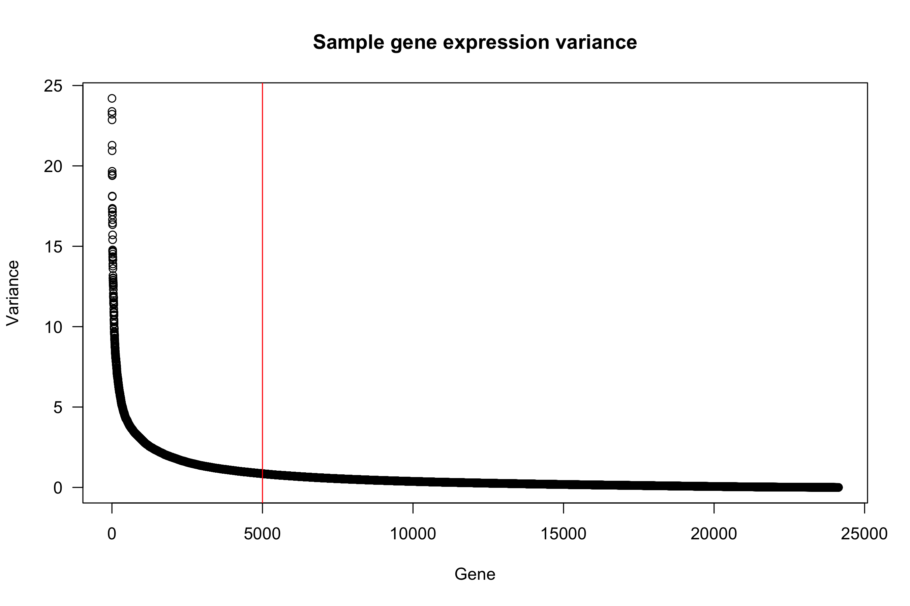
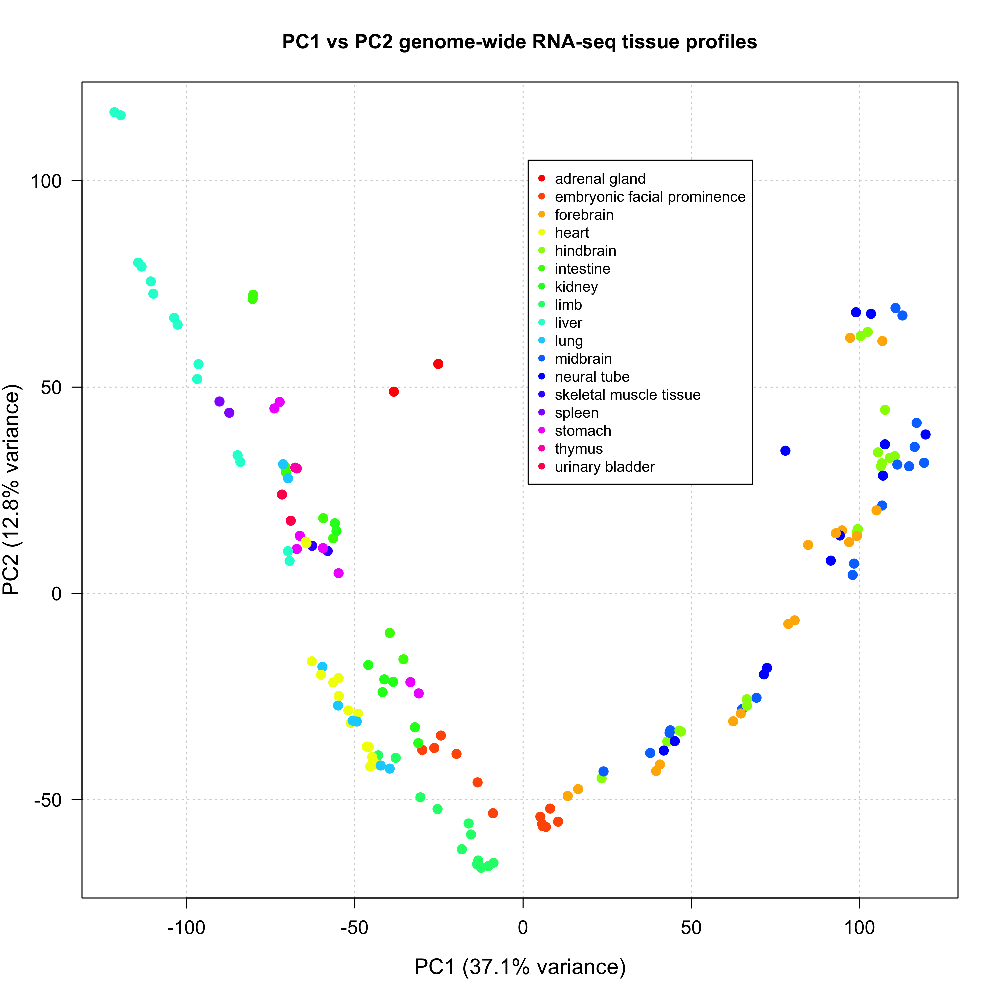
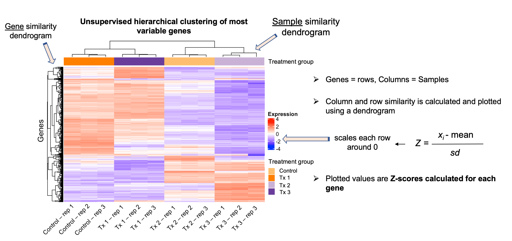
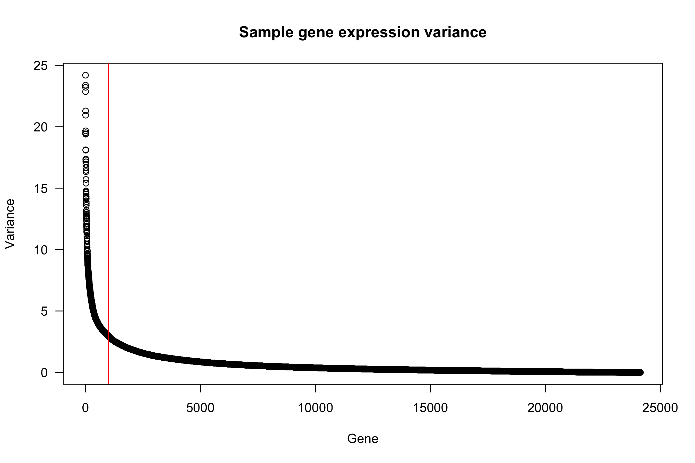
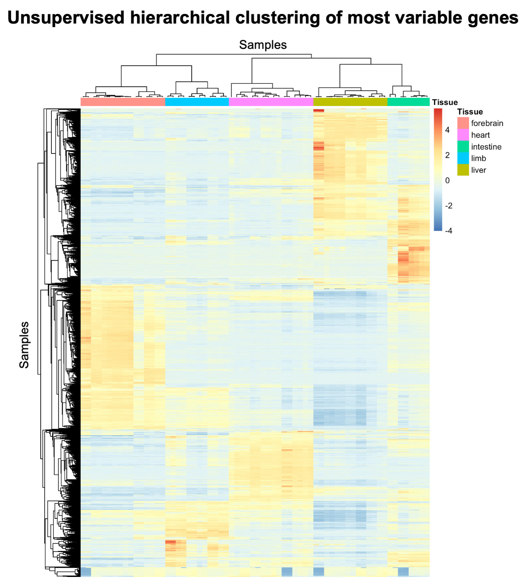

# Introduction to statistics for bioinformatics - Part I

As we discussed on day 1, bioinformatics draws on knowledge from multiple disciplines. To effectively solve most bioinformatic problems, knowledge from each of these disciplines must be applied to address the overall problem. Developing a **working knowledge of statistics** is critical for anyone hoping to solve bioinformatic problems, particularly in genomics.

In particular, this working knowledge of statistics is required to understand the downstream data analysis methods we employ after data reduction of NGS datasets (e.g. differential analysis on raw gene expression counts).

<p align="center">
  
</p>

Adapted from Md Arman Hossen on [Medium](https://medium.com/datadriveninvestor/i-have-designed-my-own-bioinformatics-degree-260b24767d87).

Statistics involves the analysis of numerical data that we wish to use for making inferences on a larger population. Generally, **statistical learning** refers to the models and procedures with which we analyze these numerical datasets. **Statistical inference** refers to the process of drawing conclusions from these models and procedures.

While a comprehensive introduction to *statistical learning and inference* is well beyond the scope of this workshop (and generally takes years of specific training and experience), we will introduce some fundamental concepts required for appropriate statistical analysis of genomics data sets that are relevant to wet- or dry-lab scientists alike.

**What we *will* cover:**  
- What is statistical learning?
- Basics of supervised & unsupervised data analysis methods
- Basics of statistical inference & hypothesis testing
- *P*-values & the multiple testing problem

**What we *will not* cover:**  
- Math & probability theory underlying statistical learning procedures
- Model selection procedures & how to assess model fit
- A comprehensive introduction to the methods used for statistical learning and inference in bioinformatics

> **Important note:** Building a more complete understanding of the statistical procedures commonly used in bioinformatics, such that you are able to confidently implement, interpret, and troubleshoot these procedures, requires a strong working knowledge of relevant math and probability theory. Such training is best sought out through formal instruction, and is usually not included in applied bioinformatics courses. While developing an understanding of the fundamental concepts in statistical learning and inference covered here will allow you to begin leveraging more complex statistical analyses in your own research, and act as a solid fondation upon which to further your training in this domain, it is also important to recognize when more specialist expertise is needed to address your analytical questions.

---

## Statistical learning

As described above, *statistical learning* describes the models and procedures we use in order to understand data. Generally, the methods we use can be categorized into *supervised* and *unsupervised* methods. In bioinformatic & genomic data analysis, we commonly perform these methods in sequence.

**Unsupervised methods**

We are often interested in identifying clusters and groups that form naturally in our data, meaning that we do not supervise the analysis using any dependent variable (e.g. tx group, WT vs KO). This part of an analysis is often referred to as an *exploratory data analysis*, and make use of *unsupervised statistical methods* to perform this analysis.

Unsupervised data analysis is often used in bioinformatics to adress questions like:
- How similar are my samples based on genome-wide profiles?
- Are any samples in the dataset clear outliers?
- Do any variables systematically affect genome-wide profiles (e.g. batch)?

**Examples of unsupervised methods:**    
- Dimensionality reduction (e.g. PCA, NMF, t-SNE, UMAP)
- Clustering methods (e.g. hierachical, K-means)
- Hidden markov modeling


**Supervised methods**

In contrast to unsupervised methods, we often wish to test a more specific question of hypothesis, for example in the context of a gene expression analysis, we might ask:
- *Which genes are associated with disease?*
- *How much does a given gene contribute to the disease phenotype?*

The statistical methods we use to address these sorts of questions are typically referred to as *supervised statistical methods*.

**Examples of supervised methods:**   
- Linear regression
- Generalized linear regression models
- Descision trees
- Support vector machines

Below, we provide more specific introductions to both supervised and unsupervised learnings, using basic linear modeling as an example for supervised approaches, while exploring PCA and hierachical clustering for unsupervised analysis.

> A more comprehensive introduction to statistical learning can be found in the book: [An Introduction to Statistical Learning](http://faculty.marshall.usc.edu/gareth-james/ISL/), in addition to numerous other statistical texts and online resources.


### Unsupervised learning - Dimension reduction & clustering

As mentioned above, unsupervised learning methods are very powerful tools to conduct exploratory data analysis. Two important groups of unsupervised methods include *dimensionality reduction methods* and *clustering-based methods*.

- ***dimensionality reduction methods***: involves the transformation of data from a high-dimensional space to a low-dimensional space, allowing intrinsic properties of the high-dimensional dataset to be identified. These approaches are valuable when you have a large number of features (*p*) but a much smaller sample number (*n*).

- ***clustering-based methods***: involves calculation of the similarity/dissimilarity between samples, resulting in organization of these samples into *'clusters'* defined by their relatedness to one-another

We will explore an example of each approach below, using *principal components analysis (PCA)* as an example of dimensionality reduction, and *unsupervised hierachical clustering* as an example of a clustering-based method.

#### Principal components analysis (PCA)

For high dimensional datasets (e.g. genomics data), where we have measured many thousands of features over a relatively smaller number of samples, it is often desirable to reduce the complexity of the dataset so that it can be viewed in fewer dimensions that hopefully reveal some intrinsic properties of the dataset.

> We will not discuss the mathematical procedures used to perform PCA here, however this is discussed exhaustively elsewhere. One excellent resource is the StatQuest video linked [here](https://www.youtube.com/watch?v=_UVHneBUBW0&ab_channel=StatQuestwithJoshStarmer).

PCA is a very popular approach to perform dimensionality reduction. At its simplest level, PCA accepts a matrix of numerical values (e.g. gene expression matrix, ChIP-seq counts, etc.), and returns a set of numerical vectors (principal components) that represent the axes of greatest variation in the dataset.

The principal components (PCs) explain distinct sources of variation in the data, and represent the lower-dimensional space that the original dataset has been projected into. Importantly, each PC explains more variation in the dataset than the last (e.g. PC1 explains more variation than PC2).

By using the projection values of each sample along the PCs, we can visualize this lower-dimensional space to learn defining properties of the dataset.

<p align="center">
  
</p>

To demonstrate how you would perform a PCA analysis in R, we will use gene expression data (RNA-seq) collected as part of the same ENCODE study we discussed in previous lessons [Gorkin et al, 2020](https://www.nature.com/articles/s41586-020-2093-3?proof=t), but published in the companion paper: [*The changing mouse embryo transcriptome at whole tissue and single-cell resolution*](https://www.nature.com/articles/s41586-020-2536-x).

The expression data includes samples collected as multiple time-points during development of the mouse embryo across 17 different tissues and organs (see Figure 1A from the manuscript below).

<p align="center">
  
</p>

To help get you started, you have been provided with a matrix of FPKM counts (*fragments per kilobase million mapped reads*, which represent normalized expression values) and sample metadata. In the code chunks below, we will explore the relationships between samples from different tissues using PCA.

```r
# read in data
fpkm <- read.table("fpkm_sub.txt", stringsAsFactors = FALSE, header=TRUE)
meta <- read.delim("metadata_sub.tsv", stringsAsFactors = FALSE, header = TRUE)

# have a quick look at top of files
head(fpkm[,1:6])
head(meta)

# log transform fpkm counts
log_fpkm <- log2(fpkm+1)

# calculate variance across samples for each gene
vars <- apply(log_fpkm, 1, var)
# order variances based on magnitude of variance
vars <- rev(vars[order(vars)])

# plot variance for genes accross samples
plot(vars, las = 1, main="Sample gene expression variance", xlab = "Gene", ylab = "Variance")
abline(v=5000, col="red")
```

<p align="left">
  
</p>

In-fact, most genes show little variance in expression levels across tissues. Features that do not vary across samples are not informative for dimensionality reduction or clustering methods, therefore it is generally useful to remove them.

In these data, it seems that ~ the top 5000 genes will explain most of the variance in these data, so we will only use these genes for the PCA.

```r
# perform PCA and order by variance
vars_sub <- vars[1:5000]

# perform the PCA on the fpkm matrix
pca <- prcomp(t(log_fpkm[names(vars_sub), ]))

# look at the object returned
str(pca)
head(pca$x)

# construct data frame w/ PC loadings and add sample labels
pca_df <- as.data.frame(pca$x)
pca_df$tissue <- as.factor(meta$Biosample.term.name)
pca_df$sample_ids <- meta$File.accession

# extract percent variance explained by each PC
percentVar <- pca$sdev^2/sum(pca$sdev^2)

# add colors for plotting to df
cols <- grDevices::rainbow(length(levels(pca_df$tissue)))

# create an empty variable in pca_df to be filled with colors from cols
pca_df$col <- NA

# loop over tissue types in pca_df and assign colors for plotting
for(i in 1:length(levels(pca_df$tissue))){
  ind1 <- which(pca_df$tissue == levels(pca_df$tissue)[i])
  pca_df$col[ind1] <- cols[i]
}

# plot PC1 vs PC2
plot(pca_df[, 1], pca_df[, 2],
     xlab = paste0("PC1 (", (round(percentVar[1], digits=3)*100), "% variance)"),
     ylab = paste0("PC2 (", (round(percentVar[2], digits=3)*100), "% variance)"),
     main = paste0("PC1 vs PC2 genome-wide RNA-seq tissue profiles"),
     pch = 16, cex = 1.35, cex.lab = 1.3, cex.axis = 1.15, las = 1,
     panel.first = grid(),
     col = pca_df$col)

# add a legend to the plot
legend(1.5, 105, levels(pca_df$tissue), pch = 16, col = cols, cex = 0.9)
```

<p align="center">
  
</p>

Viewing the dataset using this lower dimensional representation provides us with critical insights into the data that would be too challenging to obtain by looking at the expression levels of individual genes separately. We see that samples from similar tissues generally cluster together on the PCA plot, while more distinct tissue types appear further away from each other. This fits with our expectations, as samples from the same (or similar tissues) should have similar gene expression profiles.

---

#### Unsupervised hierarchical clustering

Generally, clustering analysis describes a collection of methods used to group samples into groups called *clusters* which define their relation to one-another. These relationships are defined by the *distance metric* used, which is simply a measure of how similar/dissimilar samples or features in a dataset are to each other. Several distance metrics exist, such as *manhattan* or *euclidean* distance, and are calculated differently (and affect the clustering).

Unsupervised hierarchical clustering describes a specific approach to performing clustering analysis, in which a tree-like structure is generated to describe the relatedness of samples and features. The results of this procedure are commonly represented using heatmaps, with samples defining columns and features (e.g. genes) defining the rows. Visualization using heatmaps is valuable as it allows us to identify *'modules'* of similar/dissimilar features across samples, making approaches like hierarchical clustering complimentary to dimensionality-reductions methods like PCA.

<p align="center">
  
</p>

To demonstrate how one could perform an unsupervised hierachical clustering analysis in R, we will use the same RNA-seq dataset from [He *et al*](https://www.nature.com/articles/s41586-020-2536-x), describing transcriptomic changes in the developing mouse embryo.

Clustering can be quite computationally intensive, therefore we will first generate a subset of the gene expression data containing five specific tissues, rather than all 17.
```r
# subset mnetadata to 5 tissues of interest
meta_ord <- meta[meta$Biosample.term.name=="forebrain" |
                 meta$Biosample.term.name=="heart" |
                 meta$Biosample.term.name=="limb" |
                 meta$Biosample.term.name=="liver" |
                 meta$Biosample.term.name=="intestine", ]

# subset FPKM matrix to contain the same subset of samples
log_fpkm_sub <- log_fpkm[, c(colnames(log_fpkm) %in%  meta_ord$File.accession)]
```

Since we took a subset of the original dataset, we need to recalculate the variance of each gene across the samples in this subset, so that we can assess how many features will be informative for the clustering procedure.
```r
# calculate variance of each gene across samples for new subset of data
vars <- apply(log_fpkm_sub, 1, var)

# order variances based on magnitude of variance
vars <- rev(vars[order(vars)])

# plot variance for genes across samples
plot(vars, las = 1, main="Sample gene expression variance",
     xlab = "Gene", ylab = "Variance")
# add vertical line
abline(v=1000, col="red")
```

<p align="left">
  
</p>


The per gene variances look similar to before, however we will focus on the top 2000 most variable genes to help speed up the hierarchical clustering.
```r
# subset var to only top 2000 genes with most variance
vars_sub <- vars[1:2000]

# subset the fpkm matrix to these genes
mat <- log_fpkm_sub[names(vars_sub), ]

# order the samples in the same order they are in in the metadata file
mat <- mat[, c(match(meta_ord$File.accession, colnames(mat)))]

# scale the fpkm matrix by row
mat_scaled = t(apply(mat, 1, scale))

# set column names for this matrix (they were removed during transposition)
colnames(mat_scaled) <- colnames(mat)
```

We will be using the *pheatmap()* from the `pheatmap` package, which provides extensive functionality for performing and visualizing the results of clustering analyses using heatmaps.
```r
# load the pheatmap package
library(pheatmap)

# create data frame to annotate heatmap with
annotation_col = data.frame(Tissue = meta_ord$Biosample.term.name)
rownames(annotation_col) = meta_ord$File.accession

# use pheatmap() to perform clustering on scaled data matrix
pheatmap(mat_scaled,
         show_rownames=FALSE, show_colnames=FALSE,
         annotation_col = annotation_col,
         cluster_cols = TRUE,
         clustering_method = "average",
         clustering_distance_cols = "correlation")
```

<p align="center">
  
</p>

The sample dendrogram and annotation bar tells us that all five tissues were assigned to their own cluster, with sub-clusters among each. It also allows us to compare between these groups to make inferences, for example, intestine seems to be the most dissimilar tissue from forebrain based on gene expression.

In addition, the heatmap shows us the genes and their accompanying dendrogram, which allows us to visualize sets of genes that show coordinated changes across the samples, providing insight into the differences described by the clusters. For example, there is a set of ~200-300 genes that are uniquely up-regulated in intestinal tissue, and an additional ~100-200 genes that are shared with liver tissue.  
