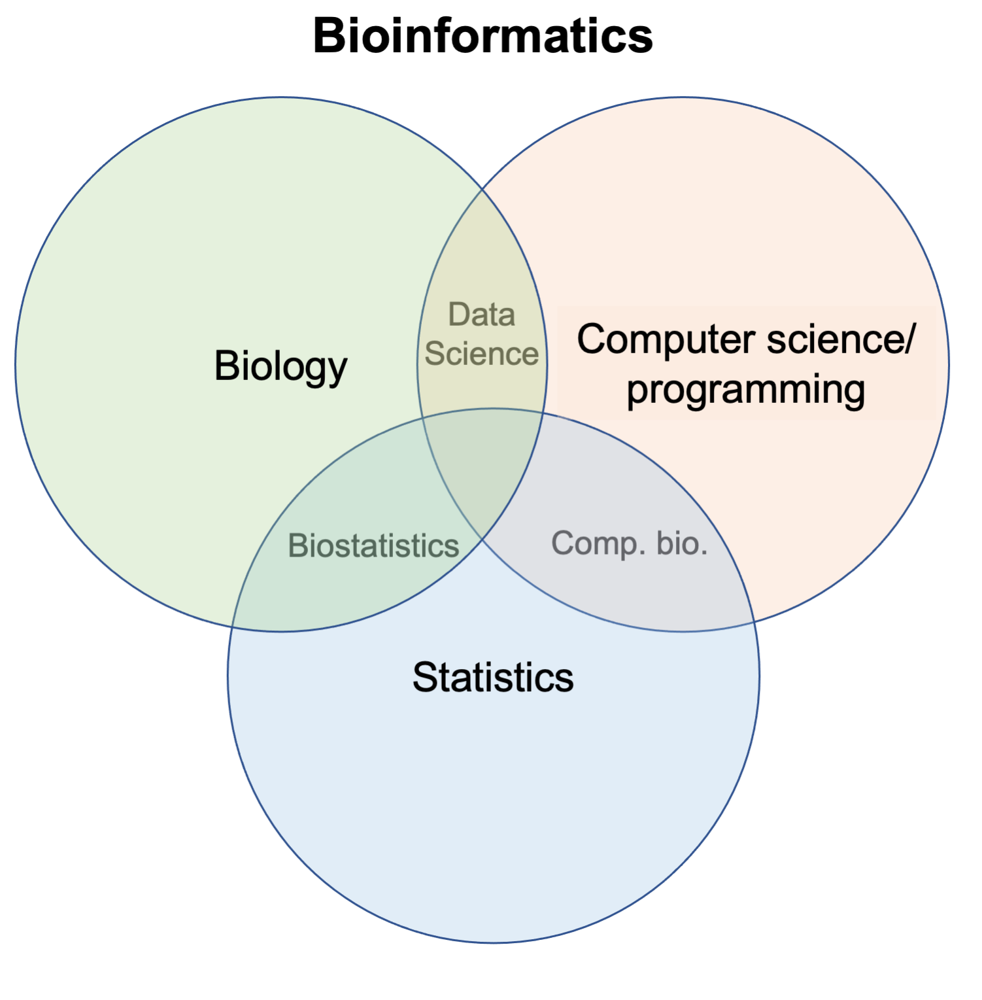

# Introduction to Statistical Learning & Inference in bioinformatics 

As we discussed on day 1, bioinformatics draws on knowledge from multiple disciplines. To effectively solve most bioinformatic problems, knowledge from each of these disciplines must be applied to address the overall problem. Developing a **working knowledge of statistics** is critical for anyone hoping to solve bioinformatic problems, particularly in genomics. 

<p align="center">
  
</p>

Adapted from Md Arman Hossen on [Medium](https://medium.com/datadriveninvestor/i-have-designed-my-own-bioinformatics-degree-260b24767d87). 

Statistics involves the analysis of numerical data that we wish to use for making inferences on a larger population. Generally, ***statistical learning*** refers to the models and procedures with which we analyze these numerical datasets. 

These models and procedures can be used to either make **predictions** (e.g. healthy vs. diseased tissue based on gene expression profiles) or for ***statistical inference***, where tools from statistical learning are applied to help us understand the relationship between a set of variables (e.g. which genes are associated with diseased tissue). 

While a comprehensive introduction to *statistical learning and inference* is well beyond the scope of this workshop (and generally takes years of specific training and experience), we will introduce some fundamental concepts required for approriate statsitcal analysis of genomics data sets that are relevant to wet- or dry-lab scientists alike. 

**What we *will* cover:**  
- What is statistical learning? 
- Basics of supervised & unsupervised data analysis methods
- Fundamentals of statistical inference & hypothesis testing 
- *P*-values & multiple testing correction 

**What we *will not* cover:**  
- Math & probability theory underlying statistical learning procedures
- Model selection procedures & how to assess model fit 
- A comprehensive introduction to the methods used for statistical learning and inference in bioinformatics

> **Important note:** Builing a more complete understanding of the statistical procedures commonly used in bioinformatics, such that you are able to confidently implement, interpret, and troubleshoot these procedures, requires a strong working knowledge of relevant math and probability theory. Such training is best sought out through formal instruction, and is usually not included in applied bioinformatics courses. While developing an understanding of the fundamental concepts in statistical learning and inference covered here will allow you to begin leveraging more complex statistical analyses in your own research, and act as a solid fondation upon which to further your training in this domain, it is also important to recognize when more specialist expertise is needed to address your analytical questions. 

--- 

## Statistical learning 

As described above, *statistical learning* describes the models and procedures we use in order to understand data. Generally, the methods we use can be categorized into *supervised* and *unsupervised* methods. 

**Supervised methods** describe approaches used when a set of observations we have made (e.g. gene expression levels) are all associated with a response variable (e.g. diseased or healthy). The observations, also called predictors, are generally referred to as the *independent variable (X)*, while the response is the *dependant variable (Y)*. 

By fitting statistical models to the data (the *learning* part), we aim to learn about the relationship between the *independent* and *dependent* variables (the *inference* part). For example, we may apply a form of linear model to gene expression data from heathly cases and diseased controls in order to address questions like:  
- *Which genes are associated with disease?*
- *How much does a given gene contribute to the disease phenotype?*

**Examples of supervised methods:**   
- Linear regression
- Generalized linear regression models 
- Descision trees 
- Support vector machines 

**Unsupervised methods** 

There are times when observations are not associated with a predictor (the *dependent variable*) and we simply wish to explore the relationships that exist in our data in a way that is *not supervised* by any such variable. This is often true in *exploratory data analysis* when we want to explore how samples are related to each other without assiging samples to a specific group for modeling purposes. For example, we may wish to confirm samples in an RNA-seq experiment fo not cluster by batch. 

Alternatively, we may not have a predictor/dependent variable that can be used to model our observations. For example, in analysis of single cell sequencing data, we are often interested in studying subpopulations of cells that come from the same sample, and therefore require some way assessing similarities and differences between the cells so that wse can identify potential subpopulations of interest.  

**Examples of unsupervised methods:**    
- Dimensionality reduction (e.g. PCA, NMF, t-SNE, UMAP)
- Clustering methods (e.g. hierachical, K-means)
- Hidden markov modeling 

Below, we provide more speicifc introductions to both supervised and unsupercised learnings, using basic linear modeling as an example for supervised approaches, while exploring PCA and hierachical clustering for unsupervised analysis. 

> A more comprehensive introduction to statistical learning can be found in the book: [An Introduction to Statistical Learning](http://faculty.marshall.usc.edu/gareth-james/ISL/). 


### Supervised learning - Basic linear modeling 

<script type="text/javascript" src="http://cdn.mathjax.org/mathjax/latest/MathJax.js?config=default"></script>


$  Y= \beta_0+\beta_1X + \epsilon $


Linear modeling is a common approach for statistical inference in bioinformatics, especially for genomics. Linear models provide flexible and generally interpretable ways of performing these statistical inferences. 

Critical for RNA-seq, ChIP-seq, microarray data, GWAS, 


multiple regression - Batch correction example 
glms 


- linear modeling 
    - justify by saying linear modeling is a very straightfoward way for modeling a continuious response variable (or discrete in generalized models) that has been applied to many data types and scenarios in hypothesis testing of bioinformatic and genomics data, therefore we will discuss the basics of linear modeling since an understanding of this is cruicial to performing or understanding tehse analyses 
    - use basic example dataset of expression vs treatment, but mention in relaity we used generalized linear models for many data types to more appropriate model the distribution of those data types (e..g RNA seq neg binom.) based on some other variables, and has therefore been adopted heavily in genomics 


### Unsupervised learning - Dimension reduction & clustering 

As mentioned above, two commonly used types of unsupervised learning are *dimension reduction* and *clustering-based* methods. Both encompass a number of distinct methodologies that have various strengths and weaknesses. 

To gain an appreciation for how these methods are used and presented in bioinformatic and genomic data analyses, we will explore the fundamental aspects of *principal components analysis (PCA)* as an example of dimension reduction, and *hierachical clustering* as an example of clustering-based analyses. 

#### Principal components analysis 


t-SNE and UMAP 


```r
prcomp()
```


#### Hierachical clustering 


# use CB book to help get an example function to use 
```r
pheatmap()
```


---

## Statistical inference 


statsitical inference refers to: 
estimation
hypothesis testing 


mention MLE 

bayseian 


### What is *hypothesis testing*?


### What is a *P*-value?


### The multiple testing problem


### Methods for multiple testing correction


